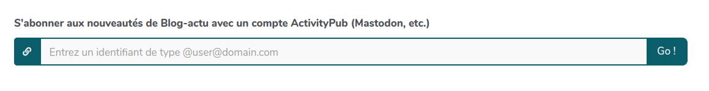

# Activer la compatibilité ActivityPub

Les fiches Bazar étant structurées, il est possible de les rendre compatible
ActivityPub. Chaque formulaire devient un acteur ActivityPub que l'on peut
suivre, et qui envoie des activités `Create`, `Update` et `Delete`. Le
formulaire lui-même peut suivre d'autres acteurs, et les fiches qu'il reçoit
vont être ajoutées automatiquement dans la liste.

Cela peut permettre de synchroniser deux instances YesWiki, ou alors de
permettre à n'importe quel utilisateur Mastodon d'être averti lorsqu'il y a des
nouveaux éléments qui sont postés. D'autres usages seront possible dans le
futur.

## Activer ActivityPub sur un formulaire Bazar

- Editer le formulaire et cliquez sur le bouton "Configuration avancée" tout en
  bas.
- Cochez la case "Activer ActivityPub pour ce formulaire"
- Entrez un nom pour d'utilisateur ActivityPub (par exemple "agenda" ou "blog")
- Entrez une template sémantique (utilisée pour convertir les données YesWiki en
  données ActivityPub - voir ci-dessous)
- Entrez une template sémantique inverse (utilisée pour convertir les données
  ActivityPub en YesWiki - voir ci-dessous)

Après avoir validé la modification, il devrait y avoir deux nouveaux éléments
dans la liste des formulaires:

- Dans la colonne "Format de données", un bouton "AP" qui renvoie vers l'acteur
  ActivityPub du formulaire
- Dans les actions, un bouton "Gestion des abonnements"

Depuis la page "Gestion des abonnements", plusieurs choses sont possibles:

- S'abonner à un nouvel acteur en entrant son identifiant
- Suivre en retour un acteur qui nous suit déjà
- Synchroniser toutes les données d'un acteur auquel on est abonné
- Effacer un abonnement ou un abonné

## Exemples de templates

Voilà ci-dessous deux exemples de template. A noter que, si l'on veut que
ActivityPub soit utilisé pour synchroniser deux instances YesWiki, il est
important que tous les champs soient inclus, sinon des données seront perdues.

### Agenda

Note: Avec la template ci-dessous, Mastodon affiche le nom de l'événement,
l'image et un lien vers la page. La compatibilité Mobilizon n'est pas encore
possible car Mobilizon attend deux activités (`Announce` et `Create`) - cela
devrait être réglé dans une future version.

#### Template de l'agenda

```json
{
  "@context": "https://www.w3.org/ns/activitystreams",
  "type": "Event",
  "name": {{ bf_titre | json_encode }},
  "content": {{ bf_description | default("") | json_encode }},
  "startTime": {{ bf_date_debut_evenement | json_encode }},
  "endTime": {{ bf_date_fin_evenement | default("") | json_encode }},
  "url": {{ bf_site_internet | json_encode }},
  "published": {{ date_creation_fiche | replace({" ": "T"}) | json_encode }},
  "updated": {{ date_maj_fiche | replace({" ": "T"}) | json_encode }},
  
  "location": {
    "type": "Place",
    "name": {{ [bf_adresse, bf_ville] | join(", ") | trim(", ") | json_encode }},
    "latitude": {{ geolocation.bf_latitude | json_encode }},
    "longitude": {{ geolocation.bf_longitude | json_encode }},
    "address": {
      "type": "PostalAddress",
      "streetAddress": {{ bf_adresse | default("") | json_encode }},
      "postalCode": {{ bf_code_postal | default("") | json_encode }},
      "addressLocality": {{ bf_ville | default("") | json_encode }}
    }
  },
  
  "attachment": [
    
    {
      "type": "Image",
      "url": {{ fileUrl(imagebf_image) | json_encode }}
    }
    
  ]
}
```

#### Template inverse de l'agenda

```json
{
  "bf_titre": {{ name | json_encode }},
  "bf_description": {{ content | default("") | json_encode }},
  "bf_date_debut_evenement": {{ startTime | json_encode }},
  "bf_date_fin_evenement": {{ endTime | default("") | json_encode }},
  "bf_adresse": {{ location.address.streetAddress | default("") | json_encode }},
  "bf_code_postal": {{ location.address.postalCode | default("") | json_encode }},
  "bf_ville": {{ location.address.addressLocality | default("") | json_encode }},
  "bf_site_internet": {{ url | default("") | json_encode }},
  "imagebf_image": {{ (attachment | first).url | default("") | json_encode }},
  "geolocation": {
    "bf_latitude": {{ location.latitude | default("") | json_encode }},
    "bf_longitude": {{ location.longitude | default("") | json_encode }}
  }
}
```

### Blog

Note: Nous n'utilisons pas la propriété `summary` car Mastodon l'interprête
comme s'il fallait cacher le contenu du texte. Le titre n'est pas afficher par
Mastodon. Il serait possible d'améliorer ça en agrégeant le titre, le chapeau et
le contenu dans la propriété `content`, mais il faudrait prévoir de les séparer
dans la template inverse (ce qui est possible avec Twig, mais peut demander un
peu de travail)

#### Template du blog

```json
{
  "@context": "https://www.w3.org/ns/activitystreams",
  "type": "Note",
  "name": {{ bf_titre | json_encode }},
  "preview": {{ bf_chapeau | default("") | json_encode }},
  "content": {{ bf_description | default("") | json_encode }},
  "published": {{ date_creation_fiche | replace({" ": "T"}) | json_encode }},
  "updated": {{ date_maj_fiche | replace({" ": "T"}) | json_encode }},
  "attachment": [
    
    {
      "type": "Image",
      "url": {{ fileUrl(imagebf_image) | json_encode }}
    }
    
  ]
}
```

### Template inverse du blog

```json
{
  "bf_titre": {{ name | json_encode }},
  "bf_chapeau": {{ preview | default("") | json_encode }},
  "bf_description": {{ content | default("") | json_encode }},
  "imagebf_image": {{ (attachment | first).url | default("") | json_encode }}
}
```

## Actions

### `entryfollow`

Si vous avez activés ActivityPub pour un formulaire Bazar, vous pouvez utiliser
cette action pour permettre à n'importe qui de suivre l'acteur avec un compte
ActivityPub (par exemple Mastodon).

Elle prend comme unique paramètre l'ID du formulaire:

```text
{{entryfollow id="3"}}
```

Cela affiche un champ comme ça:



Lorsque l'utilisateur entre son identifiant ActivityPub, cela le redirige vers
la page de l'acteur formulaire sur sa propre instance.
