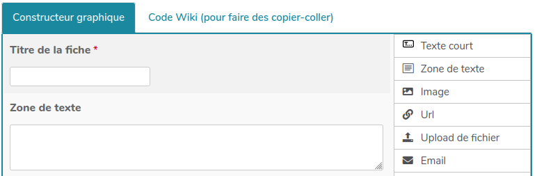

# Bazar : des bases de données coopératives dans YesWiki

Bazar permet **la création et la gestion de bases de données** pour structurer des contenus et faciliter leur manipulation par les usagers. La page "bases de données" (BazaR) est accessible via la roue crantée en haut à droite du menu.

## Introduction - Principe de fonctionnement

Bazar utilise des formulaires qui permettent deux choses :

- faciliter la **saisie** en offrant un cadre structuré de collecte d'informations,
- **visualiser** tout ou partie des informations saisies sous une forme qui vous semble pertinente (une carte, un trombinoscope, une liste, etc.).

### Exemples d'utilisation

A l'installation de votre wiki, quelques formulaires sont présents dans votre [base de données](BazaR) à titre d'exemple : Agenda, Annuaire, Blog-Actu, Ressources. Vous pouvez les modifier pour qu'ils correspondent à vos besoins ou en créer de nouveaux.

### Les trois phases de fabrication d'un formulaire

1.  **Concevoir** le formulaire,
2.  Mettre à disposition une page pour la **saisie** des fiches,
3.  Mettre en œuvre une page d'**affichage** des résultats du formulaire.

### Présentation de l'interface Bazar

!> Notez qu'il faut être connecté.e avec un compte administrateur du wiki pour pouvoir utiliser certaines fonctionnalités _Bazar_.

L'écran qui se présente ressemble à ceci (voir ci dessous).  


L'onglet **Formulaires** se présente sous la forme d'un tableau dans lequel chaque formulaire présent sur le wiki occupe une ligne.  
Pour chaque ligne, et donc chaque formulaire, on a donc les informations suivantes (les nombres en rouge sur la capture d'écran correspondent aux numéros dans la liste ci-après).

**1 –** Le nom du formulaire. C'est le nom sous lequel ce formulaire apparaîtra pour vous.  
Parfois ce nom est suivi de quelques mots de description (dans l'exemple ci-contre c'est le cas des formulaires Convive et Ressources)  
**2 –** Ce petit bouton en forme de loupe vous permet d'accéder à la recherche parmi les fiches de ce formulaire. Le comportement est alors similaire à celui qu'on aurait avec l'onglet « Rechercher » en haut de page.  
**3 –** Ce petit bouton en forme de « + » vous permet d'accéder à la saisie de fiches pour ce formulaire. Le comportement est alors similaire à celui qu'on aurait avec l'onglet « Saisir » en haut de page.  
**4 –** Chacune des icônes ou libellés dans ce groupe permet de déclencher l'export, la diffusion ou la publication selon le format indiqué.  
**5 –** Il s'agit de l'identifiant (ou nom) du formulaire pour YesWiki. Vous n'aurez _a priori_ pas à utiliser ce nom.  
**6 –** Ce petit bouton permet de dupliquer un formulaire afin de s'en inspirer pour en construire un autre en partie similaire sans avoir à tout refaire.  
**7 –** Ce petit bouton en forme de crayon permet d'accéder à la modification du formulaire.  
**8 –** Cette petite gomme permet de supprimer toutes les fiches du formulaire. Attention, il n'y a pas de moyen de récupérer des fiches supprimées.  
**9 –** Cette petite poubelle permet de supprimer le formulaire. Attention, il n'y a pas de moyen de récupérer un formulaire supprimé.  
**10 –** Ce bouton permet de créer un nouveau formulaire.  
**11 –** Vous pouvez, si vous avez repéré sur un autre YesWiki un formulaire qui vous conviendrait, utiliser ce champ pour saisir l'adresse du wiki en question. Vous serez ensuite guidés pour récupérer le ou les formulaires qui vous intéressent sur ce wiki.

**Création et modification d'un formulaire _Bazar_**
Pour modifier un formulaire on utilisera donc le petit bouton en forme de crayon (cf. 7 précédent).  
Et, pour créer un nouveau formulaire, on utilisera le bouton « Saisir un nouveau formulaire ».  
Les deux boutons envoient sur un écran similaire, vide dans le cas de la création et présentant les questions du formulaire dans le cas d'une modification.

### Concevoir le formulaire

Concevoir le formulaire revient à choisir et agencer les différentes questions que vous allez poser.  
Si vous partez de zéro, cela peut être une excellente occasion de mettre en œuvre de la coopération en co-élaborant votre formulaire.

Lors de la **conception** vous travaillerez dans la page _Base de données_ de votre wiki accessible _via_ le menu roue crantée en haut à droite du wiki.

#### Nom du formulaire

Ce nom peut être composé de plusieurs mots, comportant éventuellement des caractères accentués. Il pourra être modifié par la suite.

#### Description du formulaire

Cette zone permet de saisir des explications pour comprendre l'objectif du formulaire depuis l'écran de gestion des formulaires.

#### Ajout, suppression et réorganisation des champs du formulaire

**Remarque concernant le vocabulaire –** Nous appellerons **« champ »** la mise en œuvre technique d'une question.  


Ce constructeur graphique se présente en deux parties. Les numéros sur l'image renvoient aux explications ci-dessous.  
**Dans la partie gauche de l'écran**, sont montrés les champs (ou questions) déjà présents avec :

- leur libellé (**1**),
- une représentation de leur aspect dans le formulaire final (**2**),
- un petit astérisque rouge si le champ est obligatoire (**3**).

Lorsqu'on déplace le pointeur de la souris au dessus de la zone correspondant au champ, celui-ci devient une poignée (**4**) qui permet de déplacer le champ pour le positionner à un autre endroit dans le formulaire.  
Apparaissent également au survol de la souris,

- un bouton de suppression du champ (**5**),
- un bouton de modification du champ (**6**),
- un bouton de duplication du champ (**7**).

**Dans la partie de droite** se trouvent les différents types de champs possibles (**8**).  
En saisissant, dans la partie droite, l'icône d'un type de champs et en la glissant dans la partie gauche, on va ajouter un champ de ce type au formulaire.


Une zone noire apparaît alors à l'endroit où le champ sera inséré. Dans l'exemple montré, cette zone est placée en dessous du champ préexistant.


En relâchant le bouton de la souris, le champ se crée.



#### Modification d'un champ de formulaire

En cliquant sur le petit crayon correspondant à un champ, on peut modifier ses différents paramètres.

#### Enregistrer

Lorsque vous avez fini de modifier votre formulaire, vous devez valider au moyen du bouton du même nom en bas de page.

## Paramétrer les champs (questions)

_Bazar_ propose de nombreux types de champs. Voici ceux auxquels vous aurez le plus souvent recours.

### Paramètres génériques

Certains paramètres sont génériques à tous ou pratiquement tous les types de champs. Ils sont repris ici.

- **Obligatoire** : Ce paramètre permet d'indiquer si répondre à cette question sera obligatoire. Le champ est obligatoire lorsque la case est cochée.
- **Identifiant unique** : Ce paramètre permet de définir le nom du champ pour YesWiki. Ce nom sera utilisé par YesWiki pour identifier le champ et doit donc impérativement être unique. Si un autre champ avait le même identifiant dans votre formulaire, vous observeriez des dysfonctionnements.  
  Vous n'avez à intervenir sur ce paramètre que dans les rares cas où la documentation le spécifie.
- **Intitulé** : Il s'agit du texte de votre question. YesWiki préremplit ce paramètre avec le type de champ, charge à vous de remplacer cela par un libellé pertinent.
- **Texte d'aide** : Ce paramètre vous permet de saisir un texte d'aide afin d'aiguiller l'utilisateur si vous pensez qu'il peut en avoir besoin pour cette question.
- **Peut être lu par** : Par défaut, chaque champ peut être lu par toute personne ayant le droit de visualiser une fiche du formulaire. Ce paramètre permet de modifier ce comportement pour le champ en question. On peut ainsi masquer un champ à certains utilisateurs.
- **Peut être saisi par** : Par défaut, chaque champ peut être saisi par toute personne ayant le droit de saisir une fiche du formulaire. Ce paramètre permet de modifier ce comportement pour le champ en question. On peut ainsi masquer un champ à certains utilisateurs.

### Le seul champ indispensable : le titre

- Il a l'aspect d'un titre (en haut, plus gros, en couleur). Mais on s'y attendait.
- Dans une liste de fiches par exemple, seul le titre sera visible pour toutes les fiches non « dépliées ».
- Le titre est le seul champ qui soit présenté sans rappel de la question posée lors de sa saisie. Par exemple, dans un formulaire dans lequel on utilise le prénom comme titre, on aura « Nadine » et non pas « Prénom : Nadine ».

#### Particularités indispensables

Ce champ est un champ de type texte court. Cependant, il a trois particularités indispensables.  
**1.** Il doit être présent dans tout formulaire.  
**2.** Son paramètre identifiant unique doit nécessairement être « bf_titre ».  
**3.** Il doit nécessairement être obligatoire.  
Vous êtes libres de définir le libellé qui vous convient.

#### Qu'advient-il de ce titre ?

**Lors de la création d'une fiche** par un·e utilisateurice, YesWiki fabrique une page à partir de cette fiche.  
L'adresse (_url_) de cette page est déterminée automatiquement à partir du titre de la fiche. Une fiche dont le titre serait « Le titre de ma fiche » donnerait la page _LeTitreDeMaFiche_. À l'usage, il peut arriver que deux fiches soient créées avec le même titre. _Bazar_ évite alors les doublons en ajoutant un nombre à la fin du titre qu'il génère (ici, _LeTitreDeMaFiche1_).

#### Fabriquer un titre à partir de 2 champs

Il est possible d'utiliser un titre combiné : par exemple : "champ prénom + champ nom".
Pour cela utiliser le champ de type **[Titre automatique](/docs/fr/bazar?id=titre-automatique)**

### Texte court

Un champs de texte qui permet la saisie de quelques mots.

#### Paramètres spécifiques au type de champs « texte court » :

- **Valeur** Ce paramètre permet de pré-remplir le champ. C'est utile lorsque on connait la réponse la plus courante (si, par exemple, on demande le pays).
- **Nombre de caractères visibles** : Ce paramètre permet de préciser combien de caractères seront visibles à l'écran.
- **Longueur max** : Ce paramètre permet de limiter la longueur de la réponse que les utilisateurices peuvent saisir.
  **NB.** ce champ est par défaut de type texte, les autres types disponibles sont :
- nombre
- slider <= propose un curseur coulissant entre une valeur minil=male et maximale
- adresse url
- mot de passe
- couleur <= propose de choisir une couleur

### Texte long

Une zone de texte permet la saisie d'un texte relativement long et pouvant courrir sur plusieurs lignes.

#### Paramètres spécifiques au type de champs « zone de texte » :

- **Valeur** : Ce paramètre permet de pré-remplir le champ. C'est utile lorsque on connaît la réponse la plus courante (si, par exemple, on demande le pays).
- **Format d'écriture** : Ce paramètre permet de paramétrer les fonctionnalités d'écriture dont disposeront les utilisateurices. Trois valeurs sont possibles.
  - **Wiki –** C'est la valeur par défaut. Elle offre pour la saisie de ce champ tous les outils disponibles lorsqu'on édite une page YesWiki (liens, fichiers joints, composants ...).
  - **Éditeur wysiwyg –** Ce paramétrage offre à l'utilisateurice plus de facilité de saisie. Son usage est toutefois à limiter pour des raisons d'ergonomie. La barre de mise en forme est plus classique mais n'offre pas les options wiki (composants...)
  - **Texte non interprété –** Cette valeur limite la saisie aux seuls caractères sans mise en forme (pas d'italique ni de gras par exemple). C'est très utile pour saisir des adresses postales.
- **Largeur champ de saisie** : Ce paramètre permet de préciser la largeur du champ de saisie.

### Date

Un champ de type date permet de saisir sans erreur une date.
Certains affichages des résultats (calendrier, agenda, etc.) nécessitent la présence d'un champ date.

#### Paramètres spécifiques au type de champs date :

- **Initialiser à Aujourd'hui** : Ce paramètre permet de préciser si on souhaite que la date soit prédéfinie à la date du jour.

### Image

Un champ de type image permet d'importer un fichier image qui sera ensuite visualisable dans la fiche.

#### Paramètres spécifiques au type de champs « image » :

- **Hauteur vignette** : YesWiki génère une vignette des images afin de les afficher rapidement si besoin. Ce paramètre permet de préciser la hauteur de cette vignette.
- **Largeur vignette** : YesWiki génère une vignette des images afin de les afficher rapidement si besoin. Ce paramètre permet de préciser la largeur de cette vignette.
- **Hauteur re-dimension** : YesWiki peut harmoniser la taille des images importées pour ce formulaire. Ce paramètre permet de préciser la hauteur de cette image redimensionnée.
- **Largeur re-dimension** : YesWiki peut harmoniser la taille des images importées pour ce formulaire. Ce paramètre permet de préciser la largeur de cette image redimensionnée.
- **Alignement** : C'est là que l'on paramètre le comportement d'affichage de l'image. Son fonctionnement est similaire à ce qui se passe dans l'édition de pages (quand on joint une image avec le bouton Fichier).
- **Taille max** Ce paramètre permet de limiter la taille du fichier. Il s'agit d'un nombre d'octets mais qui peut être écrit avec des préfixe d'unités : k pour kilo, m pour mega (par ex.: 2097152, 2048k, 2m). Si la valeur donnée dépasse la valeur configurée sur le serveur, la valeur du serveur sera prise.

### URL

Permet de saisir un lien web qui sera cliquable dans la fiche

### Upload de fichier

Ce type de champ permet d'uploader un fichier (par exemple au format PDF). Ce fichier est ensuite téléchargeable par les personnes qui visualisent la fiche.

#### Paramètres spécifiques au type de champs « upload de fichier » :

- **Taille max** Ce paramètre permet de limiter la taille du fichier. Il s'agit d'un nombre d'octets mais qui peut être écrit avec des préfixe d'unités : k pour kilo, m pour mega (par ex.: 2097152, 2048k, 2m). Si la valeur donnée dépasse la valeur configurée sur le serveur, la valeur du serveur sera prise.

### Email

Ce type de champs permet de saisir une adresse électronique. YesWiki effectue automatiquement des contrôles sur la syntaxe de l'adresse et propose également de paramétrer des comportements spécifiquement liés à ce type de données.

#### Paramètres spécifiques au type de champs « email » :

- **Remplacer l'email par un bouton contact** En sélectionnant « oui » pour ce paramètre, on fait en sorte que l'adresse électronique soit remplacée, lors de l'affichage de la fiche, par un bouton qui renvoie vers un formulaire de contact automatiquement généré. L'email n'est donc pas visible par les personnes qui visualisent la fiche.
- **Affichage brut de l'email autorisé pour** Ce paramêtre permet d'indiquer qui a le droit de voir l'email saisi depuis ce champ dans des tableaux et dans les affichages de la fiche sans bouton contact
- **Envoyer le contenu de la fiche à cet email** Ce paramètre permet de demander à YesWiki d'envoyer le contenu de la fiche à l'adresse saisie. Cet envoi se fera lorsque la personne aura validé la saisie de la fiche.
  **Astuce** : Il est possible d'ajouter un contenu personnalisé dans le corps du mail via la page Fichier de configuration dans Gestion du site. Pour cela : insérer votre contenu (avec mise en forme possible en HTML) au niveau du paramètre `Message personnalisé des mails envoyés depuis l'action contact - mail_custom_message`
  **Pour aller plus loin dans la personnalisation des mails envoyés** : pour les développeurs Il est possible d'adapter les messages affichés dans les e-mails en copiant les templates associés depuis tools/contact/templates/notify-email-\*.twig dans custom/templates/contact/ puis en modifiant le contenu de ces modèles (syntaxe twig)

### liste déroulante

Un champ de ce type permet de proposer à l'utilisateur une liste fermée de choix. Les choix possibles seront présentés sous forme d'une liste déroulante.
En outre, l'utilisation de ce type de champ permet d'avoir recours à des [facettes](/docs/fr/bazar.md#afficher-des-filtres-facettes) pour filtrer parmi les fiches remplies.
Avec "Sélectionner", l'utilisateurice ne pourra choisir qu'un choix parmi la liste.

En premier lieu ce type de champs nécessite de pouvoir énumérer les différentes valeurs possibles.

#### Paramètres spécifiques au type de champs « sélectionner » :

- **Origine des données** : Dans ce paramètre, pour permettre à l'utilisateur de choisir parmi les valeur d'une liste, sélectionnez « une liste ».
  Si, au contraire, vous souhaitez permettre à l'utilisateur de choisir parmi des fiches d'un autre formulaire, sélectionnez « Un formulaire Bazar ».
- **Choix de la liste/du formulaire** Avec ce paramètre vous choisissez la liste (ou le formulaire) à partir de laquelle vous souhaitez que les utilisateurs choisissent.
- **Valeur par défaut** Ce paramètre vous permet de proposer une valeur par défaut. Si vous n'en précisez pas, c'est le mot « choisir » qui s'affichera jusqu'à ce qu'un choix soit effectué. Attention, pour préciser la valeur par défaut, il faut indiquer sa clef dans la liste (et non pas sa valeur).

### Cases à cocher

Un champ de ce type permet de proposer à l'utilisateur une liste fermée de choix. Les choix possibles seront présentés sous forme d'un groupe de cases à cocher. En outre, l'utilisation de ce type de champ permet d'avoir recours à des facettes pour filtrer parmi les fiches remplies.
Avec "Groupe de cases à cocher", l'utilisateurice pourra cocher plusieurs choix parmi la liste.

En premier lieu ce type de champs nécessite de pouvoir énumérer les différentes valeurs possibles.

#### Paramètres spécifiques au type de champs « groupe de cases à cocher » :

- **Origine des données** Dans ce paramètre, pour permettre à l'utilisateurice de choisir parmi les valeur d'une liste, sélectionnez « une liste ».
  Si, au contraire, vous souhaitez permettre à l'utilisateurice de choisir parmi des fiches d'un autre formulaire, sélectionnez « Un formulaire Bazar ».
- **Choix de la liste/du formulaire** Avec ce paramètre vous choisissez la liste (ou le formulaire) à partir de laquelle vous souhaitez que les utilisateurices choisissent.
- **Valeur par défaut** Ce paramètre vous permet de proposer une valeur par défaut. Attention, pour préciser la valeur par défaut, il faut indiquer sa clef dans la liste (et non pas sa valeur).

### Boutons radio

Un champ de ce type permet de proposer à l'utilisateur une liste fermée de choix. Les choix possibles seront présentés sous forme d'un groupe de boutons radio. En outre, l'utilisation de ce type de champ permet d'avoir recours à des facettes pour filtrer parmi les fiches remplies.
"Groupe de boutons radio " se présente comme les cases à cocher mais l'utilisateurice ne pourra choisir qu'une option parmi la liste.

#### Paramètres spécifiques au type de champs « groupe de boutons radio » :

- **Origine des données** : Dans ce paramètre, pour permettre à l'utilisateur de choisir parmi les valeur d'une liste, sélectionnez « une liste ».
  Si, au contraire, vous souhaitez permettre à l'utilisateur de choisir parmi des fiches d'un autre formulaire, sélectionnez « Un formulaire Bazar ».
- **Choix de la liste/du formulaire** : Avec ce paramètre vous choisissez la liste (ou le formulaire) à partir de laquelle vous souhaitez que les utilisateurs choisissent.
- **Valeur par défaut** : Ce paramètre vous permet de proposer une valeur par défaut. Attention, pour préciser la valeur par défaut, il faut indiquer sa clef dans la liste (et non pas sa valeur).

### Géolocalisation de l'adresse


Ce champ est un outil qui permet de transformer une adresse saisie en un jeu de coordonnées (longitude et latitude).  
Son comportement est donc un peu différent de ce qu'on trouve dans les autres champs.

Notamment, pour trouver les coordonnées d'une adresse, il faut à YesWiki des informations sur celle-ci. Votre formulaire doit donc obligatoirement contenir au moins un des champs suivants (une bonne pratique étant d'en avoir plusieurs, voire tous).

- un champ dont l'identifiant unique est « bf_adresse ». S'il n'existe pas, il est d'ailleurs inséré automatiquement lors de la création du champ « géolocalisation de l'adresse » ;
- un champ dont l'identifiant unique est « bf_ville » ;
- un champ dont l'identifiant unique est « bf_codepostal » ;
- un champ dont l'identifiant unique est « bf_pays ».

Il est indispensable d'avoir un champ de ce type dans votre formulaire si vous souhaitez afficher vos résultats sous forme de carte.

#### Paramètres du type de champs « géolocalisation de l'adresse » :

- **Nom Champ Latitude** Sauf besoin précis, conservez la valeur par défaut qui est « bf_latitude ».
- **Nom Champ Longitude** Sauf besoin précis, conservez la valeur par défaut qui est « bf_longitude ».
- **Champ code postal pour l'autocomplétion** : s'assurer que le formulaire possède un champ texte court pour le code postal et noter son nom (ex. : bf_codepostal). Ainsi quand vous allez taper un code postal puis sélectionner la ville associée, la géolocalisation sera automatiquement mise à jour.
- **Champ ville pour l'autocomplétion** : s'assurer que le formulaire possède un champ texte court pour la ville et noter son nom (ex. : bf_ville). Ainsi quand vous allez taper un nom de ville puis sélectionner le code postal associé, la géolocalisation sera automatiquement mise à jour.

- Vous pourrez activer la possibilité de se géolocaliser depuis la position de l'ordi ou du GSM

### Mots clés

Possibilité d'ajouter des mots clés en les séparant par un clic sur la touche entrée

### Custom HTML

Le champ custom html permet d'insérer un texte, un titre, un lien, ou tout autre contenu au format HTML.
Il se décline en deux options :

- le contenu qui sera affiché lors de la saisie (cela peut être une information destinée à expliquer à l'utilisateur ce qu'on attend comme élément )
- le contenu affiché lors de la consultation d'une fiche

ex : <H2> Mon titre niveau 2 </H2>

### Titre automatique

Il est possible d'utiliser un titre combiné à partir de 2 champs (ou plus) : par exemple : "champ prénom + champ nom".
Dans le paramètre **valeur** mettre les identifiants uniques des champs que l'on souhaite utiliser : {{bf_nom}} {{bf_prenom}} .
Vous pouvez également y ajouter du texte : par exemple mettre un tiret entre le nom et le prénom.
!> Si vous utilisez un titre automatique, il faudra supprimer le champ bf_titre créé par défaut.

### Bookmarklet

Ce champ spécial génère un bouton qui sera affiché dans votre formulaire de saisie. En glisssant le bouton vers la barre de raccourci du navigateur, les utilisateurs pourront bénéficier d'un raccourci pour faire une veille partagée.

### Affichage conditionnel

Ce champ permet d'afficher certaines questions en fonction de la réponse apportée à une des questions précédentes. Par exemple : lorsque lʼutilisateur répond « autre » à une liste, on lui propose alors un champ texte pour préciser.
**La question conditionnelle fait donc suite à une question de type Liste (Sélectionner), Checkbox (cases à cocher) ou Radio (Boutons radio).**
Lorsque vous insérez un « Affichage conditionnel » dans votre formulaire, deux champs sont créés : le premier, intitulé « Condition », le second intitulé « Fin de condition ». Vous devez placer, entre le champ « Condition » et le champ « Fin de condition », le ou les champs que vous souhaitez faire apparaître de manière conditionnelle.

#### Paramètres spécifiques au type de champs « question conditionnelle »

- **Condition** Ce paramètre définit la condition à respecter pour afficher les champs qui suivent (jusquʼà « Fin de condition »).
  Voici quelques exemples pour illustrer la syntaxe.
  On suppose quʼon dispose d'un champ de type « Sélectionner » (ou radio ou checkbox) dont l'**identifiant unique** est _bf_champ_
  | Pour afficher si… | valeur du paramètre |
  |---|------|
  |on a répondu « autre »|`bf_champ==autre`|
  |on nʼa pas répondu « autre »|`bf_champ!=autre`|
  |on nʼa répondu ni « 1 », ni « 5 »|`bf_champ!=1 and bf_champ!=5`|
  |on nʼa pas répondu du tout|`bf_champ is empty`|
  |on a répondu « 1 » ou « 2 » (pareil quʼen dessous)|`bf_champ==1 or bf_champ==2`|
  |on a répondu « 1 » ou « 2 » (pareil quʼau dessus)|`bf_champ in [1,2]`|
  |dans le cas dʼune checkbox, on a répondu « 1 » et « 2 »|`bf_champ==[1,2]`|
  |dans le cas dʼune checkbox, moins de trois cases ont été cochées|`bf_champ\|length < 3`|
  |dans le cas dʼune checkbox, au moins deux cases ont été cochées mais pas la case « autre »|`bf_champ\|length > 2 and bf_champ!=5`|

- **Masquer à l'affichage** :
  - valeur par défaut :`Effacer` supprime le champ et les valeurs éventuellement saisies precedemment dedans,
  - autre valeur :`ne pas effacer` permet de cacher le champ et les valeurs et on retrouverait les valeurs si le champs réapparaissait

### Calculs

Ce champ permet de réaliser un calcul mathématique à l'enregistrement de la fiche. Le résultat sera visible après avoir sauvé la fiche.

#### Paramètres spécifiques du champ calcul

- **Texte d'affichage** : permet d'ajouter un symbole après la valeur si nécessaire - exemple : `{value}€`
- **Formule** : pour faire référence à un nombre saisi dans le formulaire utilisez son identifant - exemple : `bf_nombre*15`

### Réactions

Permet au rédacteur de la fiche d'ajouter la possibilité de réagir au contenu et pour le lecteur identifié de réagir sur en cliquant sur des propositions
Par défaut, vous aurez les propositions suivantes

Elles sont modifiables et agissant sur les champs

- Noms des réactions (séparées par des virgules)
- Noms des fichiers d'images (séparées par des virgules)
  vous pouvez vous inspirer du composant réactions afin de repérer les possibilités notamment au niveau des illustrations :far fa-grin,far fa-angry

### Inscription liste de diffusion

- Email d'inscription fourni par le service ex. subscribe@framaliste.net
- Type de Service de Diffusion : sympa ou mailman

### Créer un utilisateur lorsque la fiche est validée

Ce champ est utile pour créer un compte utilisateur à partir des informations contenues dans le formulaire.

- Champ pour le nom d'utilisateur
- Champ pour l'email de l'utilisateur
- Auto. Synchro. e-mail
- Groupes où ajouter l'utilisateur

Tips : ce champ peut être associé à l'option **Config droits d'accès** afin de permettre à ce nouvel utilisateur de modifier sa propre fiche par la suite.

### Config droits d'accès

Ce champ n'est pas un vrai champ. Il s'agit d'un outil qui permet de définir les droits d'accès qui seront affectés à chacune des fiches du formulaire. Vous pouvez donc ainsi préciser quelles catégories d'utilisateurs (Tout le monde, Utilisateurs identifiés, Membres du groupe admins, ou Propriétaire de la fiche et admins) peuvent lire, saisir ou modifier ou encore commenter des fiches de votre formulaire.

!> Cette configuration des droits d'accès ne s'applique qu'aux fiches saisies après son paramétrage. Autrement dit, si vous ajoutez ce « champ » à votre formulaire, ou si vous le modifiez, seules les fiches saisies ou modifiées après cet ajout, ou cette modfication, auront les droits que vous avez définis.

### Config thème de la fiche

Permet de définir un thème graphique spécifique à associer à toutes les fiches du formulaire, cela peut être un jeu de couleur que vous définissez dans la page LookWiki

### Liste des fiches liées

Ce type de champs est utilisable dans le cas où un autre formulaire est lié à celui-ci. Il permet d'afficher les fiches liées.
Son effet n'est visible que dans la phase 3 d'affichage des résultats du formulaire.

#### Exemple

Un auteur a écrit plusieurs livres. On peut avoir un formulaire auteur (identifiant 1) et un formulaire livre (identifiant 2).
Le formulaire livre contiendra un champ liste basé sur le formulaire auteur pour identifier son auteur
Le formulaire auteur pourra contenir un champ liste des fiches liées afin d'afficher dans la fiche auteur tous les livres qui ont été écrits par l'auteur .

#### Paramètres spécifiques au type de champs « liste des fiches liées »

- **Id du formulaire lié** : Ce paramètre, obligatoire, doit contenir l'identifiant Bazar du formulaire lié.
  Le formulaire lié est celui qui contient la référence au formulaire courant (via une liste déroulante, des cases à cocher ou des boutons radio)
- **Query** : Ce paramètre permet de n'afficher qu'une partie des fiches liées.
  Il est facultatif, par défaut, toutes les fiches liées s'afficheront.
  La syntaxe du paramètre query est la même que dans bazar liste - voir [afficher une partie des données - query](/docs/fr/bazar?id=afficher-une-partie-des-donn%c3%a9es-query)
- **Params de l'action** : permet l'ordre d'affichage des fiches liées. Par défaut elles sont triées par ordre alphabétique croissant sur le champ titre.On peut modifier le champ de référence pour le tri ainsi que l'ordre de tri - voir [ordre et champ](/docs/fr/bazar?id=ordre-et-champ)
  On notera que les deux paramètres sont séparés par un espace.
- **Nombre de fiches à afficher** vous pouvez préciser ici le nombre de fiches liées à afficher
- **Template de restitution** Par défaut, les fiches liées s'afficheront sous forme de liste en accordéon. Pour utiliser un autre template saisir dans cette zone le nom du template, par exemple : _trombinoscope.tpl.html_
- **Type de fiche liée (ou label du champ)** Vous devez préciser ici le type de champ utilisé dans le formulaire lié pour effectuer cette liaison.
  « liste » pour une liste déroulante.
  « checkbox » pour un groupe de cases à cocher.
  « radio » pour un groupe de boutons radio.

### Custom

Ce champ sera utile pour les développeurs qui ont recours à un champ custom. Plus de détails (dans la section développeurs)[/docs/fr/dev?id=custom-bazar-field]

### Navigation par onglet /Passage à l'onglet suivant

Il est possible de découper le formulaire en plusieurs onglets pour rendre le formulaire plus lisible.

### Onglet : code wiki

Lorsque vous modifiez un formulaire, un onglet permet de consulter le **code wiki** qui a été généré. Il peut être utile de le consulter lorsque vous avez un problème d'affichage de votre formulaire. Souvent le problème vient d'un caractère invisible issu d'un copié collé sur les intitulés des champs. Afficher le code wiki permet de déceler ces caractères html.

## Permettre la saisie des fiches

Pour permettre la **saisie des fiches**, insérez le formulaire de saisie dans la page wiki de votre choix via le bouton composant **Afficher un formulaire de création de fiche**.
Dans les options avancées, vous pouvez choisir le **Nom de la page de ce wiki à afficher après création d'une fiche** pour renvoyer vers une page préparée par vos soins suite à la saisie d'une fiche.

## Afficher les résultats du formulaire

Le composant **Afficher les données d'un formulaire** permet d'insérer un apercu des fiches qui ont été saisies. Plusieurs types affichage possible.

### Blocs

L'affichage sous forme de bloc est le plus souple d'utilisation. Son paramétrage permet de personnaliser l'affichage pour mettre en valeur vos données. Le constructeur graphique permet de lister les options possibles.

### Carte

#### Tips

- **Cluster et facettes** Les options affichage en cluster et filtre par facette ne sont compatibles qu'en activant le rendu dynamique
- **Afficher les contours de département** (à completer)

### Afficher des filtres (facettes)

Les facettes permettent d'afficher des filtres à coté de vos données, l'utilisateurice pourra cocher un ou plusieurs pour afficher une sélection de données. Ces filtres sont basés sur les listes, les cases à cocher et les boutons radios.
Les filtres peuvent être configurés via l'interface composant **Afficher les données d'un formulaire**

### Afficher une partie des données (query)

Il est possible d'afficher seulement une partie des données présentes dans la base de données en utilisant le paramètre query. Ce paramètre doit être ajouté dans le code `{{bazarliste ...}}` à la suite de vos autres paramètres
Vous souhaitez :

- **trier sur base du contenu d'une (ou plusieurs) liste(s)**
  `query="listeListeGenre=M|listeListeDep=26"`
  notez qu'il est possible de trier sur plusieurs valeurs au sein de la même query en séparant les valeurs par une virgule (sans espace)
  Notez bien que la syntaxe est bien liste+Nomdelaliste=clé ou liste+Nomdelaliste=clé1,clé2 (dans votre liste, la clé n'est pas le texte mais bien l'identifiant que vous avez indiqué juste devant)
- **trier sur base du contenu d'une (ou plusieurs) checkbox(s)**
  `query="checkboxListeGenre=M|checkboxListeDep=26"`
  Notez bien que la syntaxe est bien checkbox+Nomdelaliste=clé
- **trier sur base du contenu de boutons radios**
  `query="radioListeGenre=M|radioListeDep=26"`
  Notez bien que la syntaxe est bien radio+Nomdelaliste=clé
- **trier sur base du contenu d'un champ (bf\_...)**
  query="bf*titre=a.*" (affiche tous les titres commençant par a)
  query="bf*titre=*.a" (affiche tous les titres finissant par a)
  query="bf_titre=NomYeswiki (affiche la fiche dont le champ titre est NomYeswiki)
  query="bf_titre=." (affiche toutes les fiches dont le champ "bf_titre" est vierge)
- **trier sur base d'une liste dynamique de type "checkboxfiche"**
  ` query="checkboxfiche<numeroduformulaireappelé>=Chat-Mot dufiltre"}}`
  Exemple : {{bazarliste id="2" query="checkboxfiche2=TesT"}}
  Cet exemple est un annuaire. Ici, on veut voir les personnes qui ont rempli l'annuaire (formulaire 2), en affichant uniquement les personnes qui appartiennent au groupe de travail "Test" (dont le ChatMot est TesT - donc à écrire exactement comme ça)
- **trier sur base d'un contenu vide**
  `query="radioListeGenre=" `
  Permet de ne garder que les fiches dont le champ radioListeGenre est vide
- **trier sur base d'un contenu non vide**
  `query="radioListeGenre!="`
  Permet de ne garder que les fiches dont le champ radioListeGenre n'est pas vide
- **trier sur base d'un contenu différent d'une valeur**
  ` query="radioListeGenre!=M"`
  Permet de ne garder que les fiches dont le champ radioListeGenre n'est pas égale à M

### Ordre et champ

- **ordre** Permet d'afficher la liste par ordre croissant ou décroissant. Par défaut : rangé par ordre croissant (asc) sinon mettre "desc" pour l'ordre décroissant
- **champ** Permet de choisir le champ utilisé pour le tri. Par défaut : tri sur le champ titre (bf_titre). Par date par ex : `champ="date_creation_fiche"` ou `champ="date_maj_fiche"`

### Random

Permet d'afficher une sélection aléatoire de fiches `random="1"`
en général on l'utilise avec le paramètre **nb** `nb="5"` pour afficher 5 ressources au hasard à mettre en valeur.

### Données issues d'un autre yeswiki

Il est possible d'afficher les données issues d'un YesWiki distant.

1. Définir l'action `{{bazarliste id="1" template="map" ...}}` en utilisant le bouton **composants** "Afficher les données d'un formulaire" lors de la modification d'une page
2. Identifier l'adresse des ""YesWiki"" distants et les formulaires recherchés. Ex: sur le formulaire 4 sur wiki https://www.example.com et le formulaire 5 sur le wiki https://www.example.com/trombi2/
3. remplacer l'identifiant du formulaire dans l'action bazarliste id par %%`{{bazarliste id="1,https://www.example.com|4,https://www.example.com/trombi2|5,6" template="map" ...}}` %%
4. Sauver la page et enjoy

#### Explications

- un formulaire local est uniquement représenté par un nombre. Dans l'exemple, nous avons les formulaires 1 et 6
- un formulaire distant est représenté par son url suivi de `|` suivi du numéro de son formulaire. Dans l'exemple, nous avons deux formulaires distants.
- plusieurs formulaires peuvent être appelés depuis une même action bazarliste, chaque formulaire est séparé par une virgule
- S'il faut plusieurs formulaires distants d'un même YesWiki, il faut à chaque fois répéter l'url devant `|`

#### Rafraichir les données locales:

Il y a un système de cache des requêtes externes dont la durée est paramètrable par les variables //baz_external_service_time_cache_for_entries// et //baz_external_service_time_cache_for_forms// (voir {{button class="new-window" nobtn="1" link="https://github.com/YesWiki/yeswiki/blob/doryphore/tools/bazar/config.yaml#L106" text="config.yaml" title="config.yaml"}}).
Pour forcer un rafraîchissement des données, il faut être connecté et ajouter à la fin de l'url : %%&refresh=1%%

#### Tips avancés

**Avoir des couleur différentes par formulaire (entre données du formulaire local et distants) :**
Sur la base du fonctionnement colorfield="id_typeannonce" (voir ActionBazarliste section color), definir un ID pour le formulaire externe n'existant pas en local (999 par exemple) de la manière suivante
%%id="5,http://www.exemple.com/?PagePincipale|1->999" color="green=5, blue=999"%%
NB : Dans l'exemple ci-dessus l'id du formulaire local est 5 et celui du formulaire distant 1

#### Pour aller plus loin, pour les personnes connaissant les fields\*\*:

- pour configurer l'affichage des données sur le site local, il faut plutôt créer un formulaire qui ressemble au formulaire distant (même nom de champs) mais avec vos adaptations
- noter le numéro de ce formulaire en local (A pour l'exemple)
- noter le numéro du formulaire distant (B pour l'exemple)
- entrer dans id ceci %%id="http://www.exemple.com/?PagePincipale|B->A"%%
  Tout se joue avec l'association de B vers A.

#### Pour lier à un template custom fiche-x.tpl.html :

//x étant le numéro du formulaire local concerné//

1.  dupliquer le formulaire distant sur le ""YesWiki"" local en utilisant la fonctionnalité d'importation disponible en bas de la page ""BazaR""
2.  copier le fichier //fiche-x.tpl.html// dans le dossier local //custom/templates/bazar/// avec le nom //fiche-y.tpl.html// où y est le numéro du formulaire dupliqué en local
3.  modifier le formulaire y en local en mode code en remplaçant, //z étant le numéro du formulaire distant//

```
   %%liste***...***...*** *** ***...%% par %%externalselectlistfield***...***...*** https://www.example.com/?BazaR/json&demand=forms&id=y***liste***...%%
   %%listefiche***...***...*** *** ***...%% par %%externalselectentryfield***...***...*** https://www.example.com/?BazaR/json&demand=forms&id=y***listefiche***...%%
   %%listefiches***...***...*** *** ***...%% par %%externallinkedentryfield***...***...*** https://www.example.com/?BazaR/json&demand=forms&id=y***listefiches***...%%
   %%listefichesliees***...***...*** *** ***...%% par %%externallinkedentryfield***...***...*** https://www.example.com/?BazaR/json&demand=forms&id=y***listefichesliees***...%%
   %%checkbox***...***...*** *** ***...%% par %%externalcheckboxlistfield***...***...*** https://www.example.com/?BazaR/json&demand=forms&id=y***checkbox***...%%
   %%checkboxfiche***...***...*** *** ***...%% par %%externalcheckboxentryfield***...***...*** https://www.example.com/?BazaR/json&demand=forms&id=y***checkboxfiche***...%%
   %%radio***...***...*** *** ***...%% par %%externalradiolistfield***...***...*** https://www.example.com/?BazaR/json&demand=forms&id=y***radio***...%%
   %%tags***...***...*** *** ***...%% par %%externaltagsfield***...***...*** https://www.example.com/?BazaR/json&demand=forms&id=y***tags***...%%
   %%fichier***...***...*** *** ***...%% par %%externalfilefield***...***...*** https://www.example.com/?BazaR/json&demand=forms&id=y***fichier***...%%
   %%image***...***...*** *** ***...%% par %%externalimagefield***...***...*** https://www.example.com/?BazaR/json&demand=forms&id=y***image***...%%
```

Dans l'exemple:

- le formulaire concerné est *https://www.example.com|z*
- la formule entrée _{{bazarliste id="https://www.example.com|z->y"}}_

//Si dans votre formulaire local vous voulez un comportement correct pour les liens, inspirez-vous des [[https://github.com/YesWiki/yeswiki/tree/doryphore/tools/bazar/fields externalfields]], comme par exemple ://

- pour les urls vers les fiches %%$fiche['url']%%
- pour les urls vers les fiches avec un handler %%$fiche['url'] . '/pdf'%%
- pour savoir si la fiche est externe %%isset($fiche['external-data'])%%
- pour avoir l'url de base du site distant pour les fiches externes %%$fiche['external-data']['baseUrl']%%

## Importer / exporter des données

Afin de faciliter l'importation d'un certain nombre de fiches à la fois, il est possible d'importer dans un formulaire bazar des données organisés sous forme d'un tableur par exemple.
Ou encore d'exporter des données d'un formulaire bazar pour les utiliser ensuite dans un tableur.

Prérequis :

- Disposer des accés administrateurs.
- Avoir accés à un logiciel de tableur tel que libre office calc.

### Étapes pour importer des données

- Se rendre sur la page permettant la gestion des formulaires (elle contient l'action{{bazar}}). Par défaut cette page se trouve en joignant "/?bazar" à l'URL de votre wiki tel que "https://monwiki.net/?Bazar"
- Cliquer sur l'onglet **importer**
- Choisir parmi les formulaires celui dans lequel on souhaite importer des données


- le wiki fournit alors diverses infos sur la structure du fichier nécessaire pour permettre une bonne importation
- le wiki fournit un fichier type vide au format CSV comme exemple. Il est possible de télécharger cette exemple puis de l'ouvrir au moyen d'un logiciel de tableur. Si le logiciel le demande, les virgules "," sont séparateurs de cellules et les guillemets encadrent les textes.


Une fois que l'on a préparé son fichier d'importation selon les consignes données et que l'on a enregistré ce dernier en ".csv":

- Sélectionner le fichier à importer
- Cliquer sur le bouton **Importer le fichier\`**
- une étape de contrôle / validation est proposée
- si tout s'est bien passé on reçoit un message

### Importer plusieurs fichiers à la fois

Pour lier des fiches de formulaire à des fichiers comme souvent des images, il est nécessaire d'importer les fiches via un tableur CSV comme détaillé à l'étape précédente. A la différence que le formulaire cible devra impérativement disposer d'un champ "image" ou "Upload de fichier".

Lors de l'édition du tableur qui contiendra les données, renseigner la ou les colonne(s) correspondantes à "image" et/ou "fichier" avec l'url du fichier en question qui sera détaillé lors des étapes suivantes.

Prérequis :

- Disposer des accés administrateurs.
- Avoir accés à un logiciel de tableur tel que libre office calc.
-     Avoir accés au serveur sur lequel est placé le wiki par les protocoles FTP.
-     Disposer d'un logiciel de transfert de fichiers FTP tel que [FileZilla](https://filezilla-project.org/).

Etapes :

- Via le FTP, déposer sur le serveur dans le dossier "/files" les fichiers que l'on souhaitent voir lier avec les fiches que l'on va importer.
- Ouvrir un tableur ou le fichier ".csv" d'exemple importé précédemment. A chaque ligne de ce tableur correspondra une fiche importé.
- Dans la colonne "image" ou "fichier" renseigner l'URL où se trouve le fichier suivi du nom du fichier et de son extension. Exemple : "https://monwiki.net/files/image.jpg"
- Faire de même pour chaque fiche.
- Enregistrer puis importé le fichier csv comme détaillé dans la partie ci dessus : "Étapes pour importer des données".

Astuces :

- Pour lister des fichiers contenu dans un dossier, il existe des outils tel que la commande linux : `ls > filenames.txt` qui va stocker dans un fichier du nom de "filenames.txt" la liste des noms de fichiers. Il sera alors facile de copier coller ces noms et des les intégrer au tableur.
- Afin de lier l'URL de base tel que "https://monwiki.net/files/" au nom de fichier on peut utiliser une fonction de jonction de textes comme sur libre office calc : `=JOINDRE.TEXTE( ; ;cellule1;cellule2)`. Dans ce cas, nettoyer le tableur des colonnes non attendu par le formulaire ye wiki.

### Étapes pour exporter des données

- se connecter au wiki (il faut être parmi les administrateurs pour pouvoir importer des données)
- se rendre sur la page permettant la gestion des formulaires (elle contient l'action{{bazar}})
- cliquer sur le bouton **exporter**
- choisir parmi les formulaires celui que l'on souhaite exporter


- le wiki génère un fichier CSV à télécharger


**Quoi faire avec mon fichier CSV ?** Un CSV peut s'ouvrir avec Excel, Open Office, Google Doc ... en précisant simplement que le caractère d'espacement est une virgule.
