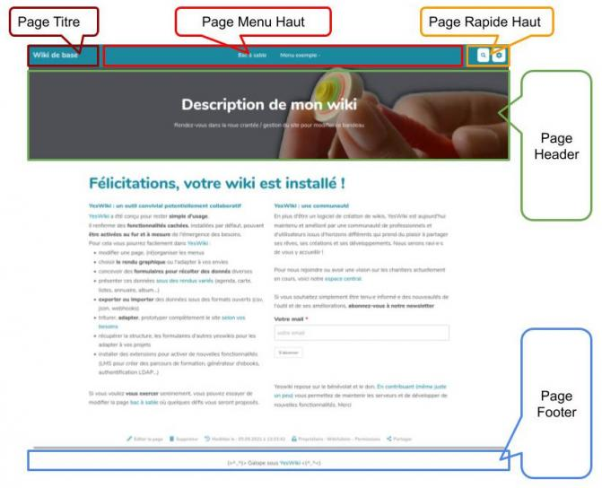
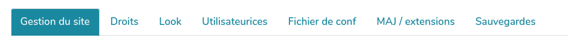

# Prise en main

Tout ce que vous devez savoir pour bien débuter avec YesWiki !

## Editer une page

Pour passer en mode édition, trois solutions :

- Utiliser le lien **éditer** en bas de page
- Double cliquer dans la page
- Ajouter /edit à la fin de l'adresse de la page

!> Vous n'arrivez pas à éditer une page YesWiki, elle a certainement été fermée en écriture

### Syntaxe YesWiki

YesWiki utilise des balises plus ou moins complexes pour les styles, les actions et autre astuces de mise en forme.
Par exemple, un texte en **gras** s'affiche `**`**gras**`**`

- Pour supprimer les balises, il faut les supprimer avant **ET** après l'élément impacté
- Pour des balises plus complexes comme `{{section bgcolor="var(--primary-color)" class="shape-rounded" pattern="border-solid" }}Texte encadré{{end elem="section"}}` (oui, on sait, ça fait peur au début) il faut bien supprimer tout ce qui est avant **ET** après "Texte encadré".

Deux solutions en cas de soucis :

- revenir sur une version précédente de la page
- supprimer tous les codes de la partie impactée et remettre les choses en place calmement

> Exemple: si tout le texte de ma page est en gras ou en italique, c'est souvent une balise qui est ouverte et n'est pas fermée, par exemple : `**texte en gras`

### Mise en forme

La plupart des mises en forme standard (gras, encadré, titre...) sont accessible via les boutons de l'éditeur. Certaines mise en forme sont également accessibles dans le menu `Composants`.
En voici quelqu'unes supplémentaires

### Markdown arrive dans YesWiki

Vous pouvez utiliser les syntaxes mardown suivante

```yeswiki preview
**Gras**
*Italique*
~~Souligné~~
# Titre 1
## Titre 2
### Titre 3
#### Titre 4
##### Titre 5
[Lien](https://yeswiki.net)
```

#### Listes

```yeswiki preview
 - Liste à puce niveau 1
 - Puce niveau 1
   - Puce niveau 2
   - Puce niveau 2
 - Puce niveau 1

 1) Liste énumérée
 2) Liste énumérée
 3) Liste énumérée
```

> Remarque : en mode édition, il faut parfois sauter une ligne après une liste à puce pour garder la coloration syntaxique...

#### Tableaux

```yeswiki preview
[|
|**Nom**  |**prénom** |**Couleurs préférées** |
|Lagaffe  |Gaston     |jaune                  |
|Lapalice |Jean       |vert                   |
|]
```

#### Écrire du code HTML

Si vous déposez du HTML dans la page wiki, il faut l'entourer de `""` pour qu'il soit interprété

```yeswiki
""<b>Ceci est du HTML</b>""
```

#### Créer une ancre : un lien qui envoie sur une partie de votre page

```yeswiki
""<a href="#ancre1">Texte du lien pour aller vers le paragraphe cible</a>""

...

""<div id="ancre1"></div>""
Paragraphe vers lequel on arrivera en cliquant sur le lien
```

#### Mettre du texte en couleur

```yeswiki
""<span style="color:#votrecodecouleur;">votre texte à colorer</span>""
```

De nombreux site vous aideront à trouver le code couleur, [comme celui-ci](https://rgbacolorpicker.com/hex-color-picker)

#### Utiliser des icônes

Il est possible de copier des Emoji depuis des sites sources puis de les coller dans votre wiki. [Par exemple sur ce site](http://getemoji.com)

Les icones du site de [Font awesome](https://fontawesome.com/v5/search?o=r&m=free) sont également accessibles. Il vous suffit de mettre le code donné sur le site, par exemple

```yeswiki
""<i class="fas fa-yin-yang"></i>""
```

#### Barre de progression

```yeswiki preview=120
[10%]
[50%]
[85%]
```

## Ajouter un lien au texte sélectionné

Sélectionnez un texte destiné à devenir un lien puis cliquez sur le petit chaînon dans la barre d'édition, vous pourrez ainsi

- ajouter un lien vers un site web
- ajouter un lien vers une page de votre wiki qui apparaitra par autocomplétion NB. si la page n'existe pas, elle sera créée
- indiquer un texte qui s'affichera au survol du lien
- proposer que le lien s'ouvre
- dans l'onglet courant
- dans un nouvel onglet
- sous forme de fenêtre modale (pop up)

## Créer une page

**Trois méthodes sont à votre disposition pour créer une page**

1. Cliquez sur le petit bouton plus de la barre d'édition, entrez le nom de la page, le texte du lien. Si une page au nom similaire existe déjà, un petit message d'alerte vous l'indiquera.
2. Lors de l'édition d'une page, cliquez sur l'icône pour ajouter un lien. Dans la fenêtre qui s'ouvre, inscrivez le nom de votre nouvelle page yeswiki, cette dernière sera créée automatiquement.
3. Allez directement vers l'URL de la page que vous souhaitez créer (exemple : https://yeswiki.net/?MaNouvellePage). Comme elle n'existe pas encore on vous proposera de la créer.

> Astuce 1: une fois ma nouvelle page créée, je peux enlever le lien qui y mène sans que la page disparaisse pour autant. Je peux retrouver mes pages dans la roue crantée en haut à droite > Tableau de bord. Une bonne manière de cacher des pages ;-)

!> **Règle de nommage** : le nom des pages YesWiki ne doivent contenir ni espaces ni caractères spéciaux. Pour les rendre lisible, le mieux est d'utiliser des tirets `nom-de-ma-page`, ou des majuscules `NomDeLaPage` (c'est ce qu'on appelle un `ChatMot`)

> Astuce 2: YesWiki va interpréter tout ChatMot comme une nouvelle page. Si on veut écrire un ChatMot sans créer de nouvelle page (par exemple pour écrire YesWiki sans créer de lien), on l'encadre de double guillemets:

## Revenir à la version précédente d'une page

Dans YesWiki chaque modification d'une page est sauvegardée dans un **historique**. Par défaut il est possible de voir les 30 versions antérieures d'une page et, ce qui est souvent bien pratique, de restaurer une version antérieure.

**Pour y accéder** il suffit de cliquer sur le lien en bas de page nommé : "Dernière édition : _jour_._mois_._année_"

!> Attention, l'historique est accessible uniquement aux personnes qui ont les droits en écriture sur la page concernée.

## Insérer et gérer les médias (images, pdf...)

Lors de l'édition d'une page, il vous est facile de téléverser différents type de documents grâce au bouton "Fichier". Cela créera un bout de code qui ressemble à cela

```
{{attach file="mon_image.png" desc="Une jolie image" }}
```

> Pour les vidéos, il est préférable de les héberger sur un site spécifique puis de les insérer via le composant "Vidéo intégrée"

### Réutiliser le fichier sur une autre page

Chaque fichier sera lié à la page dans laquelle il a été téléversé. Si vous copiez le code dans une autre page cela ne fonctionnera pas. Il faudra préfixer le nom du fichier par le nom de la page, par exemple :

```
{{attach file="PagePrincipale/mon_image.png" desc="Une jolie image" }}
```

Si le fichier n'est pas trouvé, un bouton de téléversement sera affiché à la place

### Gérer les fichiers attachés à une page

Ajoutez `/filemanager` à l'URL de votre page pour voir la liste des fichiers qui ont été téléversés sur celle-ci. Par exemple https://yeswiki.net/?AccueiL/filemanager

## Insérer des éléments d'un autre site (iframe)

> Une **iframe** est un petit bout de code qui permet à une page d'embarquer (encapsuler, intégrer... _embed_ en anglais) des contenus et fonctionalités issus d'autres sites internet.

Vous pouvez ainsi profiter des fonctionnalités de cet autre site au sein même de votre wiki : lire une vidéo, écrire dans un pad et bien d'autre... Voici comment faire :

### Trouver le code iframe permettant l'intégration

On le trouve souvent dans les options _Partager_, _Intégrer_ ou encore _iframe_. Il ressemble à quelque chose comme ça:

```
<iframe src="https://unsite.com/iframe" ...></iframe>
```

### Collez ce code dans la page wiki

Il faudra juste penser à ajouter avant et après **deux guillemets**.

```
""<iframe src="https://unsite.com/iframe" ...></iframe>""
```

### Bricoler le code

Dans le bout de code à copier-coller, plusieurs paramètres peuvent être ajoutés/modifiés :

Les paramètres `width` (largeur) et `height` (hauteur) permettent de **spécifier la taille de l'iframe** et ils sont renseignés en pixels ou en pourcentage.

```
<iframe src="..." width="100%" height="500"></iframe>
```

Pour que la **hauteur se calcule automatiquement**, utilisez le paramètre `class`

```
<iframe src="..." class="auto-resize"></iframe>
```

Le paramètre `frameborder` permet de **gérer la bordure** noire du cadre (`1` pour activer, `0` pour désactiver)

```
<iframe src="..." frameboder="0"></iframe>
```

## Structure du wiki

### La composition d'une page

#### Par défaut une page wiki contient :

- une **Page Titre** : c'est le nom du wiki
- une **Page Menu Haut** : on peut y ajouter des liens vers les pages du wiki (menu et sous-menu)
- une **Page Rapide Haut** : il s'agit des pages d'administration du wiki, la roue crantée en haut à droite
- une **Page Header** : c'est une partie utile pour écrire le titre donné au wiki, ajouter une description, un logo...
- une **Page Footer** : autrement dit un pied de page, où se trouvent diverses informations au sujet due wiki



Pour modifier ces pages spéciales, allez dans la roue crantée puis "Gestion du site"

### Zoom sur la PageMenuHaut

La PageMenuHaut est organisée comme une liste de liens ou de boutons.

- Les puces de premier niveau (un seul espace avant le tiret) seront toujours apparents dans le menu.
- Les puces de deuxième niveau (deux espaces avant le tiret) permettent de créer des sous menus

```yeswiki
 - [[PageDemo Démo]]
 - Test
  - [[Pagetest1 Sous menu 1]]
  - [[PageTest2 Sous menu 2]]
 - {{button icon="fas fa-leaf" link="PageMargot" text="Margot" }}
```

!> A noter : lorsque que vous souhaitez mettre en place un menu déroulant, un simple mot suffira en premier niveau de liste à puce et non une page wiki.

### Visite de la roue crantée

La roue crantée (en haut à droite) donne accès à un certain nombre d'espaces dédiés à l'administration du wiki

#### Gestion du site

Cette page gestion du site est très importante. Elle donne accès à de nombreuses fonctionnalités d'administration :



[Voir la page dédiée](admin.md)

#### Tableau de bord

Dans le tableau de bord, vous pouvez voir :

- les derniers comptes utilisateurs créés
- les dernières pages modifiées
- la liste exhaustive des pages du wiki

C'est le tableau de bord configuré par défaut mais vous pouvez le personnaliser.

#### Base de données

C'est ici que l'on configure Bazar : Bazar est une extension importante de YesWiki qui lui ajoute des fonctionnalités de création et de gestion de bases de données (formulaires).

Il faut être identifié comme administrateur pour créer ou modifier un formulaire Bazar. [Voir la page dédiée](bazar.md)

## Les composants

Les composants sont des éléments que l'on peut rajouter dans une page wiki. Ils sont accessible depuis le menu "Composants" dans l'éditeur de page.
Utiliser les composants ajoutera un code (parfois compliqué) dans votre page. Mais rassurez vous, une interface vous permet de facilement créer et modifier simplement chacune des fonctionnalités de votre composant.
Si vous souhaitez modifier une action déjà insérée dans une page, en mode édition, cliquez sur le code, un petit crayon apparaîtra dans la marge (sauf pour accordéon et colonnes), en cliquant dessus, l'interface d'aide à la modification du code apparaitra en pop up.

Voici une liste des composants disponibles :

### Boutons

Le composant bouton permet de créer un bouton avec des icônes, qui enverra sur une page du wiki ou un autre site. Les combinaisons entre les différents paramètres vous permettrons de faire bouton à votre pied.
Quelques fonctionnalités potentiellement intéressantes :

- Masquer le bouton si l'utilisateur n'a pas droit d'accès à cette page
- Afficher la page liée juste au survol du bouton
- Afficher le bouton uniquement sous forme de lien, à première vue anodine, cette action permet d'utiliser toutes les possibilités d'un bouton sur un simple lien, par exemple, cacher un lien du menu si les visiteurs n'ont pas accès aux contenus qui se trouvent derrière ou afficher automatiquement la définition d'un mot lors de son survol.

### Mise en forme (mise en page)

Mise en forme propose 6 possibilités :

- **Étiquette** : mettre en avant un texte au travers d’une couleur de fond.
- **Onglets avec des parties d'une même page**, créer des onglets appelant divers paragraphes de votre page
- **Onglet avec des pages différentes**, créer des onglets dans une page appelant diverses pages de votre wiki, permet d’obtenir des sous menus horizontaux ou verticaux. Utile pour proposer plusieurs affichages des résultats d'un formulaire
- **Encadré** : encadrer un texte ou proposer un encadré qui se ferme quand on clique sur son titre.
- **Section** : couteau suisse de mise en forme, permet d’encadrer un paragraphe, de lui adjoindre une couleur ou une image de fond et beaucoup d’autres combinaisons.
  - Quelques fonctionnalités potentiellement intéressantes :
    - créer des aplats de couleurs sous du texte
    - encadrer un paragraphe
    - afficher un élément sur toute la largeur de l'écran
    - justifier du texte
    - Animer votre section (rebonds, déformation...)
    - Réserver la lecture de cette section à un groupe
    - Afficher une image sous le texte qui restera fixe lors du scroll
- **Afficher des encadrés en accordéon** : déclinaison d’encadré, accordéon permet de présenter plusieurs encadrés dépliables. Cela permet de présenter une certaine quantité de textes ou d'éléments sur une page en laissant la possibilité à l'utilisateur de les ouvrir ou de les cacher. Quand vous ouvrez un encadré les autres se ferment.

  - (cette action ne bénéficie pas encore d'interface pour le paramétrage) ;
  - L'objet "Accordéon" s'ouvre et se ferme avec les balises :

  ```yeswiki
  {{accordion}}
  {{end elem="accordion"}}
  ```

  - Pour ajouter des éléments (que l'on nomme : panels) à votre accordéon, il suffira d'ajouter le code suivant entre les deux balises de l'accordéon. Chaque panel pourra être personnalisé en cliquant sur le crayon en marge du code correspondant.

  ```yeswiki
  {{panel title="Titre 1"}}
  Le texte
  {{end elem="panel"}}
  ```

  - Ce qui donne :

  ```yeswiki
  {{accordion}}
  {{panel title="Titre 1"}}
  Le texte du panel 1
  {{end elem="panel"}}
  {{end elem="accordion"}}
  ```

  - Il est possible de poser plusieurs "panels" dans un seul Accordéon :

  ```yeswiki
  {{accordion}}
  {{panel title="Titre 1"}}
  Le texte
  {{end elem="panel"}}
  {{panel title="Titre 2"}}
  Le texte du panel 2
  {{end elem="panel"}}
  {{end elem="accordion"}}
  ```

  - **Les paramètres de panels** Ces paramètres s'utilisent dans la balise `panel`
    - `title="le titre"` : Permet de définir le titre.
    - `class="panel-success"`: Permet de définir la couleur dominante de l'accordéon (essayez aussi d'autre couleurs : panel-info, panel-warning, panel-danger...).
    - `type="collapsible` : permet de laisser ouvert le panel lorque la page sera chargé.

- **Afficher plusieurs colonnes** : permet de créer plusieurs colonnes dans une page ou une partie de page, très utile pour des mises en page avancées.
  - cette action ne bénificie pas encore d'aide au codage. Pour ajouter ou supprimer des colonnes à votre tableau, il suffira d'ajouter ou supprimer le code suivant) avant {{end elem="grid"}}.

```yeswiki
{{col size="3"}}
Texte de la colonne à changer par la suite
{{end elem="col"}}
```

!> important : la somme des size (largeur) de vos colonnes doit être égal à 12, cela veut dire que vous pouvez faire 12 colonnes de size 1 ou 3 colonnes de size 4 et bien sur mixer les possibilités (une de 6 et deux de 3)

### Syndication / Flux RSS

Permet d'afficher des informations arrivant de sites internet externe, permet de créer une page de veille.

### Gestion des tags

Dans chaque page (en bas en mode édition) ou fiche d’un formulaire, vous pouvez ajouter des mots clefs ou tags. Gestion des tags vous propose 3 actions :

- Créer une liste des pages par tag
- Nuage de tags
- Lien RSS vers la liste pour des tags donnés

### Réactions / Votes

Ce composant vous offre trois possibilités :

- Réactions et votes
  - Si à la place des icones vous souhaitez mettre une image à votre convenance, il suffir de remplacer le code de l'icone par l'adresse web de l'image : images="fab fa-angellist" par images="https://yeswiki.net/files/toto.jpg"
- Réactions de l'utisateur.ice connecté.e
- Administration des réactions

### Vidéo intégrée

Afficher une vidéo proposée par PeerTube, Viméo ou Youtube à partir de son identifiant.

### Actions d'envoi d'e-mail/listes

Permet 3 actions :

- Afficher un formulaire de contact
- S’abonner à une liste de discussion (qui devra être créée par ailleurs)
- Se désabonner à une liste de discussion

### Afficher les données d'un formulaire

Afficher les données d’un formulaire : véritable logiciel dans YesWiki, le gestionnaire de formulaire vous permet d’en créer mais ensuite d’afficher les résultats. Avec cette action, vous pourrez afficher les données des 4 formulaires fournis par défaut :

- Annuaire
- Agenda
- Blog-Actu
- Ressources

Vous pourrez bien sûr afficher les données des formulaires que vous aurez fabriqués. Il vous suffira de choisir le formulaire qui vous intéresse puis de choisir parmi les formes de restitution des résultats : Liste, Blocs, Cartographie, Calendrier, Agenda, Annuaire , Time Line, Carousel, Photobox, Liste de liens, Blog, Tableau.
[Voir la page dédiée](bazar.md)

### Afficher un formulaire de création de fiche

Ce composant est le pendant de l’action précédente, il permet d’afficher l’espace de saisie correspondant au formulaire qui vous intéresse.

### Actions avancées

De nombreuses autres actions sont disponibles dans les composants, rubrique Actions avancées

#### Créer un sommaire de la page

#### Afficher des liens "Page Suivante" "Sommaire" "Page Précédente" dans une page

#### Afficher une barre de progression

#### Recherche de texte

#### Inclure une page dans une autre

#### Rediriger vers une autre page du Wiki

#### Afficher les pages sous forme de liste

#### Afficher les pages qui ont un lien vers la page courante

#### Afficher mes changements

#### Afficher mes pages

#### Afficher le contenu du fichier de configuration

#### Lister les utilisateurs, utilisatrices

#### Liste les derniers changements

#### Liste les derniers commentaires

#### Lister toutes les pages

#### Lister toutes les pages sauf les fiches bazar

#### Lister les pages à créer

#### Lister les pages orphelines

#### Lister seulement les fiches bazar

#### Mode multilangue

Le composant lang YesWiki permettant de proposer une version de votre page dans une autre langue .
Sur une même page vous pouvez avoir :

- un texte en francais, il sera précédé par {{lang="fr"}}
- un texte en anglais, il sera précédé par {{lang="en"}}
- un texte en espagnol, il sera précédé par {{lang="es"}}
  Exemple

```
{{lang="fr"}}
=====Bienvenue=====

{{lang="en"}}
=====Welcome=====

{{lang="es"}}
=====Bienvenido=====
```

Le composant translation permet aux utilisateurs de **choisir leur langue**. En l'ajoutant dans votre barre de menu le composant translation, il permettra d'ajouter des drapeaux pour identifier les langues de votre choix.
Lorsqu'un utilisateur clique sur un drapeau anglais alors les contenus précédés de lang="en" seront affichés
Exemple de code à ajouter dans le menu :

```
 - {{translation destination="fr"}}
 - {{translation destination="en"}}
 - {{translation destination="es"}}
```

### Les Handlers : accéder à certains fonctionalités via l'URL

---

Un handler est une URL spéciale qui permet de modifier la façon d'afficher une page. On l'active en ajoutant à la fin de l'adresse URL, le signe **/** suivi du nom du handler. Exemple avec le handler `raw`: https://yeswiki.net/?AccueiL/raw

> Certains handler permettent juste d'accéder à une fonctionalité à laquelle on peut accéder via des boutons de l'interface. C'est le cas pour `edit`, `revisions` ou `share`. Lorsque vous naviguez dans votre wiki, soyez attentif aux changement d'URL pour connaitre ces raccourcis

- **/edit** : pour passer en mode Édition
- **/revisions** : pour voir les versions de l'historique
- **/filemanager** : pour accéder à la liste des fichiers attachés à cette page
- **/slide_show** : pour transformer le texte en diaporama
- **/diaporama** : idem slide_show en un peu différent
- **/mail** : envoie la page en mailing
- **/raw** : affiche le code wiki non formaté de la page
- **/deletepage** : si vous êtes propriétaire de la page, vous pouvez la supprimer
- **/claim** : si la page n'a pas de propriétaire, vous pouvez vous l'approprier
- **/acls** : si vous êtes propriétaire de la page, vous pouvez gérer les droits
- **/share** : pour afficher des possibilités de partage sur les réseaux sociaux, et pour générer un code embed (iframe) qui permettra d'afficher la page sur un site externe.
- **&amp;debug** : permet d'afficher en bas de page toutes les actions effectuées au niveau informatique, permet de repérer les bugs, causes de plantage...
- **/editiframe** : permet d'ouvrir la page en mode édition mais en cachant les autres pages du squelette (utile quand une image ou un spam sur le bandeau empêche de voir le contenu de la page à modifier ou dans le cas d'un wiki intégré en iframe)
