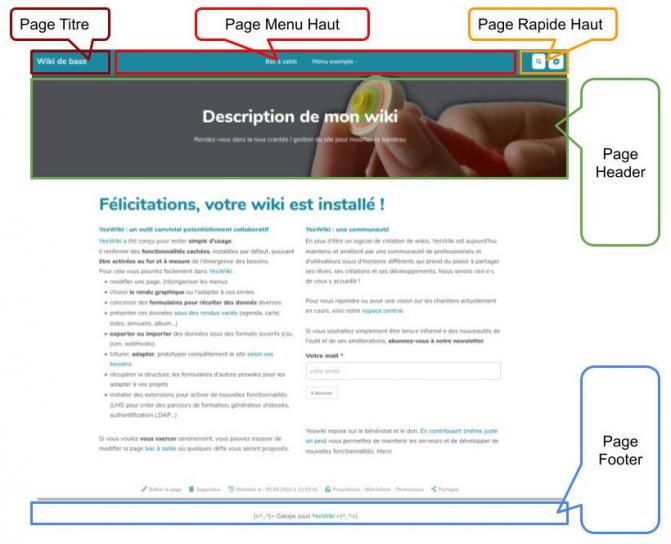
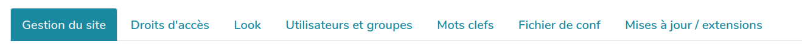

# Prise en main

Tout ce que vous devez savoir pour bien débuter avec YesWiki !

## 1. Editer une page

Pour passer en mode édition, trois solutions :

- Utiliser le lien **éditer** en bas de page
- Double cliquer dans la page
- Ajouter l'handler /edit à la fin de l'adresse de la page

!> Vous n'arrivez pas à éditer une page YesWiki, elle a certainement été fermée
en écriture

### 1.1 Syntaxe YesWiki

YesWiki utilise des balises plus ou moins complexes pour les styles, les actions
et autre astuces de mise en forme. Par exemple, un texte en **gras** s'affiche
`**`**gras**`**`

- Pour supprimer les balises, il faut les supprimer avant **ET** après l'élément
  impacté
- Pour des balises plus complexes comme
  `{{section bgcolor="var(--primary-color)" class="shape-rounded" pattern="border-solid" }}Texte encadré{{end elem="section"}}`
  (oui, on sait, ça fait peur au début) il faut bien supprimer tout ce qui est
  avant **ET** après "Texte encadré".

Deux solutions en cas de soucis :

- revenir sur une version précédente de la page
- supprimer tous les codes de la partie impactée et remettre les choses en place
  calmement

?>**Exemple:** si tout le texte de ma page est en gras ou en italique, c'est
souvent une balise qui est ouverte et n'est pas fermée, par exemple :
`**texte  en gras`

### 1.2 Mise en forme

La plupart des mises en formes standards (gras, encadré, titre...) sont
accessibles via les boutons de l'éditeur. Certaines mise en forme sont également
accessibles dans le menu `Composants`.

### 1.3 Markdown arrive dans YesWiki

Vous pouvez utiliser les syntaxes mardown suivante

```yeswiki preview
**Gras**
*Italique*
~~Souligné~~
# Titre 1
## Titre 2
### Titre 3
#### Titre 4
##### Titre 5
[Lien](https://yeswiki.net)
```

#### 1.3.1 Listes

```yeswiki preview
 - Liste à puce niveau 1
 - Puce niveau 1
   - Puce niveau 2
   - Puce niveau 2
 - Puce niveau 1

 1) Liste énumérée
 2) Liste énumérée
 3) Liste énumérée
```

?>**Remarque :** en mode édition, il faut parfois sauter une ligne après une
liste à puce pour garder la coloration syntaxique...

#### 1.3.2 Tableaux

```yeswiki preview
[|
|**Nom**  |**prénom** |**Couleurs préférées** |
|Lagaffe  |Gaston     |jaune                  |
|Lapalice |Jean       |vert                   |
|]
```

#### 1.3.3 Écrire du code HTML

Si vous déposez du HTML dans la page wiki, il faut l'entourer de doubles
guillemets `""` pour qu'il soit interprété

```yeswiki
""<b>Ceci est du HTML</b>""
```

#### 1.3.4 Créer une ancre

Une ancre est un lien qui au clic renvoi à une autre partie d'une même page.

Le texte encadré de cette manière :

```yeswiki
""<a href="#ancre1">Texte du lien pour aller vers le paragraphe cible</a>""
```

Renverra au clic vers cette autre partie de votre page :

```yeswiki
""<div id="ancre1"></div>""
Paragraphe vers lequel on arrivera en cliquant sur le lien
```

#### 1.3.5 Mettre du texte en couleur

Il est possible de colorer du texte de la manière suivante :

```yeswiki
""<span style="color:#votrecodecouleur;">votre texte à colorer</span>""
```

Le `#votrecodecouleur` devra être remplacé par le code html de la couleur
désiré.

De nombreux site vous aideront à trouver ce code couleur,
[comme celui-ci](https://rgbacolorpicker.com/hex-color-picker).

#### 1.3.6 Utiliser des icônes

Il est possible de copier des Emoji depuis des sites sources puis de les coller
dans votre wiki. [Par exemple depuis ce site](http://getemoji.com)

Les icones du site de
[font awesome](https://fontawesome.com/v5/search?o=r&m=free) sont également
accessibles. Il vous suffit de mettre le code donné sur le site, par exemple

```yeswiki
""<i class="fas fa-yin-yang"></i>""
```

#### 1.3.7 Barre de progression

```yeswiki preview=120
[10%]
[50%]
[85%]
```

## 2 Créer un lien ou une page

Sélectionnez un texte destiné à devenir un lien puis cliquez sur le petit
chaînon dans la barre d'édition, vous pourrez ainsi

- ajouter un lien vers un site web
- ajouter un lien vers une page de votre wiki qui apparaitra par autocomplétion.
- Créer une nouvelle page en inscrivant un nom qui n'exista pas déjà.
- indiquer un texte qui s'affichera au survol du lien
- proposer que le lien s'ouvre
  - dans l'onglet courant
  - dans un nouvel onglet
  - sous forme de fenêtre modale (pop up)

## 3. Créer une page

**Deux méthodes sont à votre disposition pour créer une page**

1. Lors de l'édition d'une page, cliquez sur l'icône chainon pour ajouter un
   lien. Dans la fenêtre qui s'ouvre, inscrivez le nom de votre nouvelle page
   yeswiki, cette dernière sera créée automatiquement. Un système
   d'autocomplétion vous indiquera si une page existe déjà.
2. Allez directement vers l'URL de la page que vous souhaitez créer (exemple :
   https://yeswiki.net/?MaNouvellePage). Comme elle n'existe pas encore on vous
   proposera de la créer.

?> **Astuce 1** Une fois ma nouvelle page créée, je peux enlever le lien qui y
mène sans que la page disparaisse pour autant. Je peux retrouver mes pages dans
la roue crantée en haut à droite > Tableau de bord. Une bonne manière de cacher
des pages ;-)

?> **Attention !** Le nom des pages YesWiki ne doivent contenir ni espaces ni
caractères spéciaux. Pour les rendre lisible, le mieux est d'utiliser des tirets
`nom-de-ma-page`, ou des majuscules `NomDeLaPage` (c'est ce qu'on appelle un
`ChatMot`)

?> **Astuce 2** YesWiki va interpréter tout ChatMot comme une nouvelle page. Si
on veut écrire un ChatMot sans créer de nouvelle page (par exemple pour écrire
YesWiki sans créer de lien), on l'encadre de double guillemets: `""YesWiki""`

## 4. Revenir à la version précédente d'une page

Dans YesWiki chaque modification d'une page est sauvegardée dans un
**historique**. Par défaut il est possible de voir les 30 versions antérieures
d'une page, ce qui est souvent bien pratique, de restaurer une version
antérieure.

**Pour y accéder** il suffit de cliquer sur le lien en bas de page nommé :
"Dernière édition : _jour_._mois_._année_"

!> **Attention** L'historique est accessible uniquement aux personnes qui ont
les droits en écriture sur la page concernée.

## 5. Insérer et gérer les médias (images, pdf...)

### 5.1 Insérer

Lors de l'édition d'une page, il vous est facile de téléverser différents type
de documents grâce au bouton "Fichier". Cela créera un bout de code qui
ressemble à cela

```
{{attach file="mon_image.png" desc="Une jolie image" }}
```

!> **Attention!** Pour les vidéos, il est préférable de les héberger sur un site
spécifique puis de les insérer via le composant "Vidéo intégrée"

### 5.2 Réutiliser le fichier sur une autre page

Chaque fichier sera lié à la page dans laquelle il a été téléversé. Si vous
copiez le code dans une autre page cela ne fonctionnera pas. Il faudra préfixer
le nom du fichier par le nom de la page, par exemple :

```
{{attach file="PagePrincipale/mon_image.png" desc="Une jolie image" }}
```

Si le fichier n'est pas trouvé, un bouton de téléversement sera affiché à la
place

- Les jpg, gif, png, svg permettront d'accéder à une interface pour centrer les
  images, proposer des tailles...
- Les mp3, mp4, flv permettront d'afficher un player son ou vidéo.
- Les pdf permettront soit d'accéder à un lien vers le fichier soit de
  l'afficher dans la page.
- Tout autre extension proposera un lien pour télécharger le fichier.

### 5.2 Gérer les fichiers attachés à une page

Cliquez, en mode admin sur l'icone dossier en bas de la page ou ajoutez
`/filemanager` à l'URL de votre page pour voir la liste des fichiers qui ont été
téléversés sur celle-ci. Par exemple https://yeswiki.net/?AccueiL/filemanager

## 6. Insérer des éléments d'un autre site (iframe)

!> Une **iframe** est un petit bout de code qui permet à une page d'embarquer
(encapsuler, intégrer... _embed_ en anglais) des contenus et fonctionalités
issus d'autres sites internet.

Vous pouvez ainsi profiter des fonctionnalités de cet autre site au sein même de
votre wiki : lire une vidéo, écrire dans un pad et bien d'autre... Voici comment
faire :

### 6.1 Trouver le code iframe permettant l'intégration

On le trouve souvent dans les options _Partager_, _Intégrer_ ou encore _iframe_.
Il ressemble à quelque chose comme ça:

```
<iframe src="https://unsite.com/iframe" ...></iframe>
```

### 6.2 Collez ce code dans la page wiki

Il faudra juste penser à ajouter avant **et** après deux guillemets `""`.

```
""<iframe src="https://unsite.com/iframe" ...></iframe>""
```

### 6.3 Bricoler le code

Dans le bout de code à copier-coller, plusieurs paramètres peuvent être
ajoutés/modifiés :

Les paramètres `width` (largeur) et `height` (hauteur) permettent de **spécifier
la taille de l'iframe** et ils sont renseignés en pixels ou en pourcentage.

```
<iframe src="..." width="100%" height="500"></iframe>
```

Pour que la **hauteur se calcule automatiquement**, utilisez le paramètre
`class`

```
<iframe src="..." class="auto-resize"></iframe>
```

Le paramètre `frameborder` permet de **gérer la bordure** noire du cadre (`1`
pour activer, `0` pour désactiver)

```
<iframe src="..." frameboder="0"></iframe>
```

## 7. Structure du wiki

### 7.1 La composition d'une page

#### 7.1.1 Par défaut une page wiki contient :

Une partie de cet habillage est un **réglage** du wiki, éditable dans le tableau
de bord, section _Apparence_ → **Mise en page** (`?admin/layout`) :

- le **titre** : le nom du wiki, en haut à gauche. S'il est laissé vide, c'est le
  nom du wiki (`yeswiki_name`) qui s'affiche
- un **logo**, à afficher seul, ou à côté du titre, ou au-dessus
- le **menu du haut** : une liste de liens, avec un niveau de sous-menus
- les **boutons d'accès rapide** : les boutons à droite de la barre de menu, dont
  le bouton de compte

L'autre partie reste du **contenu wiki**, dans des pages ordinaires, parce que ce
qu'on y met est arbitraire (sections, actions, inclusions) :

- une **Page Header** : le bandeau affiché en haut de toutes les pages
- une **Page Menu** : le menu vertical
- une **Page Footer** : le pied de page



Le tableau de bord donne accès aux deux : la section _Apparence_ pour les
réglages, et un lien vers l'éditeur de chacune des trois pages.

### 7.2 Zoom sur le menu du haut

Le menu du haut est une liste d'entrées, chacune avec un intitulé et un lien, que
l'on ajoute et déplace dans l'écran _Mise en page_.

- une entrée sans lien devient un **menu déroulant** : son intitulé ouvre le menu
- le bouton d'indentation range une entrée **sous celle du dessus**. Il n'y a
  qu'un seul niveau de sous-menu
- un lien peut être un nom de page (`BacASable`), une route (`search`) ou une
  adresse complète (`https://…`)

!> Avant cette version, ce menu était une page wiki nommée `PageMenuHaut`, écrite
comme une liste à puces. Les wikis existants sont convertis automatiquement à la
mise à jour, et ce qui n'a pas pu être converti est signalé dans le journal des
actions administratives — la page, elle, est conservée telle quelle.

### 7.3 Visite de la roue crantée

La roue crantée (en haut à droite) donne accès à un certain nombre d'espaces
dédiés à l'administration du wiki

#### 7.4 Gestion du site

Cette page gestion du site est très importante. Elle donne accès à de nombreuses
fonctionnalités d'administration :



[Voir la page dédiée](admin.md)

#### 7.5 Tableau de bord

Dans le tableau de bord, vous pouvez voir :

- les derniers comptes utilisateurs créés
- les dernières pages modifiées
- la liste exhaustive des pages du wiki

C'est le tableau de bord configuré par défaut mais vous pouvez le personnaliser.

#### 7.6 Formulaire

C'est ici que l'on configure les formulaires : cette fonctionnalité importante
de YesWiki permet la création et de gestion de bases de données (formulaires).

Il faut être identifié comme administrateur pour créer ou modifier un formulaire
Bazar. [Voir la page dédiée](bazar.md)

## 8. Les composants

Les composants sont des éléments que l'on peut rajouter dans une page wiki. Ils
sont accessible depuis le menu "Composants" dans l'éditeur de page. Utiliser les
composants ajoutera un code (parfois compliqué) dans votre page. Mais rassurez
vous, une interface vous permet de facilement créer et modifier chacune des
fonctionnalités de votre composant. Si vous souhaitez modifier une action déjà
insérée dans une page, en mode édition, cliquez sur le code, un petit crayon
apparaîtra dans la marge, en cliquant dessus, l'interface d'aide à la
modification du code apparaitra en pop up.

Voici une liste des composants disponibles :

### 8.1 Boutons

Le composant bouton permet de créer un bouton avec des icônes, qui enverra sur
une page du wiki ou un autre site. Les combinaisons entre les différents
paramètres vous permettrons de faire bouton à votre pied. Quelques
fonctionnalités potentiellement intéressantes :

- Masquer le bouton si l'utilisateur n'a pas droit d'accès à cette page
- Afficher la page liée juste au survol du bouton
- Afficher le bouton uniquement sous forme de lien, à première vue anodine,
  cette action permet d'utiliser toutes les possibilités d'un bouton sur un
  simple lien, par exemple, cacher un lien du menu si les visiteurs n'ont pas
  accès aux contenus qui se trouvent derrière ou afficher automatiquement la
  définition d'un mot lors de son survol.

### 8.2 Mise en forme (mise en page)

Mise en forme propose 7 possibilités :

- **Étiquette** : mettre en avant un texte au travers d’une couleur de fond.
- **Onglets avec des parties d'une même page**, créer des onglets appelant
  divers paragraphes de votre page
- **Onglet avec des pages différentes**, créer des onglets dans une page
  appelant diverses pages de votre wiki, permet d’obtenir des sous menus
  horizontaux ou verticaux. Utile pour proposer plusieurs affichages des
  résultats d'un formulaire
- **Encadré** : encadrer un texte ou proposer un encadré qui se ferme quand on
  clique sur son titre.
- **Section** : couteau suisse de mise en forme, permet d’encadrer un
  paragraphe, de lui adjoindre une couleur ou une image de fond et beaucoup
  d’autres combinaisons.
  - Quelques fonctionnalités potentiellement intéressantes :
    - créer des aplats de couleurs sous du texte
    - encadrer un paragraphe
    - afficher un élément sur toute la largeur de l'écran
    - justifier du texte
    - Animer votre section (rebonds, déformation...)
    - Réserver la lecture de cette section à un groupe
    - Afficher une image sous le texte qui restera fixe lors du scroll
- **Afficher des encadrés en accordéon** : déclinaison d’encadré, accordéon
  permet de présenter plusieurs encadrés dépliables. Cela permet de présenter
  une certaine quantité de textes ou d'éléments sur une page en laissant la
  possibilité à l'utilisateur de les ouvrir ou de les cacher. Quand vous ouvrez
  un encadré les autres se ferment.

- **Afficher plusieurs colonnes** : permet de créer plusieurs colonnes dans une
  page ou une partie de page, très utile pour des mises en page avancées.

!> **Attention !** La somme des size (largeur) de vos colonnes doit être égal à
12, cela veut dire que vous pouvez faire 12 colonnes de size 1 ou 3 colonnes de
size 4 et bien sur mixer les possibilités (une de 6 et deux de 3)

### 8.3 Syndication / Flux RSS

YesWiki est capable d'afficher des informations émisent par d'autres sites-web
sous forme de flux rss.

!> Pour afficher un flux RSS il faut déjà disposer de son URL. Pour le trouver
on peut installer sur son naviguateur un détecteur de flux RSS comme par exemple
"Awesome RSS" avec firefox.

Cette option se trouve dans les composants, sélectionner "Syndication / Flux
RSS".

- **Adresse du flux RSS :** Permet de spécifier l'URL du flux auquel on souhaite
  s'abonner. Il est possible de s'abonne à plusieurs flux en séparant les
  différentes URLs par des virgules ",".
- **Titre des flux :** Lister les noms des fluxs un par un dans le même ordre
  que les URLs en les séparant par des virgules.
- **Nb d'infos à afficher :** Limitera le nombre d'éléments affichés au nombre
  renseigné.
- **Affiches les dates de publications :** Permet de demander l'affichage des
  dates des éléments et d'en spécifier le format.
- **Mapping vers une fiche bazar :** Avec ce paramètre il est possible de
  renvoyer les données issus du flux RSS dans un formulaire. Pour sélectionner
  le formulaire entrer la valeur suivante `id=xx` en remplaçant `xx` par l'ID du
  formulaire cible.

!> Si le mapping est renseigné, il sera possible en cliquant sur le symbole "+"
à la fin de chaque article d'envoyer l'article en question dans le formulaire
qui a été renseigné.

!> Il est possible de modifier les paramètres par défaut suivant si les
identifiants différents des standarts.

```
id=1400,title=bf_titre,url=bf_url,description=bf_description,image=imagebf_image,categories=bf_tags
```

### 8.4 Gestion des tags

Dans chaque page (en bas en mode édition) ou fiche d’un formulaire, vous pouvez
ajouter des mots clefs ou tags. Gestion des tags vous propose 3 actions :

- Créer une liste des pages par tag
- Nuage de tags
- Lien RSS vers la liste pour des tags donnés

### 8.5 Réactions / Votes

Ce composant vous offre trois possibilités :

- Réactions et votes
  - Si à la place des icones vous souhaitez mettre une image à votre convenance,
    il suffir de remplacer le code de l'icone par l'adresse web de l'image :
    images="fab fa-angellist" par images="https://yeswiki.net/files/toto.jpg"
- Réactions de l'utisateur.ice connecté.e
- Administration des réactions

### 8.6 Vidéo intégrée

Afficher une vidéo proposée par PeerTube, Viméo ou Youtube à partir de son
identifiant.

### 8.7 Actions d'envoi d'e-mail/listes

Permet 3 actions :

- Afficher un formulaire de contact
- S’abonner à une liste de discussion (qui devra être créée par ailleurs)
- Se désabonner à une liste de discussion

#### 8.7.1 Afficher un formulaire de contact

- Il est possible de définir plusieurs mails pour diriger un envoi de formulaire
  de contact. Pour cela, rentrer les différentes adresses mails en les séparants
  par des virgules.
- Ajouter tous les membres d'un groupe comme par exemple `@admins` (dans ce cas
  tous les membres du groupe recevront un courriel)

**Exemple : Ce que ca donne en language YesWiki** Plusieurs adresses mails :

```
{{contact mail="contact@yw.net,hello@yw.net" }}
```

Un groupe d'utilisateurices :

```
{{contact mail="@admins" }}
```

#### 8.7.2 S’abonner / se désabonner d'une liste de discussion

Une liste de discussion est une adresse mail unique qui renvoi un mail reçu à
une lite de mails. C'est très utile pour ne pas oublier des membres lors
d'envois de mails groupés. Surtout cela permet aux membres de pouvoir se
désinscrire.

Mais avant cela il conviendra de créer une liste de diffusion tel que par
exemple avec l'outil [Frama groupe](https://framagroupes.org).

**Ce que ca donne en language YesWiki** Abonnement :

```
{{subscribe mail="my@mailing.list" }}
```

Désabonnement :

```
{{unsubscribe mail="my@mailing.list" }}
```

### 8.8 Afficher un formulaire de création de fiche

Ce composant est le pendant de l’action précédente, il permet d’afficher
l’espace de saisie correspondant au formulaire qui vous intéresse.

### 8.9 Afficher les données d'un formulaire

Afficher les données d’un formulaire : véritable logiciel dans YesWiki, le
gestionnaire de formulaire vous permet d’en créer mais ensuite d’afficher les
résultats. Avec cette action, vous pourrez afficher les données des 4
formulaires fournis par défaut :

- Annuaire
- Agenda
- Blog-Actu
- Ressources

Vous pourrez bien sûr afficher les données des formulaires que vous aurez
fabriqués. Il vous suffira de choisir le formulaire qui vous intéresse puis de
choisir parmi les formes de restitution des résultats : Liste, Blocs,
Cartographie, Calendrier, Agenda, Annuaire , Time Line, Carousel, Photobox,
Liste de liens, Blog, Tableau. [Voir la page dédiée](bazar.md)

## 9. Actions avancées

De nombreuses autres actions sont disponibles pour faciliter l'affichage, donner
de la visibilité sur le contenu de l'ensemble du wiki ou sur le contenu créé par
un utilisateur.

### 9.1 Actions avancées

#### 9.1.1 Créer un sommaire de la page

Cette action permet de rechercher les titres au sein de la page et de générer un
sommaire automatique. Vous pourrez

- caler le sommaire à gauche ou a droite
- choisir la largeur dédiée au sommaire

#### 9.1.2 Afficher des liens "Page Suivante" "Sommaire" "Page Précédente" dans une page

Si dans une page, vous créez une liste à puce d'une série de page. cette action
permettra ensuite de passer facilement de page en page.

#### 9.1.3 Afficher une barre de progression

Cette action permet de... "ta dam" générer une barre de progression

#### 9.1.4 Recherche de texte

Action puissante permettant de configurer un moteur de recherche sur mesure.
Vous pourrez délimiter la zone à requèter (tel formulaire, tels pages comportant
des tags...) mais aussi paramétrer les formes d'affichage des résultats.

#### 9.1.5 Inclure une page dans une autre

Très utile pour faire circuler du contenu au sein d'un wiki ou pour concaténer
plein de "pages simples" pour générer une page plus complexe. (par exemple,
plein de pages pour rédiger les articles d'une newsletter qui sont agrégées au
sein d'une page qui regroupe "la totale")

#### 9.1.6 Rediriger vers une autre page du Wiki

#### 9.1.7 Afficher les pages sous forme de liste

Permet de se fabriquer des pages de gestion du site aux petits oignons

### 9.2 rendre visible le contenu du wiki

#### 9.2.1 Afficher les pages qui ont un lien vers la page courante

### 9.2 Afficher Mes Contenus

Les actions ci-dessous permettent de récupérer les contenus de l'utilisateur
connecté

#### 9.2.1 Afficher mes changements

L'action `{{mychanges}}` Affiche tout les changements réalisés par l'utilisateur

#### 9.2.2 Afficher mes pages

L'action `{{mypages}}` Affiche toutes les pages dont l'utilisateur est
propriétaire

#### 9.2.3 Afficher mes favoris

L'action

```
{{myfavorites template="my-favorites-tiles.twig" }}
{{myfavorites template="my-favorites-with-titles.twig"}}
{{myfavorites template="my-favorites-table.twig"}}
```

Affiche toutes les favoris de l'utilisateur

#### 9.2.4 Afficher mes fiches bazar

L'action
`{{entrylist template="liste_accordeon" dynamic="true" filteruserasowner="true"}}`

Affiche toutes les fiches bazar dont l'utilisateur est propriétaire

#### 9.2.5 Afficher mes commentaires, mes votes, mes réactions

` {{userreactions}}` Affiche toutes les commentaires, les votes et les réaction
de l'utilisateur connecté

## 10.Gestion des langues dans YesWiki

Le composant lang YesWiki permettant de proposer une version de votre page dans
une autre langue . Sur une même page vous pouvez avoir :

- un texte en francais, il sera précédé par {{lang="fr"}}
- un texte en anglais, il sera précédé par {{lang="en"}}
- un texte en espagnol, il sera précédé par {{lang="es"}} Exemple

```
{{lang="fr"}}
=====Bienvenue=====

{{lang="en"}}
=====Welcome=====

{{lang="es"}}
=====Bienvenido=====
```

Le composant translation permet aux utilisateurs de **choisir leur langue**. En
l'ajoutant dans votre barre de menu le composant translation, il permettra
d'ajouter des drapeaux pour identifier les langues de votre choix. Lorsqu'un
utilisateur clique sur un drapeau anglais alors les contenus précédés de
lang="en" seront affichés Exemple de code à ajouter dans le menu :

```
 - {{translation destination="fr"}}
 - {{translation destination="en"}}
 - {{translation destination="es"}}
```

## 11. Les Handlers : accéder à certains fonctionalités via l'URL

---

Un handler est une URL spéciale qui permet de modifier la façon d'afficher une
page. On l'active en ajoutant à la fin de l'adresse URL, le signe **/** suivi du
nom du handler. Exemple avec le handler `raw`: https://yeswiki.net/?AccueiL/raw

> Certains handler permettent juste d'accéder à une fonctionalité à laquelle on
> peut accéder via des boutons de l'interface. C'est le cas pour `edit`,
> `revisions` ou `share`. Lorsque vous naviguez dans votre wiki, soyez attentif
> aux changement d'URL pour connaitre ces raccourcis

- **/edit** : pour passer en mode Édition
- **/revisions** : pour voir les versions de l'historique
- **/filemanager** : pour accéder à la liste des fichiers attachés à cette page
- **/slide_show** : pour transformer le texte en diaporama
- **/diaporama** : idem slide_show en un peu différent
- **/mail** : envoie la page en mailing
- **/raw** : affiche le code wiki non formaté de la page
- **/deletepage** : si vous êtes propriétaire de la page, vous pouvez la
  supprimer
- **/claim** : si la page n'a pas de propriétaire, vous pouvez vous l'approprier
- **/acls** : si vous êtes propriétaire de la page, vous pouvez gérer les droits
- **/share** : pour afficher des possibilités de partage sur les réseaux
  sociaux, et pour générer un code embed (iframe) qui permettra d'afficher la
  page sur un site externe.
- **&amp;debug** : permet d'afficher en bas de page toutes les actions
  effectuées au niveau informatique, permet de repérer les bugs, causes de
  plantage...
- **/editiframe** : permet d'ouvrir la page en mode édition mais en cachant les
  autres pages du squelette (utile quand une image ou un spam sur le bandeau
  empêche de voir le contenu de la page à modifier ou dans le cas d'un wiki
  intégré en iframe)
