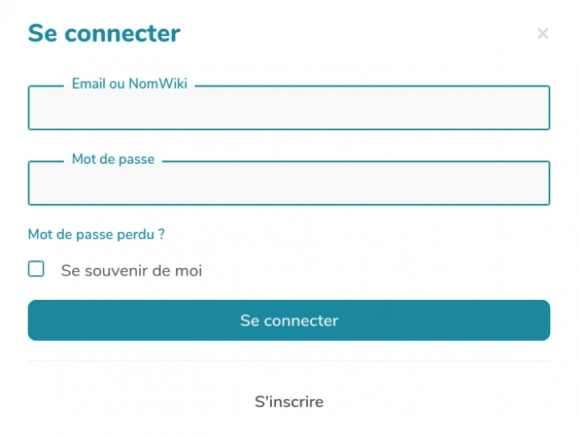
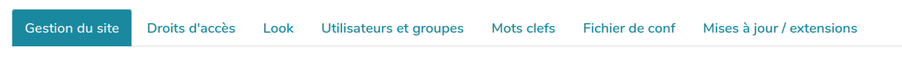

# Prise en main

## Structure du wiki

### La composition d'une page

#### Par défaut une page wiki contient :

*   une **Page Titre** : c'est le nom du wiki
*   une **Page Menu Haut** : on peut y ajouter des liens vers les pages du wiki (menu et sous-menu)
*   une **Page Rapide Haut** : il s'agit des pages d'administration du wiki, la roue crantée en haut à droite
*   une **Page Header** : c'est une partie utile pour écrire le titre donné au wiki, ajouter une description, un logo...
*   une **Page Footer** : autrement dit un pied de page, où se trouvent diverses informations au sujet due wiki


#### Il y a deux manières d'accéder à une page menu pour la modifier :

##### Par la roue crantée


Dans la page Gestion du site, on retrouve les liens vers toutes les pages citées ci-dessus.

##### Par l'url


Pour les menus par défaut ces url sont :  

*   https://www.urldusite.ext/PageTitre
*   https://www.urldusite.ext/PageMenuHaut
*   https://www.urldusite.ext/PageRapideHaut
*   https://www.urldusite.ext/PageHeader
*   https://www.urldusite.ext/PageFooter

### Zoom sur le menu du haut

Pour créer ou modifier un menu...

#### ... il faut savoir créer des liens...

Les titres de menu correspondent à des liens menant à des pages, qu'elles soient déjà créées ou non.  
Ici la page "Démo" n'existe pas : il y a un petit crayon à côté de son nom dans la page (en bas) et dans le menu (en haut). On peut créer la page en cliquant sur son nom, dans la page ou dans le menu.

#### ...et des listes à puces (idem !)

Une page menu est organisée comme une liste de puces. Un niveau de menu correspond au retrait de la puce, soit un ou plusieurs espaces placés en début de ligne :  

*   un seul espace avant le tiret créera un titre de premier niveau (toujours apparent dans le menu). Ici la page "Démo".
*   deux espaces avant le tiret créera un titre de deuxième niveau (apparent après avoir cliqué sur le titre de premier niveau). Ici les pages Test1 et Test2.

N'hésitez pas à vous inspirer du code du menu déjà en place. Un wiki récemment installé a quelques éléments de menu justement pour vous montrer comment ça marche ;-)  


### Visite de la roue crantée

Cliquer sur la roue crantée en haut à droite me donne accès à un certain nombre d'espaces dédiés à l'administration du wiki :


La roue crantée peut être personnalisée sur PageRapideHaut.

#### Se connecter

Ce bouton sert à s'identifier ou à se créer un compte ("s'inscrire") :



#### Aide, démo, actu

Vous avez là une intégration des pages d'aide du site yeswiki.net

#### Présentation YesWiki

Cette page vous décrit YesWiki et sa communauté.

#### Gestion du site

Cette page gestion du site est très importante. Elle donne accès à de nombreuses fonctionnalités d'administration :



##### Accueil de gestion du site

Vous avez là un récap des menus et pages spéciales du wiki.

##### Droits d'accès

C'est ici que vous pouvez indiquer "qui a le droit de faire quoi sur quelle page".
Il faut être identifié comme administrateur pour visionner et modifier les informations de cet espace.

##### Look

C'est par là que vous personnalisez le squelette et l'esthétique de votre wiki.
Il faut être identifié comme administrateur pour visionner et modifier les informations de cet espace.

##### Utilisateurs et groupes

Ici vous visualisez les comptes utilisateurs créés et vous pouvez les organiser en "groupes".
Il faut être identifié comme administrateur pour visionner et modifier les informations de cet espace.

##### Mots clés

Si vous avez utilisé des mots clés pour qualifier vos pages wiki vous en trouvez un récap ici.
Il faut être identifié comme administrateur pour visionner et modifier les informations de cet espace.

##### Fichier de conf

Certains éléments de configuration peuvent être personnalisés ici : accès par défaut, sécurité, indexation ...
Il faut être identifié comme administrateur pour visionner et modifier les informations de cet espace.
Nous les explorerons au fil des modules.

##### Mises à jour / extensions

Vous pouvez voir ici la version du wiki et s'il s'agit de la toute dernière. 
Si vous êtes identifié comme administrateur vous pouvez faire les mises à jour.

#### Tableau de bord

Dans le tableau de bord, vous pouvez voir :

* les derniers comptes utilisateurs créés
* les dernières pages modifiées
* la liste exhaustive des pages du wiki

C'est le tableau de bord configuré par défaut mais vous pouvez le personnaliser.

#### Base de données

C'est ici que l'on configure Bazar : Bazar est une extension importante de YesWiki qui lui ajoute des fonctionnalités de création et de gestion de bases de données (formulaires).<br>

Il faut être identifié comme administrateur pour créer ou modifier un formulaire Bazar.

## Se connecter à son wiki

### Créer un compte utilisateur (à ré-écrire et captures d'écrans à refaire)

INSÉRER ICI UN MOT RELATIF A action login  

Pour créer son compte, il faut aller dans la roue crantée en haut à droite, cliquer sur "Se connecter", puis cliquer sur "s'inscrire".


Remplir les différents champs de la fenêtre :


Finaliser en cliquant sur "Nouveau compte" : votre compte est créé.

#### S'identifier sur YesWiki / se connecter sur YesWiki

Dans la roue crantée en haut à droite, cliquer sur "Se connecter". 


1.  Remplir les champs "email ou NomWiki" et "mot de passe"
2.  Cliquer sur "Se connecter", et éventuellement sur "se souvenir de moi" (en cochant cette case Se souvenir de moi, vous serez identifiés durant quelques mois)


### Changer de mot de passe (à ré-écrire)

Si Vous connaissez votre mot de passe :

1.  Dans la roue crantée en haut à droite, cliquer sur "Se connecter".
2.  Renseigner les champs de la fenêtre qui s'ouvre et cliquer sur "se connecter"
3.  A nouveau, aller dans la roue crantée pour cliquer sur "l'identifiant de votre compte" : une nouvelle fenêtre s'ouvre


4.  Cliquer sur "modifier mes paramètres utilisateurs", remplir les champs de la nouvelle fenêtre qui s'ouvre (ancien mot de passe et nouveau mot de passe) et cliquer sur "changer"


#### Récupérer son mot de passe en cas d'oubli

Si vous avez perdu votre mot de passe,
1.  Dans la roue crantée en haut à droite, cliquer sur "Se connecter" puis "mot de passe perdu ?"


####A mettre dans la doc webmaster !!!

    *   Vous pouvez également ajouter dans une page [l'action {{lostpassword}}](https://yeswiki.net/?PassworD) qui permet de retrouver son mot de passe
2.  voir plus bas "permettre aux utilisateurs de récupérer leur mot de passe par mail en cas d'oubli)
3.  allez dans la partie "récupération du mot de passe"
4.  ajoutez votre mail dans le champ "email" et cliquez sur "envoyer"
5.  vous allez recevoir un nouveau mail avec un lien pour générer un nouveau mot de passe
6.  changez votre mot de passe pour un nouveau que vous n'oublierez pas ;-)

#### Permettre aux utilisateurs de récupérer leur mot de passe par mail

ATTENTION : cette fonctionnalité nécessite la version Cercopithèque
il suffit d'insérer ce bout de code (on parle "d'action" quelque part. La page [ParametresUtilisateur](https://yeswiki.net/?ParametresUtilisateur) semble assez appropriée

{{lostpassword}}

## Revenir à la version précédente d'une page

Dans YesWiki chaque modification d'une page est sauvegardée dans un **historique**. Par défaut il est possible de voir les 30 versions antérieures d'une page et, ce qui est souvent bien pratique, de restaurer une version antérieure.

**Pour y accéder** il suffit de cliquer sur le lien en bas de page nommé : "Dernière édition : _jour_._mois_._année_"


**Attention** : cet accès est possible pour les personnes qui ont les droits en écriture sur la page concernée, c'est-à-dire tout le monde par défaut, mais les administrateurs du site peuvent faire un autre choix.

*   le "handler" révisions est ajouté dans l'url


*   et une fenêtre comme celle-ci s'affiche :


### Vous y trouverez dans la partie haute

*   la représentation des 30 dernières modifications effectuées sur la page affichées avec, en survol avec la souris, le numéro, la date et l'heure de la modification
*   en cliquant sur un rond : en plus des éléments précédents, l'adresse IP depuis laquelle la modification a été effectuée (par exemple : 78.246.209.114), ou, si la modification a été effectuée depuis un compte connecté du site, le nom du compte (par exemple : WikiAdmin)
*   un bouton vert "Restaurer cette version" permettant d'enregistrer la page choisie

### dans la partie en dessous, en fonction de l'onglet choisi

*   premier onglet : l'aperçu de la version choisie (par défaut la dernière ou "version actuelle")
*   deuxième onglet : les modification apportées par cette version, en rouge pour ce qui a été retiré et en vert pour ce qui a été ajouté
*   troisième onglet : la comparaison avec la version actuelle, avec les mêmes codes couleur
*   **A noter** : en cochant la case "Afficher le code Wiki" vous aurez les mêmes éléments, vus en mode édition !

## mettre en forme de texte

En mode édition, le langage YesWiki nécessite de connaître quelques petites astuces pour mettre en forme le texte d'une page. En voici quelques unes de base.
A noter : La plupart est accessible directement dans la barre d'édition !


### Les principales astuces de mise en page

#### Accentuation

**\*\*Gras\*\***
_//Italique//_
\_\_Souligné\_\_
@@Barré@@

#### Titres

```
======Titre 1======
=====Titre 2=====
====Titre 3====
===Titre 4===
==Titre 5==
```

#### Insérer une ligne

\----

#### Listes

 - Liste à puce niveau 1
 - Puce niveau 1
   - Puce niveau 2
   - Puce niveau 2
 - Puce niveau 1

 1) Liste énumérée
 1) Liste énumérée
 1) Liste énumérée

Remarque : en mode édition, il faut sauter une ligne après une liste à puce pour garder la coloration syntaxique... (mais pas pour les listes énumérées)_

#### Tableaux

\[|
| \*\*Nom\*\* | \*\*prénom\*\* | \*\*Couleurs préférées\*\* |
| Lagaffe     | Gaston     | jaune     |
| Lapalice    | Jean    | vert   |
|\]

#### Écrire en html

si vous déposez du html dans la page wiki,
il faut l'entourer de ""  ""
pour qu'il soit interprété

#### Placer du code en commentaire sur la page

{* en utilisant ce code on peut mettre du texte qui n’apparaît pas sur la page... ce qui permet de laisser des explications par exemple ou même d'écrire du texte en prépa d'une publication future *}

## insérer un média (images/pdf/...)

En plus du texte, on peut vouloir ajouter des images, des documents à télécharger, voire des vidéos ou des fichiers audio. Avec YesWiki ceci est très facile ! Voici comment faire.

### Bouton "fichier"

Dans la page en mode édition, cliquer sur le bouton "Fichier" permet de choisir un fichier qui se trouve sur votre ordinateur.


En fonction du type de fichier à insérer, YesWiki propose des interfaces différentes, mais le principe reste le même.


Choisir son fichier à télécharger sur le wiki.

#### Pour un fichier image (svg, png, gif, jpg, bmp...)

**Le bouton ouvre une fenêtre** qui permet de choisir l'alignement de l'image, sa taille à l'affichage ainsi que le texte qui s'affichera au survol (texte de la vignette).  


**En cliquant sur "Paramètres avancés"**, on peut ajouter un lien associé (en vert ci-dessous), des effets graphiques, modifier le texte alternatif et empêcher l'affichage de l'image lorsqu'on clic dessus (en jaune).  


**On peut modifier l'image après l'avoir enregistrée**. Pour cela il faut éditer à nouveau la page, trouver le bout de code entre {{ }} qui concerne ce fichier et positionner votre curseur sur la ligne de code : un bouton crayon apparaît sur la gauche, il suffit de cliquer dessus pour afficher la fenêtre permettant de faire toutes les modifications que vous souhaitez.


#### Pour un fichier texte (.doc, .pdf, .xls, .odt, .txt...)

**Ici le bouton ouvre une fenêtre** qui permet de modifier le texte du lien et d'afficher le fichier sous forme de lien ou directement inclus dans la page.


  
Comme pour les images, on peut :  
\- **cliquer sur Paramètres avancés** pour ajouter un lien associé, des effets graphiques et que modifier le texte alternatif.
\- **et modifier le fichier après l'avoir enregistré** en cliquant sur bout de code entre {{ }}.

#### pour un fichier audio (mp3) et vidéo (flv)

Le principe est toujours le même. Ces fichiers seront interprétés sous forme de lecteur audio. Mais souvent ce sont des fichiers lourds qu'on a tendance à stocker sur des plateformes spécialisées (vimeo, youtube, peertube ...) pour ensuite les intégrer au wiki en iframe.

### Vous avez envie de code ?

Pas de souci, vous avez ci-dessus les bouts de codes générés par les boutons, ils peuvent être créés directement sur votre page en mode édition, et modifiés comme vous le souhaitez.
**Pour plus d'infos**, aller sur la page [{{attach}}](https://yeswiki.net/?AttacH) de la documentation YesWiki.

## Insérer un lien / créer une page

### Créer une page, insérer un lien interne (à refaire)

#### Créer une page

Bien entendu, on ne peut pas se contenter d'une seule page dans sa gare centrale !
Vous pouvez initier une nouvelle page où que vous soyez dans votre wiki : dans une page classique ou dans le menu.
Il y a pour cela 2 étapes :

*   ouvrir le fenêtre permettant de faire un lien (voir plus haut)
*   saisir le "Nom de la page YesWiki"

##### Nommer ma nouvelle page

La seule règle pour nommer votre page est indiquée : "sans espace ni caractère spéciaux".  
Donc vous pouvez choisir de l'appeler nomdemapage ou comptesrendusdereunions  
Ce sera plus lisible si vous alternez avec des majuscules NomDeMaPage (c'est la méthode traditionnelle dans YesWiki, ce que vous nous appelions les ChatMot).  
Et c'est encore mieux (notamment pour les moteurs de recherches) si vous optez pour les tirets : nom-de-ma-page  
  
Ça donne ça :


  
Quand je clique sur "insérer", ça génère cette ligne de code :  


Il ne vous reste plus qu'à sauver.  

Quand le lien vient d'être créé mais que la nouvelle page est vide, un petit crayon apparait devant le lien. Il disparaitra quand vous aurez saisi du contenu dans la nouvelle page.  


##### Astuces

*   une fois ma nouvelle page créée, je peux enlever le lien qui y mène sans que la page disparaisse pour autant. Je peux retrouver mes pages dans la roue crantée en haut à droite > Tableau de bord. Une bonne manière de cacher des pages ;-)
*   une tout autre manière de créer une nouvelle page est de modifier l'URL : la dernière partie de l'adresse correspond au nom de la page


*   YesWiki va interpréter tout ChatMot comme une nouvelle page. Si on veut écrire un ChatMot sans créer de nouvelle page (par exemple pour écrire YesWiki sans créer de lien), on l'encadre de double guillemets:


#### Créer un lien interne

Dans les pages d'une gare centrale on a souvent besoin de faire des liens vers d'autres pages ou d'autres sites. Encore une fois, c'est assez simple.  
  
Dans la page en mode édition, cliquer sur le bouton "Lien".  


Vous serez alors guidé.e dans vos choix avec cette fenêtre :  


*   Faites vos choix et cliquez sur "Insérer" : la ligne de code s'inscrit toute seule ;-)

#### Vous avez envie de code ?

Voici ce que ça donne quand on regarde le code :  


### Créer un lien vers un site externe (à écrire)


## insérer des éléments d'un autre site (widget)

Avec YesWiki on ne réinvente pas le fil à couper le beurre et on peut facilement copier sur son voisin et récupérer des pages intéressantes ! On peut aussi tout simplement avoir besoin d'**utiliser différents outils de travail coopératif et vouloir les centraliser dans notre gare centrale**. Voici comment faire :  

### Un peu de vocabulaire

Un **widget** est un petit module qui permet à une page d'embarquer (encapsuler, intégrer... "_embed_" en anglais) et de re-publier dynamiquement des contenus et fonctions issus de services proposés par d'autres sites internet.

### Quelques étapes très simples

#### 1\. Trouver le code iframe permettant l'intégration

Un site propose souvent d'afficher ses contenus ailleurs que "chez lui", en fournissant un morceau de code html (appelé iframe), qui se trouve dans les options "_Partager_" > "_Intégrer_" ou encore "_iframe_".  
Ca peut ressembler à ça :[


Le code iframe que vous allez trouver ressemblera à ça :
```<iframe name="embed\_readwrite" src="https://unsite.com/iframe" width="100%" height="600" ></iframe>```
Vous allez sélectionner et copier ce code pour aller le coller dans votre wiki.

#### 2\. Coller ce code dans ma page wiki

Une fois le code collé dans la page il faut penser à ajouter avant et après **deux guillemets**.

""coller ici le code HTML fourni par le site tiers""

#### 3\. Sauver et profiter !

Vous enregistrez ces modifications et vous pouvez profiter des fonctionnalités de cet autre site dans votre wiki : lire la vidéo, écrire dans le pad, lire un contenu...

### Bricoler le code

#### Changer la taille de la fenêtre

Le code iframe fourni peut être personnalisé, notamment pour les dimensions de la fenêtre intégrée.
Dans le bout de code à copier-coller, les paramètres _width_ (largeur) et _height_ (hauteur) permettent de spécifier la taille de ce cadre et ils sont renseignés en pixels. Vous pouvez modifier ces chifres pour ajuster la taille de la fenêtre.
  
**Largeur**

Le paramètre width= est indispensable. Il peut indiquer un nombre pixels ou un pourcentage de la taille de l'écran.
Pour que la fenêtre prenne toute la largeur et s'adapte à l'écran vous pouvez indiquer ```width=100%```
  
**Hauteur**

L'insertion iframe peut configurer sa longueur automatiquement via la class `class="auto-resize"`

#### Ajouter ou enlever un cadre noir

La fenêtre intégrée peut être encadrée ou non.
Dans la "class" vous pouvez préciser ```frameborder="yes"``` (avec cadre noir) ou ```frameborder="no"``` (sans cadre noir)
```<iframe width="100%" src="https://unsite.com/iframe" class="frameborder="yes" ></iframe>```

## Principe des composants

Les composants sont des "trucs" que l'on peut rajouter dans une page wiki.
Utiliser les composants ajoutera un code effrayant dans votre page, pas de panique, en cliquant sur ce code, un crayon apparaîtra dans la marge. En cliquant dessus, vous activerez une interface qui codera à votre place afin de modifier simplement chacune des fonctionnalités de votre composant.

## Boutons

Le composant bouton permet de créer un bouton avec des icônes, qui enverra sur une page du wiki ou un autre site. Les combinaisons entre les différents paramètres vous permettrons de faire bouton à votre pied.

## Mise en forme (mise en page)

Mise en forme propose 6 possibilités :

* Étiquette : mettre en avant un texte au travers d’une couleur de fond.
* Onglets : créer des onglets dans une page, permet d’obtenir des sous menus horizontaux ou verticaux.
* Encadré : encadrer un texte ou proposer un encadré qui se ferme quand on clique sur son titre.
 * Section : couteau suisse de mise en forme, permet d’encadrer un paragraphe, de lui adjoindre une couleur ou une image de fond et beaucoup d’autres combinaisons.
 * Afficher des encadrés en accordéon : déclinaison d’encadré, accordéon permet de chaîner plusieurs encadrés, quand vous ouvrez un encadré, ça ferme les autres.
 * Afficher en plusieurs colonnes : permet de créer plusieurs colonnes dans une page ou une partie de page, très utile pour des mises en page avancées.

## Syndication / Flux RSS

Syndication / flux RSS permet d'afficher des informations arrivant de sites internet externe, permet de créer une page de veille.

## Gestion des tags

Gestion des tags : dans chaque page (en bas en mode édition) ou fiche d’un formulaire, vous pouvez ajouter des mots clefs ou tags. Gestion des tags vous propose 3 actions :

 * Créer une liste des pages par tag
 * Nuage de tags
 * Lien RSS vers la liste pour des tags donnés

## Réactions / Votes

Ce composant vous offre trois possibilités :

* Réactions et votes
* Réactions de l'utisateur.ice connecté.e
* Administration des réactions

## Vidéo intégrée

afficher une vidéo proposée par PeerTube, Viméo ou Youtube à partir de son identifiant.

## Actions d'envoi d'e-mail/listes

permet 3 actions :

* Afficher un formulaire de contact
* S’abonner à une liste de discussion (qui devra être créée par ailleurs)
* Se désabonner à une liste de discussion

## Afficher les données d'un formulaire

Afficher les données d’un formulaire : véritable logiciel dans YesWiki, le gestionnaire de formulaire vous permet d’en créer mais ensuite d’afficher les résultats. Avec cette action, vous pourrez afficher les données des 4 formulaires fournis par défaut :

* Annuaire
* Agenda
* Blog-Actu
* Ressources

Vous pourrez bien sûr afficher les données des formulaires que vous aurez fabriqués. Il vous suffira de choisir le formulaire qui vous intéresse puis de choisir parmi les formes de restitution des résultats : Liste, Blocs, Cartographie, Calendrier, Agenda, Annuaire , Time Line, Carousel, Photobox, Liste de liens, Blog, Tableau.

## Afficher un formulaire de création de fiche

Ce composant est le pendant de l’action précédente, il permet d’afficher l’espace de saisie correspondant au formulaire qui vous intéresse.

## Actions avancées (à écrire)
### Créer un sommaire de la page
### Afficher des liens "Page Suivante" "Sommaire" "Page Précédente" dans une page
### Afficher une barre de progression
### Recherche de texte
### Inclure une page dans une autre
### Rediriger vers une autre page du Wiki
### Afficher les pages sous forme de liste
### Afficher les pages qui ont un lien vers la page courante
### Afficher mes changements
### Afficher mes pages
### Afficher le contenu du fichier de configuration
### Lister les utilisateurs, utilisatrices
### Liste les derniers changements
### Liste les derniers commentaires
### Lister toutes les pages
### Lister toutes les pages sauf les fiches bazar
### Lister les pages à créer
### Lister les pages orphelines
### Lister seulement les fiches bazar

## Gestion du YesWiki (à écrire)
### Éditer les droits d'accès aux actions
### Éditer les droits d'accès aux handlers
### Éditer les groupes d'utilisateurs
### Gestion des pages
### Gérer les droits d'accès aux pages
### Table des utilisateurs
### Gérer le thème des pages
### Modifier les paramètres du fichier de configuration
### Définir le thème de base
### Tester les thèmes disponibles
### Gestion des tags
### S'abonner pour recevoir périodiquement le contenu d'une page par courriel
### Nettoyer les pages récemment vandalisées
### Gestion des fichiers

## Mettre à jour

## Gérer les droits

### Introduction aux droits d'accès

YesWiki a beau être très ouvert lors de son installation (ce qui oblige à se poser quelques questions que nous aborderons lors du webinaire), il n'en offre pas moins une gestion fine des droits de lecture et d'écriture de son contenu. **Cette gestion permettra :**  

*   de limiter l'accès de tout ou partie du wiki à certaines personnes ou catégories de personnes (groupes)
*   de protéger certaines parties (bandeau, menu, footer...) de votre wiki contre les modifications involontaires (ou intempestives)
*   de garder certaines parties de votre wiki cachée (mais pas réellement fermées en accès)

#### Un préalable pour jouer dans les droits d'accès : exister sur le wiki

En effet **seules les personnes ayant un compte sur le wiki peuvent modifier les droits d'accès aux pages et encore avec certaines limites.** La seule personne ayant tous les droits est celle qui a créé le wiki (le super admin). Cette personne peut évidemment partager ses droits avec d'autres utilisateurs du wiki (voir plus bas)  

**Il est donc nécessaire de pouvoir se créer un compte sur le wiki ou de se connecter à celui-ci.** Cela s'opère via la roue crantée du wiki / se connecter (ou s'inscrire). En cas de perte du mot de passe, le lien "mot de passe perdu" pourra vous le renvoyer sur le mail indiqué lors de l'inscription.  
\=> plus d'infos sur [https://yeswiki.net/?DocumentationIdentification](https://yeswiki.net/?DocumentationIdentification)  
  
**Une fois connecté, vous ne possédez pas encore beaucoup de droits** (sauf si l'administrateur du wiki vous en a attribués) à savoir :

*   créer des pages (vu précédemment)
*   vous attribuer la propriété d'une page
*   attribuer des droits d'accès en lecture et écriture sur les pages dont vous êtes propriétaire
*   supprimer les pages dont vous êtes propriétaire

##### Devenir propriétaire d'une page

*   On devient automatiquement propriétaire des nouvelles pages que l'on crée lorsque l'on est connecté sur le wiki (cela se vérifie en bas de page avec la mention propriétaire = vous)
*   Pour devenir propriétaire d'une page sans propriétaire, il suffit de cliquer sur Appropriation (en bas de page) : se faisant vous recevez des droits de gestion sur cette page (même si ça ne se voit pas comme ça)
*   On ne peut devenir propriétaire d'une page qui a déjà un propriétaire, mais le propriétaire lui même peut décider de vous nommer nouveau propriétaire de cette page. Si vous avez reçu des droits d'admin sur le wiki, vous pourrez devenir propriétaire de n'importe quelle page sans l'accord du propriétaire !

##### Supprimer une page dont vous êtes propriétaire

Lorsque vous êtes propriétaire d'une page, un bouton supprimer apparaît en bas de page. Il vous permettra de supprimer définitivement la page et son historique (attention c'est sans retour d'où le message de confirmation !).
Si vous avez reçu des droits d'admin sur le wiki, vous pourrez modifier toutes les pages, y compris celles dont vous n'êtes pas propriétaire.  

##### Modifier les droits d'une page dont vous êtes propriétaire

En bas de page, vous allez trouver un bouton permissions. En cliquant sur celui-ci, une fenêtre popup va vous permettre de gérer les droits en lecture et écriture.  
**Voici les possibilités qui vous sont offertes**  
[


](https://quincaillere.org/formationgarecentrale2022/files/M22Lectures_popuppermission_20220216161156_20220216151445.png)  

**Cette gestion page par page et user par user est vite "pesante"**

**Pour dépasser cette lourdeur,**

*   un module de gestion des droits des utilisateurs par groupe a été créé
*   un module de gestion du droit d'accès aux pages en masse a été créé

### Gérer les droits en masse

#### Gestion des droits par utilisateur

La gestion utilisateur par utilisateur est très fine MAIS présente quelques inconvénients :

*   lorsque vous avez limité l'accès de plusieurs pages à un utilisateur et qu'un nouvel utilisateur doit recevoir les mêmes accès, vous voilà bon à repasser sur chaque page pour y ajouter son nom ;-(
*   idem dans l'autre sens, si un utilisateur doit "perdre" ses accès

**Pour s'affranchir de ces limites, la notion de groupe a été introduite.**
Un groupe reprend un ou plusieurs utilisateurs wiki. Il se nomme @nomdugroupe.
Un seul groupe existe par défaut sur le wiki @admins et contient par défaut un seul utilisateur à savoir celui qui a créé le wiki.
Ce groupe @admins a TOUS les droits sur TOUTES les pages du wiki.  
C'est un groupe "sensible" donc car les utilisateurs qui s'y trouvent ont des pouvoirs importants sur le wiki et notamment des pouvoirs de suppression (de pages, de formulaires bazar, de listes...) avec des effets potentiellement complexes à "rattraper". Il faut donc être vigilant avec les utilisateurs que l'on va placer dans ce groupe.

Il est possible de créer autant d'autres groupes que souhaité.
**Ces autres groupes n'ont aucun privilège sur le wiki**. Ils sont simplement un regroupement d'utilisateurs. Ce regroupement, ce groupe (@poule, @coq, @...) pourra être utilisé dans la gestion des droits des pages du wiki comme on le ferait pour un utilisateur (on mettra le nom du groupe plutôt que le nom de l'utilisateur).  
Ce faisant, si un utilisateur (membre du groupe @coq) quitte le projet et ne doit plus pouvoir modifier les pages auquel il avait accès en écriture, il ne faut pas repasser sur chaque page concernée mais il suffira de l'enlever du groupe @coq ;-)  
  
Pour gérer les groupes (et les utilisateurs inclus) cela se passe sur la page "utilisateurs et groupes" accessible via la roue crantée / gestion du site (attention, il faut faire partie des administrateurs du wiki pour pouvoir modifier, créer, supprimer des groupes)  

**Voici à quoi ressemble la page**

*   pour voir le contenu des groupes : je choisis dans la liste et fait "voir/éditer"
*   pour créer un nouveau groupe : j'indique son nom et fait "définir"
*   pour supprimer un groupe (attention) : je choisis et fait "supprimer"

Pour info : en bas de cette page, vous découvrez et gérer (si vous êtes dans le groupe @admins) les utilisateurs connus du wiki.

[


](https://quincaillere.org/formationgarecentrale2022/files/M22GererLesDroitsDAccesEnMasse_Gerergroupe_20220223095430_20220223095106.png)

**Pour ajouter ou retirer un utilisateur d'un groupe**  
lorsque j'ai cliqué sur voir/éditer le groupe concerné, il me suffit dans la case qui apparaît d'indiquer (ou de retirer) le nomwiki de l'utilisateur sur une ligne (sans virgule) et d'enregistrer  

[


](https://quincaillere.org/formationgarecentrale2022/files/M22GererLesDroitsDAccesEnMasse_ajoutgroupe_20220223095430_20220223095137.png)

#### Gestion des droits des pages en masse

La gestion page par page c'est sympa mais quand on a 150 pages dans son wiki... ça peut vite devenir très long. Heureusement il existe une page permettant de gérer les changements des droits d'accès de plusieurs pages (toutes les pages) en même temps.  
  
Cette page se nomme "Droits d'accès aux pages" et est accessible via la roue crantée / gestion du site. (attention, il faut faire partie des administrateurs du wiki pour avoir accès à cette page)  
  
Sur cette page, vous pourrez aussi voir les droits qui sont attribués à chacune des pages du wiki et pourrez cocher les pages qui doivent être modifiées et attribuer en bas les nouveaux droits en utilisant  

##### en mode simple

via les listes déroulantes proposées (droit de lecture, droit d'écriture)  

[


](https://quincaillere.org/formationgarecentrale2022/files/M22GererLesDroitsDAccesEnMasse_modesimple_20220223095430_20220223094848.png)

##### en mode avancé

via les champs classiques (ceux qu'on retrouve quand on édite les droits d'une page seule)  

[


](https://quincaillere.org/formationgarecentrale2022/files/M22GererLesDroitsDAccesEnMasse_modeavance_20220223095430_20220223094937.png)

  

[Et on fait quoi avec les pages qui n'existent pas encore mais vont évidemment apparaître !](https://quincaillere.org/formationgarecentrale2022/?M22GererLesAccesDesPagesNonEncoreExi&course=P2Parcours2&module=M22PenserLesAccesPourOuvrirEtFermerAL)

### Gérer les droits d'accès des pages non encore existantes

La gestion vue jusque maintenant permet de gérer l'existant mais comment gérer ce qui va s'ajouter au wiki ?

#### En ce qui concerne les pages

*   soit en le faisant au fur et à mesure via les méthodes présentées ci-dessus
    *   méthode la plus courante (mais franchement pas pratique et fastidieuse)
*   soit en attribuant des droits par défaut à toutes les nouvelles pages créées
    *   Pour ce faire, il faut aller dans la roue crantée/gestion du site/fichier de conf
        *   dans l'accordéon "droit d'accès" vous pouvez déterminer quelles seront les accès par défaut des prochaines pages


#### En ce qui concerne les fiches bazar

Assez souvent, la contribution sur les wikis se passe via des formulaires.  
Par défaut ces fiches sont ouvertes en lecture et écriture.  
**On peut limiter totalement ou partiellement l'accès aux fiches ou à certaines parties des fiches.**  
Cela se réalise lors de la construction du formulaire via certains paramètres.  
  
Pour chaque champ de votre formulaire vous pouvez décider des accès en lecture et écriture afin :

*   de déterminer qui peut remplir ce champ (donc la visibilité de celui-ci en mode "saisie")
*   de déterminer qui peut voir ce champ une fois la fiche existante


Vous pouvez aussi décider d'attribuer "par défaut" des droits particuliers à la fiche entière afin :

*   qu'elle ne soit visible QUE par tel ou tel groupe d'utilisateurs
*   qu'elle ne soit modifiable QUE par tel ou tel groupe d'utilisateurs

Cette gestion s'effectue via le champ "configurer les droits d'accès" de votre formulaire  


### Configurer les accès à certaines parties au sein même des pages
Il est donc possible de limiter les accés en lecture et/ou écriture aux pages du wiki.  
**Mais pourrions nous limiter les accès à certaines parties des pages ?**  

Et oui !

Lorsque l'on construit sa page wiki, on utilise souvent les composants.  
La plupart de ces composants proposent dans leurs paramètres avancés, des choix permettant de limiter leur visibilité aux seuls utilisateurs autorisés. 
*   dans la cas d'un bouton (ou d'un onglet), vous pouvez le cacher aux utilisateurs qui n'ont pas reçu les droits d'accès vers la page vers laquelle ce bouton pointe.
*   dans le cas d'une section, vous pouvez déterminer par qui elle sera "visible"
*   ...

Ces opérations sont aussi réalisables pour les différents champs d'un formulaire (nous verrons ça la semaine prochaine).

### Lutter contre le spams en gérant les droits d'accès

#### En cas de vagues de spams

Hélas comme la plupart des wikis ouverts (MediaWiki, DokuWiki), YesWiki n'échappe pas aux attaques de quelques emmerdeurs référenceurs soit-disant professionnels et autres robots de spam, qui polluent les contenus des pages.

##### Les 10 commandements du lutteur anti spam

**1**. Je consulte régulièrement mon wiki  
**2**. Je m'abonne à son flux RSS  
**3**. Je consulte la page TableauDeBordDeCeWiki de mon wiki (accessible depuis la "roue crantée")  
**4**. Je vérifie les dernières pages modifiées dans le TableauDeBordDeCeWiki ou sur la page DerniersChangements  
**5**. Je vérifie les derniers comptes crées sur la page TableauDeBordDeCeWiki. (Action {{Listusers last="20"}} )  
**6**. J'édite les pages en question et je supprime les parties indésirables, puis je sauve. (Cela prend moins d'une minute)  
**7**. Je protège l'accès en écriture des pages non collectives ([PageRapideHaut](https://quincaillere.org/formationgarecentrale2022/?PageRapideHaut), [PageHeader](https://quincaillere.org/formationgarecentrale2022/?PageHeader), [PageFooter](https://quincaillere.org/formationgarecentrale2022/?PageFooter), etc.)  
**7bis** Je ferme temporairement l'entièreté du wiki en écriture  
**8**. Je mets à jour mon [YesWiki](https://quincaillere.org/formationgarecentrale2022/?YesWiki) quand une nouvelle version sort.  
**9**. Pour les plus endurcis, je fais le grand ménage avec l'outil despam (voir plus bas)  
**10**. Je ne cède pas à la tentation de transformer mon espace collaboratif en bunker. Et je continue à mettre en balance les effets positifs de l'intelligence collective.  

#### Les symptômes : comment identifier les spams ?

*   Vous pouvez découvrir sur une ou plusieurs pages des liens vers des sites externes qui semblent sans rapport avec l'objet du wiki _(qui vendent des robes de mariée, des sites indonésien sans rapport, des liens commerciaux vers la loi duflot, des textes en langue étrangère etc..)_
*   Il se peut aussi que de nouvelles pages soit créées, et dans certains cas de nouveaux utilisateurs wikis.

Dans tous les cas, il sera toujours possible de faire marche arrière, et les informations sensibles d'accès ftp ou mysql à votre serveur ne peuvent pas être trouvés comme cela.  

#### Fermer l'accès au wiki à certaines adresses IP

Souvent les vagues de spam proviennent d'une région spécifique et on peut s'en préserver via une fermeture des accès aux wikis à ces adresses IP spécifiques (les IP sont spécifiques des régions/pays)  
  
Vous pourrez régler ces détails dans la roue crantée/ gestion du site/ fichier de conf/ blocage d'adresse IP  


Il faudra au préalable que vous ayez installé l'extension IP block via roue crantée/gestion du site/mise à jour et extensions  


Pour découvrir l'ensemble des stratégies possibles face au spam => [https://yeswiki.net/?LutterContreLeSpam](https://yeswiki.net/?LutterContreLeSpam)

## Gérer les users (à écrire)

groupes ? 

## Mettre à jour les pages spéciales

## Gérer le look 

### Le menu principal

Vous pouvez éditer votre menu principal (appelé menu haut dans Yeswiki) via le menu gestion du site.

><span style="color:red;">Ajouter un imprim écran qui montre le chemin pour arriver sur la page "Gestion du site"</span>

**Ne pas exéder 7 items différents dans votre menu principal.**  
Si votre menu est trop chargé, il est possible de **créer un menu-déroulant** en décalant d'un espace le lien des sous menus :   


#### Le menu vertical

Si vous utilisez le thème graphique "Margot" (thème par défaut sur Yeswiki), il est possible d'utiliser un menu vertical. La structure d'un site (emplacement du menu notamment) est définie dans un fichier html que l'on appelle le **squelette**.  
Pour appliquer ce nouveau squelette, rendez-vous dans Gestion du site :  
1- **Page Mise à jour / Extensions** : mettre à jour le thème Margot  
2- **Page Look Wiki** : modifier le squelette par défault (tout en bas): choisir 1col.vertical-menu.tpl.html.


### Utilisation de la barre latérale

Pour mettre en valeur des informations redondantes ou des liens dans une colonne latérale (gauche ou droite au choix).  
Il faut choisir une structure de page différente : **le squelette**  
squelette 1col-left.tpl.html pour afficher la colonne à gauche  
squelette 1col-right.tpl.html pour afficher la colonne à droite  
  
Ce changement est possible :

* soit au niveau de la page en modifiant le thème (voir tuto ci contre):  
* soit sur plusieurs pages d'un coup en passant par Gestion du site / Look wiki  


## Changer de thème graphique

https://yeswiki.net/?DocumentationChangerThemeGraphique

Chaque page d'un wiki peut s'afficher de diverses manières, à la demande des rédacteurs. Il est ainsi possible de choisir :

*   Le thème graphique : ensemble des éléments esthétiques d'un wiki.
*   Le squelette : qui définit l'architecture de chaque page (nbre de colonnes, etc.)
*   Le style : qui correspond à l'aspect visuel de la page (couleurs, graphisme, etc.)
*   L'image de fond qui permet de changer l'image de fond (logique non ?)

Tous ces éléments peuvent être variés d'une page à l'autre. Mais afin de maintenir une cohérence graphique sur l'ensemble de votre wiki, il est conseillé de se cantonner à l'usage d'un seul et même thème graphique.  
[Tester les thèmes !](https://yeswiki.net/?DemoThemes "Tester les thèmes !")
La liste des thèmes par défaut est modifiable, cela relève d'une tache d'administrateur : [voir la documentation](https://yeswiki.net/?DocumentationAjoutThemesGraphiques).  
  
**Pour modifier ces éléments sur une page (précédemment créée ou nouvelle) :**  

*   Passer en mode édition (double clic ou "éditer la page")
*   En bas de votre page, apparait un gros bouton Thème graphique : 


*  En cliquant dessus, la fenêtre modale suivante apparaîtra alors :


*   Choisissez chaque élément de ces menus déroulants
*   cliquez sur Appliquer puis
*   Sauvez la page

### Configuration graphique par défaut

Pour **changer le thème graphiques sur l'ensemble du site**, on peut personnaliser la configuration wakka.config.php et rajouter les valeurs:  

'favorite\_theme' => 'nom du thème correspondant au nom du sous-répertoire thème correspondant à ce thème personnalisé', 
'favorite\_squelette' => 'nom du squelette en liaison avec le thème personnalisé.tpl.html', 
'favorite\_style' => 'nom de la feuille de style en liaison avec le thème personnalisé.css'

Exemples :  

'favorite\_theme' => 'yeswiki',
'favorite\_squelette' => 'responsive-1col.tpl.html',
'favorite\_style' => 'blue.css',

Mais cela ne s'applique que pour les nouvelles pages créées.  
Pour les anciennes pages, il faut alors modifier chaque page en mode édition, bouton thème,
ou bien forcer le thème pour toutes les pages en ajoutant dans wakka.config.php : 'hide\_action\_template' => '1',
  
### Ajouter des thèmes graphiques

#### Importer un thème graphique pré-existant

*Cette partie concerne les bidouilleurs confirmés.*  
  
**Pour installer un nouveau thème graphique** :  

*   Récupérer le fichier compressé (par exemple depuis [la liste disponible sur le site de Yeswiki](https://yeswiki.net/?TelechargementTemplates))
*   Le dé-compresser
*   L'envoyer par ftp dans votre yeswiki, dans le dossier "thèmes" /theme .

**Pour installer une nouvelle image de fond** :  

*   L'envoyer par ftp dans files/backgrounds.

Seuls 2 formats d'images sont acceptés :  

*   .jpg pour les images de fond pleine page (limiter la résolution à moins de 1920x1080 pixels pour éviter des temps de chargement trop longs)
*   .png pour les images en mosaïque (répétées sur l'axe horizontal et vertical)

Le thème et l'image de fond seront alors accessibles (en étant connecté sur votre wiki en mode édition) grâce au bouton "Thème graphique"  
  
Pour définir une configuration graphique par défaut se rendre sur la partie "[Changer de thème graphique](https://yeswiki.net/?DocumentationChangerThemeGraphique)"  

### Modifier un thème graphique pré-existant

Modifier un thème graphique revient à modifier :

*   Les squelettes : qui se trouvent dans le répertoire "themes/squelettes" d'un thème graphique donné
*   La feuille de style : qui se trouve dans le répertoire "themes/styles"
*   Les images de fond : qui se trouvent dans le répertoire "/files/backgrounds"

L'architecture de YesWiki est basée sur [Bootstrap](https://fr.wikipedia.org/wiki/Twitter_Bootstrap). Pour modifier les thèmes graphiques et squelettes de YesWiki, il convient de maîtriser cette bibliothèque libre de mise en forme.  
  
Modifier le thème graphique va donc revenir à adapter un squelette en modifiant celui-ci avec la syntaxe Bootstrap adaptée et la feuille de style associée.  
  
## le css 

/\*  
Voici un exemple de css custom pour le thème margot (le thème par défaut sous doryphore), il agit sur les variables css non personnalisables dans le thème et permet de faire des css sur mesure.  
Chaque ligne ci-dessous est à dé-commenter pour être utilisée  
Pour en savoir plus, voyez la documentation sur [https://yeswiki.net/?DocumentationThemeMargot](https://yeswiki.net/?DocumentationThemeMargot)  
\*/  
  
/\* :root { \*/  
  
/\* couleur pour les messages positifs par defaut vert \*/  
/\* --success-color: #3cab3b; \*/  
  
/\* couleur pour les messages d'erreur par defaut rouge \*/  
/\* --danger-color: #d8604c; \*/  
  
/\* couleur pour les messages d'alerte par defaut orange \*/  
/\* --warning-color: #D78958; \*/  
  
/\* couleur de fond de la partie centrale votre wiki \*/  
/\* --main-container-bg-color:var(--neutral-light-color); \*/  
  
/\* couleur des liens \*/  
/\* --link-color: var(--primary-color); \*/  
  
/\* couleur des liens au survol \*/  
/\* --link-hover-color: var(--primary-color); \*/  
  
/\* couleur de la barre de menu \*/  
/\* --navbar-bg-color: var(--primary-color); \*/  
  
/\* --navbar-text-color: var(--neutral-light-color); \*/  
  
/\* --navbar-link-color: var(--neutral-light-color); \*/  
  
/\* --navbar-link-bg-color: transparent; \*/  
  
/\* --navbar-link-hover-color: rgba(255,255,255,0.85); \*/  
  
/\* --navbar-link-bg-hover-color: transparent; \*/  
  
/\* --navbar-border: none; \*/  
  
/\* --navbar-border-radius: 0; \*/  
  
/\* --navbar-shadow: none; \*/  
  
/\* --header-bg-color: var(--neutral-light-color); \*/  
  
/\* --header-text-color: var(--neutral-color); \*/  
  
/\* --header-title-color: var(--primary-color); \*/  
  
/\* couleur de fond du pied de page \*/  
/\* --footer-bg-color: transparent; \*/  
  
/\* --footer-text-color: var(--main-text-color); \*/  
  
/\* --footer-title-color: var(--main-text-color); \*/  
  
/\* --footer-border-top: 3px solid var(--neutral-soft-color); \*/  
  
/\* --btn-border: none; \*/  
  
/\* --btn-border-radius: .5em; \*/  
  
/\* --checkbox-color: var(--primary-color); \*/  
  
/\* } \*/  
/\*.background-image.fixed {  

*   background-attachment: fixed;
*   background-size: auto;

}\*/

## créer des mises en page plus fines

mermaid / Izmir / bootstrap / markdown

## Bazar-Les bases de données coopératives dans YesWiki

### Définition

Bazar est une extension importante de YesWiki qui lui ajoute des **fonctionnalités de création et de gestion de bases de données** qui permettent aux usagers d'interagir avec les contenus.
Par défaut, quand on installe un nouveau wiki, une page "gestion des bases de données" est créée. Elle est accessible via la roue crantée en haut à droite du menu.

### Comprendre le principe de fonctionnement en 3 phases
Bazar utilise des formulaires qui permettent deux choses :

*   faciliter la **saisie** en offrant un cadre structuré de collecte d'informations,
*   **visualiser** tout ou partie des informations saisies sous une forme qui vous semble pertinente (une carte, un trombinoscope, une liste, etc.).

#### Exemple Bazar

**1 –** Supposons que je souhaite organiser un goûter et que j'utilise pour ce faire un **formulaire** dans lequel je demande :

*   le prénom de chaque personne,
*   si elle apporte une boisson ou un gâteau (soyons fous !),
*   une description plus détaillée de ce qu'elle apporte.

**2 –** Afin de permettre la saisie, je vais mettre à disposition une page sur laquelle je vais afficher le formulaire vide afin que chaque personne puisse y répondre.  
Marguerite, Théo, Barnabé et Manon se rendent sur cette page et remplissent le formulaire. Lorsque chacune de ces personnes se rend sur cette page elle remplit sa **fiche** qui répond à ce formulaire.

]

**3 –** Pour que tout le monde puisse voir ce que chacun va apporter, je vais également mettre à disposition une page sur laquelle je vais afficher toutes les **fiches** de réponses au **formulaire** sous forme de liste (par exemple).  
Je verrai sur cette page les **fiches** de Marguerite, Théo, Barnabé et Manon.

[]

### Qu'est-ce qu'un formulaire ?

Nous appellerons **formulaire** le jeu de questions posées. Dans notre exemple, ce sont : 
 
*   prénom,
*   le type de ce que la personne apporte,
*   des précisions sur ce que la personne apporte.

On désignera par **fiche** une réponse individuelle à un formulaire. Dans notre exemple, il y a quatre fiches qui répondent à ce formulaire.  

### Les trois phases de fabrication d'un formulaire

* **Du point de vue de l'utilisateur**, seules existent :  
    *   La page sur laquelle il ou elle pourra saisir sa **fiche**
    *   La page d'affichage sur laquelle on peut consulter les réponses au **formulaire**
* Mais pour vous qui allez fabriquer le formulaire, les choses sont légèrement différentes.  
Vous allez devoir, avant même de fabriquer les pages de **saisie** des fiches et d'**affichage** des réponses, **concevoir** ce formulaire.  

Nous avons donc trois phases :  
1.   **Concevoir** le formulaire,
2.   Mettre à disposition une page pour la **saisie** des fiches,
3.   Mettre en œuvre une page d'**affichage** des résultats du formulaire.

| Vous | L'utilisateur| 
| -------- | -------- | 
| Concevoir
| Permettre la saisie|Saisir sa fiche
| Afficher les résultats|Consulter les résultats

##### 1 – Concevoir le formulaire

Concevoir le formulaire revient à choisir et agencer les différentes questions que vous allez poser.  
Si vous partez de zéro, cela peut être une excellente occasion de mettre en œuvre de la coopération en co-élaborant votre formulaire.  

On se place, lors de cette étape, à un niveau générique (le formulaire). On ne sait pas si Marguerite va répondre. En revanche, on sait qu'on veut collecter (et donc demander) le prénom de chacune des personnes qui répond au formulaire.

Cette phase de **conception** va avoir un impact sur le comportement du formulaire lors de la **saisie** des différentes fiches, mais également sur ce qu'il est possible de faire en termes d'**affichage** du formulaire.

Lors de la **conception** vous travaillerez dans la page _Base de données_ de votre wiki accessible _via_ le menu roue crantée en haut à droite du wiki.  

##### 2 – Permettre la saisie des fiches

Pour construire la page de **saisie** des fiches vous travaillerez dans une page que vous aurez choisie à cet effet.  

##### 3 – Afficher les résultats du formulaire

De même pour l'**affichage** des résultats du formulaire que vous mettrez en œuvre dans une page de votre choix.

### Concevoir son formulaire

ne pas mettre la partie "méthodo" mais juste la doc YesWiki
https://quincaillere.org/formationgarecentrale2022/?M13Lectures&course=P1Parcours1&module=M13FaciliterLesContributions

#### Créer et modifier un formulaire

##### Accéder à _Bazar_

_Bazar_ est la partie base de données de YesWiki. On s'y rend de la manière suivante.

*   Menu roue crantée en haut à droite du wiki.
*   Entrée «  Base de données ».

  
Notez qu'il faut être connecté avec un compte administrateur du wiki pour pouvoir utiliser certaines fonctionnalités _Bazar_.  
  
L'écran qui se présente ressemble à ceci (voir ci dessous).  
[](https://quincaillere.org/formationgarecentrale2022/files/DocBazarAcces_bazar_20220211165136_20220211155202.png)  

Les différents onglets en haut de cette page permettent d'accéder aux différentes fonctions de _Bazar_.  
  
**« Formulaires »** vous permet de gérer vos formulaires.  
  
**« Rechercher »** vous permet de rechercher parmi les fiches déjà présentes dans vos formulaires.  
Vous pouvez également trier vos fiches pour n'afficher que celles appartenant à un formulaire donné.  
  
**« Saisir »** vous permet de saisir des fiches dans un de vos formulaires.  
  
**« Listes »** vous permet de créer les [listes](https://quincaillere.org/formationgarecentrale2022/?DocBazaRListes) (et leurs contenus) que vous utiliserez ensuite dans vos formulaires.  
  
**« Importer »** vous permet d'importer des données en nombre (en provenance d'un tableur par exemple) directement dans un de vos formulaire.  
  
**« Exporter »** vous permet d'exporter les données d'un de vos formulaire pour un usage externe (dans un tableur par exemple).

### Gérer des formulaires _Bazar_ 

Pour gérer les formulaires, il faut se rendre sur l'onglet « Formulaires » de la partie base de données de YesWiki.  

*   Menu roue crantée en haut à droite du wiki.
*   Entrée «  Base de données ».
*   Onglet « Formulaires ».

  
Cet onglet se présente sous la forme d'un tableau dans lequel chaque formulaire présent sur le wiki occupe une ligne.  
Pour chaque ligne, et donc chaque formulaire, on a donc les informations suivantes (les nombres en rouge sur la capture d'écran correspondent aux numéros dans la liste ci-après).  

**1 –** Le nom du formulaire. C'est le nom sous lequel ce formulaire apparaîtra pour vous.  
Parfois ce nom est suivi de quelques mots de description (dans l'exemple ci-contre c'est le cas des formulaires Convive et Ressources)  
**2 –** Ce petit bouton en forme de loupe vous permet d'accéder à la recherche parmi les fiches de ce formulaire. Le comportement est alors similaire à celui qu'on aurait avec l'onglet « Rechercher » en haut de page.  
**3 –** Ce petit bouton en forme de « + » vous permet d'accéder à la saisie de fiches pour ce formulaire. Le comportement est alors similaire à celui qu'on aurait avec l'onglet « Saisir » en haut de page.  
**4 –** Chacune des icônes ou libellés dans ce groupe permet de déclencher l'export, la diffusion ou la publication selon le format indiqué.  
**5 –** Il s'agit de l'identifiant (ou nom) du formulaire pour YesWiki. Vous n'aurez _a priori_ pas à utiliser ce nom.  
**6 –** Ce petit bouton permet de dupliquer un formulaire afin de s'en inspirer pour en construire un autre en partie similaire sans avoir à tout refaire.  
**7 –** Ce petit bouton en forme de crayon permet d'accéder à la modification du formulaire.  
**8 –** Cette petite gomme permet de supprimer toutes les fiches du formulaire. Attention, il n'y a pas de moyen de récupérer des fiches supprimées.  
**9 –** Cette petite poubelle permet de supprimer le formulaire. Attention, il n'y a pas de moyen de récupérer un formulaire supprimé.  
**10 –** Ce bouton permet de créer un nouveau formulaire.  
**11 –** Vous pouvez, si vous avez repéré sur un autre YesWiki un formulaire qui vous conviendrait, utiliser ce champ pour saisir l'adresse du wiki en question. Vous serez ensuite guidés pour récupérer le ou les formulaires qui vous intéressent sur ce wiki.

Création et modification d'un formulaire _Bazar_ Pour modifier un formulaire ou utilisera donc le petit bouton en forme de crayon (cf. 7 précédent).  
Et, pour créer un nouveau formulaire, on utilisera le bouton « Saisir un nouveau formulaire ».  
Les deux boutons envoient sur un écran similaire, vide dans le cas de la création et présentant les questions du formulaire dans le cas d'une modification.  

### Créer un formulaire


### Modifier un formulaire


##### Nom du formulaire

Dans la première zone en haut de l'écran, on saisit (création), ou on trouve (modification), le nom du formulaire.  

*   Ce nom peut être composé de plusieurs mots, comportant éventuellement des caractères accentués.
*   Il est possible de modifier ce nom par la suite.

##### Description du formulaire

Cette zone permet de saisir des explications pour comprendre l'objectif du formulaire depuis l'écran de gestion des formulaires (cf. 1 précédent).  

##### Ajout, suppression et réorganisation des champs du formulaire

**Remarque concernant le vocabulaire –** Nous appellerons **« champ »** la mise en œuvre technique d'une question.  
  
Depuis la version _Doryphore_ de _YesWiki_, la gestion des champs du formulaire se fait au moyen d'un constructeur graphique. Celui-ci permet d'ajouter, modifier, supprimer ou réorganiser des champs dans le formulaire.  


Ce constructeur graphique se présente en deux parties. Les numéros sur l'image renvoient aux explications ci-dessous.  
**Dans la partie gauche de l'écran**, sont montrés les champs (ou questions) déjà présents avec :  

*   leur libellé (**1**),
*   une représentation de leur aspect dans le formulaire final (**2**),
*   un petit astérisque rouge si le champ est obligatoire (**3**).

Lorsqu'on déplace le pointeur de la souris au dessus de la zone correspondant au champ, celui-ci devient une poignée (**4**) qui permet de déplacer le champ pour le positionner à un en autre endroit dans le formulaire.  
Apparaissent également au survol de la souris,  

*   un bouton de suppression du champ (**5**),
*   un bouton de modification du champ (**6**),
*   un bouton de duplication du champ (**7**).

**Dans la partie de droite** se trouvent les différents types de champs possibles (**8**).  
En saisissant, dans la partie droite, l'icône d'un type de champs et en la glissant dans la partie gauche, on va ajouter un champ de ce type au formulaire.


Une zone noire apparaît alors à l'endroit où le champ sera inséré. Dans l'exemple montré, cette zone est placée en dessous du champ préexistant.


En relâchant le bouton de la souris, le champ se crée.  


##### Modification d'un champ de formulaire

En cliquant sur le petit crayon correspondant à un champ, on peut modifier ses différents paramètres.  

##### Enregistrer

Lorsque vous avez fini de modifier votre formulaire, vous devez valider au moyen du bouton du même nom en bas de page.

### Les champs disponibles / types de champs des formulaires

_Bazar_ propose de nombreux types de champs. Voici ceux auxquels vous aurez le plus souvent recours.  

#### /!\\ À ne jamais oublier – Le titre /!\\

### Le seul champ indispensable : le titre

##### Particularités indispensables

Ce champ est un champ de type texte court. Cependant, il a trois particularités indispensables.  
**1.** Il doit être présent dans tout formulaire.  
**2.** Son paramètre identifiant unique doit nécessairement être « bf\_titre ».  
**3.** Il doit nécessairement être obligatoire.  
  
Vous êtes libres de définir le libellé qui vous convient.  

##### Corollaire

Si un formulaire doit comporter une question obligatoire qui en sera le titre, il convient de choisir judicieusement celle-ci. Dans le cas de la participation à un goûter, par exemple, on pourra demander le prénom de la personne qui s'inscrit.  

##### Qu'advient-il de ce titre ?

**Lors de la création d'une fiche** par un utilisateur, YesWiki fabrique une page (d'un type particulier) à partir de cette fiche.  
L'adresse (_url_) de cette page est déterminée automatiquement à partir du titre de la fiche. Une fiche dont le titre serait « Le titre de ma fiche » donnerait la page _LeTitreDeMaFiche_. À l'usage, il peut arriver que deux fiches soient créées avec le même titre. _Bazar_ évite alors les doublons en ajoutant un nombre à la fin du titre qu'il génère (ici, _LeTitreDeMaFiche1_).  
Le fait que chaque fiche soit également une page présente plusieurs avantages.  

*   Vous pouvez donner l'adresse d'une fiche (ex. : _https://mon.wiki.fr/?LeTitreDeMaFiche_) à quelqu'un sans pour autant que cette personne ait à chercher parmi toutes les fiches.
*   Les différentes modifications de la fiche occasionneront autant de versions de la page.
*   Il est possible de modifier les droits sur une fiche/page en particulier.
*   Si vous modifiez le titre d'une fiche après sa création, le titre affiché sera bien modifié, mais pas l'adresse de la page.

**Lors de l'affichage d'une fiche**, le titre est présenté de manière particulière.


### Champ de type texte court

Un champs de texte qui permet la saisie de quelques mots
.
### Paramètres génériques

Certains paramètres sont génériques à tous ou pratiquement tous les types de champs. Ils sont repris ici.  

##### Obligatoire


Ce paramètre permet d'indiquer si répondre à cette question sera obligatoire. Le champ est obligatoire lorsque la case est cochée.  

##### Identifiant unique


Ce paramètre permet de définir le nom du champ pour YesWiki. Ce nom sera utilisé par YesWiki pour identifier le champ et doit donc impérativement être unique. Si un autre champ avait le même identifiant dans votre formulaire, vous observeriez des dysfonctionnements.  
Vous n'avez à intervenir sur ce paramètre que dans les rares cas où la documentation le spécifie.  

##### Intitulé


Il s'agit du texte de votre question. YesWiki préremplit ce paramètre avec le type de champ, charge à vous de remplacer cela par un libellé pertinent.  

##### Texte d'aide


Ce paramètre vous permet de saisir un texte d'aide afin d'aiguiller l'utilisateur si vous pensez qu'il peut en avoir besoin pour cette question. 

##### ✨ Peut être lu par


Par défaut, chaque champ peut être lu par toute personne ayant le droit de visualiser une fiche du formulaire. Ce paramètre permet de modifier ce comportement pour le champ en question. On peut ainsi masquer un champ à certains utilisateurs.  
~~[Voir la liste des différentes valeurs possibles]~~(https://quincaillere.org/formationgarecentrale2022/?DocBazarParametreAccesValeurs "Les différentes valeurs possibles").  

##### ✨ Peut être saisi par


Par défaut, chaque champ peut être saisi par toute personne ayant le droit de saisir une fiche du formulaire. Ce paramètre permet de modifier ce comportement pour le champ en question. On peut ainsi masquer un champ à certains utilisateurs.  
[Voir la liste des différentes valeurs possibles](https://quincaillere.org/formationgarecentrale2022/?DocBazarParametreAccesValeurs "Les différentes valeurs possibles").

### Paramètres spécifiques au type de champs « texte court »

##### Valeur

Ce paramètre permet de pré-remplir le champ. C'est utile lorsque on connait la réponse la plus courante (si, par exemple, on demande le pays).  

##### Nombre de caractères visibles

Ce paramètre permet de préciser combien de caractères seront visibles à l'écran.  

##### Longueur max

Ce paramètre permet de limiter la longueur de la réponse que les utilisateurs peuvent saisir.

### Champ de type « zone de texte »

Une zone de texte permet la saisie d'un texte relativement long et pouvant courrir sur plusieurs lignes.
*   Il a l'aspect d'un titre (en haut, plus gros, en couleur). Mais on s'y attendait.
*   Dans une liste de fiches par exemple, seul le titre sera visible pour toutes les fiches non « dépliées ».
*   Le titre est le seul champ qui soit présenté sans rappel de la question posée lors de sa saisie. Par exemple, dans un formulaire dans lequel on utilise le prénom comme titre, on aura « Nadine » et non pas « Prénom : Nadine ».

Comme tous les champs celui-ci comporte des paramètres génériques et des paramètres spécifiques. 

#### Paramètres génériques

Certains paramètres sont génériques à tous ou pratiquement tous les types de champs. Ils sont repris ici.  

##### Obligatoire


Ce paramètre permet d'indiquer si répondre à cette question sera obligatoire. Le champ est obligatoire lorsque la case est cochée.  

##### Identifiant unique


Ce paramètre permet de définir le nom du champ pour YesWiki. Ce nom sera utilisé par YesWiki pour identifier le champ et doit donc impérativement être unique. Si un autre champ avait le même identifiant dans votre formulaire, vous observeriez des dysfonctionnements.  
Vous n'avez à intervenir sur ce paramètre que dans les rares cas où la documentation le spécifie.  

##### Intitulé


Il s'agit du texte de votre question. YesWiki préremplit ce paramètre avec le type de champ, charge à vous de remplacer cela par un libellé pertinent.  

##### Texte d'aide


Ce paramètre vous permet de saisir un texte d'aide afin d'aiguiller l'utilisateur si vous pensez qu'il peut en avoir besoin pour cette question. 

##### ✨ Peut être lu par


Par défaut, chaque champ peut être lu par toute personne ayant le droit de visualiser une fiche du formulaire. Ce paramètre permet de modifier ce comportement pour le champ en question. On peut ainsi masquer un champ à certains utilisateurs.  
~~[Voir la liste des différentes valeurs possibles]~~(https://quincaillere.org/formationgarecentrale2022/?DocBazarParametreAccesValeurs "Les différentes valeurs possibles").  

##### ✨ Peut être saisi par


Par défaut, chaque champ peut être saisi par toute personne ayant le droit de saisir une fiche du formulaire. Ce paramètre permet de modifier ce comportement pour le champ en question. On peut ainsi masquer un champ à certains utilisateurs.  
[Voir la liste des différentes valeurs possibles](https://quincaillere.org/formationgarecentrale2022/?DocBazarParametreAccesValeurs "Les différentes valeurs possibles").

### Paramètres spécifiques au type de champs « zone de texte »

##### Valeur

Ce paramètre permet de pré-remplir le champ. C'est utile lorsque on connaît la réponse la plus courante (si, par exemple, on demande le pays).  

##### Format d'écriture

Ce paramètre permet de paramétrer les fonctionnalités d'écriture dont disposeront les utilisateurs. Trois valeurs sont possibles.  

*   **Wiki –** C'est la valeur par défaut. Elle offre pour la saisie de ce champ tous les outils disponibles lorsqu'on édite une page YesWiki.
*   **Éditeur wysiwyg –** Ce paramétrage offre à l'utilisateur beaucoup plus de facilité de saisie. Son usage est toutefois à limiter pour des raisons d'ergonomie.
*   **Texte non interprété –** Cette valeur limite la saisie aux seuls caractères sans mise en forme (pas d'italique ni de gras par exemple). C'est très utile pour saisir des adresses postales.

##### Largeur champ de saisie

Ce paramètre permet de préciser la largeur du champ de saisie.

### Champ de type « image »
Un champ de type image permet d'importer un fichier image qui sera ensuite visualisable dans la fiche.

Comme tous les champs celui-ci comporte des paramètres génériques et des paramètres spécifiques. 

##### Obligatoire


Ce paramètre permet d'indiquer si répondre à cette question sera obligatoire. Le champ est obligatoire lorsque la case est cochée.  

##### Identifiant unique


Ce paramètre permet de définir le nom du champ pour YesWiki. Ce nom sera utilisé par YesWiki pour identifier le champ et doit donc impérativement être unique. Si un autre champ avait le même identifiant dans votre formulaire, vous observeriez des dysfonctionnements.  
Vous n'avez à intervenir sur ce paramètre que dans les rares cas où la documentation le spécifie.  

##### Intitulé


Il s'agit du texte de votre question. YesWiki préremplit ce paramètre avec le type de champ, charge à vous de remplacer cela par un libellé pertinent.  

##### Texte d'aide


Ce paramètre vous permet de saisir un texte d'aide afin d'aiguiller l'utilisateur si vous pensez qu'il peut en avoir besoin pour cette question. 

##### ✨ Peut être lu par


Par défaut, chaque champ peut être lu par toute personne ayant le droit de visualiser une fiche du formulaire. Ce paramètre permet de modifier ce comportement pour le champ en question. On peut ainsi masquer un champ à certains utilisateurs.  
~~[Voir la liste des différentes valeurs possibles]~~(https://quincaillere.org/formationgarecentrale2022/?DocBazarParametreAccesValeurs "Les différentes valeurs possibles").  

##### ✨ Peut être saisi par


Par défaut, chaque champ peut être saisi par toute personne ayant le droit de saisir une fiche du formulaire. Ce paramètre permet de modifier ce comportement pour le champ en question. On peut ainsi masquer un champ à certains utilisateurs.  
[Voir la liste des différentes valeurs possibles](https://quincaillere.org/formationgarecentrale2022/?DocBazarParametreAccesValeurs "Les différentes valeurs possibles").

#### Paramètres spécifiques au type de champs « image »

**Hauteur vignette**
YesWiki génère une vignette des images afin de les afficher rapidement si besoin. Ce paramètre permet de préciser la hauteur de cette vignette.
**Largeur vignette**
YesWiki génère une vignette des images afin de les afficher rapidement si besoin. Ce paramètre permet de préciser la largeur de cette vignette.
**Hauteur re-dimension**
YesWiki peut harmoniser la taille des images importées pour ce formulaire. Ce paramètre permet de préciser la hauteur de cette image redimensionnée.
**Largeur re-dimension**
YesWiki peut harmoniser la taille des images importées pour ce formulaire. Ce paramètre permet de préciser la largeur de cette image redimensionnée.
**Alignement**
C'est là que l'on paramètre le comportement d'affichage de l'image. Son fonctionnement est similaire à ce qui se passe dans l'édition de pages (quand on joint une image avec le bouton Fichier).

### Champ de type « upload de fichier »

Ce type de champ permet d'uploader un fichier (par exemple au format PDF). Ce fichier est ensuite téléchargeable par les personnes qui visualisent la fiche.

Comme tous les champs celui-ci comporte des paramètres génériques et des paramètres spécifiques. 

##### Obligatoire


Ce paramètre permet d'indiquer si répondre à cette question sera obligatoire. Le champ est obligatoire lorsque la case est cochée.  

##### Identifiant unique


Ce paramètre permet de définir le nom du champ pour YesWiki. Ce nom sera utilisé par YesWiki pour identifier le champ et doit donc impérativement être unique. Si un autre champ avait le même identifiant dans votre formulaire, vous observeriez des dysfonctionnements.  
Vous n'avez à intervenir sur ce paramètre que dans les rares cas où la documentation le spécifie.  

##### Intitulé


Il s'agit du texte de votre question. YesWiki préremplit ce paramètre avec le type de champ, charge à vous de remplacer cela par un libellé pertinent.  

##### Texte d'aide


Ce paramètre vous permet de saisir un texte d'aide afin d'aiguiller l'utilisateur si vous pensez qu'il peut en avoir besoin pour cette question. 

##### ✨ Peut être lu par


Par défaut, chaque champ peut être lu par toute personne ayant le droit de visualiser une fiche du formulaire. Ce paramètre permet de modifier ce comportement pour le champ en question. On peut ainsi masquer un champ à certains utilisateurs.  
~~[Voir la liste des différentes valeurs possibles]~~(https://quincaillere.org/formationgarecentrale2022/?DocBazarParametreAccesValeurs "Les différentes valeurs possibles").  

##### ✨ Peut être saisi par


Par défaut, chaque champ peut être saisi par toute personne ayant le droit de saisir une fiche du formulaire. Ce paramètre permet de modifier ce comportement pour le champ en question. On peut ainsi masquer un champ à certains utilisateurs.  
[Voir la liste des différentes valeurs possibles](https://quincaillere.org/formationgarecentrale2022/?DocBazarParametreAccesValeurs "Les différentes valeurs possibles").

#### Paramètres spécifiques au type de champs « upload de fichier »

**Taille max**
Ce paramètre permet de limiter la taille du fichier. Il s'agit d'un nombre d'octets (par ex. 2000000 équivalent à 2 Mo).

#### Champ de type « email »

Ce type de champs permet de saisir une adresse électronique. YesWiki effectue automatiquement des contrôles sur la syntaxe de l'adresse et propose également de paramétrer des comportements spécifiquement liés à ce type de données.

Comme tous les champs celui-ci comporte des paramètres génériques et des paramètres spécifiques. 

##### Obligatoire


Ce paramètre permet d'indiquer si répondre à cette question sera obligatoire. Le champ est obligatoire lorsque la case est cochée.

##### Identifiant unique


Ce paramètre permet de définir le nom du champ pour YesWiki. Ce nom sera utilisé par YesWiki pour identifier le champ et doit donc impérativement être unique. Si un autre champ avait le même identifiant dans votre formulaire, vous observeriez des dysfonctionnements.  
Vous n'avez à intervenir sur ce paramètre que dans les rares cas où la documentation le spécifie.  

##### Intitulé


Il s'agit du texte de votre question. YesWiki préremplit ce paramètre avec le type de champ, charge à vous de remplacer cela par un libellé pertinent.  

##### Texte d'aide


Ce paramètre vous permet de saisir un texte d'aide afin d'aiguiller l'utilisateur si vous pensez qu'il peut en avoir besoin pour cette question. 

##### ✨ Peut être lu par


Par défaut, chaque champ peut être lu par toute personne ayant le droit de visualiser une fiche du formulaire. Ce paramètre permet de modifier ce comportement pour le champ en question. On peut ainsi masquer un champ à certains utilisateurs.  
~~[Voir la liste des différentes valeurs possibles]~~(https://quincaillere.org/formationgarecentrale2022/?DocBazarParametreAccesValeurs "Les différentes valeurs possibles").  

##### ✨ Peut être saisi par


Par défaut, chaque champ peut être saisi par toute personne ayant le droit de saisir une fiche du formulaire. Ce paramètre permet de modifier ce comportement pour le champ en question. On peut ainsi masquer un champ à certains utilisateurs.  
[Voir la liste des différentes valeurs possibles](https://quincaillere.org/formationgarecentrale2022/?DocBazarParametreAccesValeurs "Les différentes valeurs possibles").

#### Paramètres spécifiques au type de champs « email »

**Remplacer l'email par un bouton contact**
En sélectionnant « oui » pour ce paramètre, on fait en sorte que l'adresse électronique soit remplacée, lors de l'affichage de la fiche, par un bouton qui renvoie vers un formulaire de contact automatiquement généré. L'email n'est donc pas visible par les personnes qui visualisent la fiche.
**Envoyer le contenu de la fiche à cet email**
Ce paramètre permet de demander à YesWiki d'envoyer le contenu de la fiche à l'adresse saisie. Cet envoi se fera lorsque la personne aura validé la saisie de la fiche.

### Champ de type « sélectionner »

Un champ de ce type permet de proposer à l'utilisateur une liste fermée de choix. Les choix possibles seront présentés sous forme d'une liste déroulante.
En outre, l'utilisation de ce type de champ permet d'avoir recours à des facettes pour filtrer parmi les fiches remplies.

En premier lieu ce type de champs nécessite de pouvoir énumérer les différentes valeurs possibles. 
*A AJOUTER : Lorsqu'on peut énumérer toutes les réponses possibles à une question *

Comme tous les champs celui-ci comporte des paramètres génériques et des paramètres spécifiques. 

##### Obligatoire


Ce paramètre permet d'indiquer si répondre à cette question sera obligatoire. Le champ est obligatoire lorsque la case est cochée.

##### Identifiant unique


Ce paramètre permet de définir le nom du champ pour YesWiki. Ce nom sera utilisé par YesWiki pour identifier le champ et doit donc impérativement être unique. Si un autre champ avait le même identifiant dans votre formulaire, vous observeriez des dysfonctionnements.  
Vous n'avez à intervenir sur ce paramètre que dans les rares cas où la documentation le spécifie.  

##### Intitulé


Il s'agit du texte de votre question. YesWiki préremplit ce paramètre avec le type de champ, charge à vous de remplacer cela par un libellé pertinent.  

##### Texte d'aide


Ce paramètre vous permet de saisir un texte d'aide afin d'aiguiller l'utilisateur si vous pensez qu'il peut en avoir besoin pour cette question. 

##### ✨ Peut être lu par


Par défaut, chaque champ peut être lu par toute personne ayant le droit de visualiser une fiche du formulaire. Ce paramètre permet de modifier ce comportement pour le champ en question. On peut ainsi masquer un champ à certains utilisateurs.  
~~[Voir la liste des différentes valeurs possibles]~~(https://quincaillere.org/formationgarecentrale2022/?DocBazarParametreAccesValeurs "Les différentes valeurs possibles").

##### ✨ Peut être saisi par


Par défaut, chaque champ peut être saisi par toute personne ayant le droit de saisir une fiche du formulaire. Ce paramètre permet de modifier ce comportement pour le champ en question. On peut ainsi masquer un champ à certains utilisateurs.  
[Voir la liste des différentes valeurs possibles](https://quincaillere.org/formationgarecentrale2022/?DocBazarParametreAccesValeurs "Les différentes valeurs possibles").

#### Paramètres spécifiques au type de champs « sélectionner »

**Origine des données**
Dans ce paramètre, pour permettre à l'utilisateur de choisir parmi les valeur d'une liste, sélectionnez « une liste ».
Si, au contraire, vous souhaitez permettre à l'utilisateur de choisir parmi des fiches d'un autre formulaire, sélectionnez « Un formulaire Bazar ».
**Choix de la liste/du formulaire**
Avec ce paramètre vous choisissez la liste (ou le formulaire) à partir de laquelle vous souhaitez que les utilisateurs choisissent.
**Valeur par défaut**
Ce paramètre vous permet de proposer une valeur par défaut. Si vous n'en précisez pas, c'est le mot « choisir » qui s'affichera jusqu'à ce qu'un choix soit effectué. Attention, pour préciser la valeur par défaut, il faut indiquer sa clef dans la liste (et non pas sa valeur).

### Champ de type « groupe de cases à cocher »

Un champ de ce type permet de proposer à l'utilisateur une liste fermée de choix. Les choix possibles seront présentés sous forme d'un groupe de cases à cocher.
En outre, l'utilisation de ce type de champ permet d'avoir recours à des facettes pour filtrer parmi les fiches remplies.

En premier lieu ce type de champs nécessite de pouvoir énumérer les différentes valeurs possibles.
*A AJOUTER : Lorsqu'on peut énumérer toutes les réponses possibles à une question *

##### Obligatoire


Ce paramètre permet d'indiquer si répondre à cette question sera obligatoire. Le champ est obligatoire lorsque la case est cochée.  

##### Identifiant unique


Ce paramètre permet de définir le nom du champ pour YesWiki. Ce nom sera utilisé par YesWiki pour identifier le champ et doit donc impérativement être unique. Si un autre champ avait le même identifiant dans votre formulaire, vous observeriez des dysfonctionnements.  
Vous n'avez à intervenir sur ce paramètre que dans les rares cas où la documentation le spécifie.  

##### Intitulé


Il s'agit du texte de votre question. YesWiki préremplit ce paramètre avec le type de champ, charge à vous de remplacer cela par un libellé pertinent.  

##### Texte d'aide


Ce paramètre vous permet de saisir un texte d'aide afin d'aiguiller l'utilisateur si vous pensez qu'il peut en avoir besoin pour cette question.

##### ✨ Peut être lu par


Par défaut, chaque champ peut être lu par toute personne ayant le droit de visualiser une fiche du formulaire. Ce paramètre permet de modifier ce comportement pour le champ en question. On peut ainsi masquer un champ à certains utilisateurs.  
~~[Voir la liste des différentes valeurs possibles]~~(https://quincaillere.org/formationgarecentrale2022/?DocBazarParametreAccesValeurs "Les différentes valeurs possibles").  

##### ✨ Peut être saisi par


Par défaut, chaque champ peut être saisi par toute personne ayant le droit de saisir une fiche du formulaire. Ce paramètre permet de modifier ce comportement pour le champ en question. On peut ainsi masquer un champ à certains utilisateurs.  
[Voir la liste des différentes valeurs possibles](https://quincaillere.org/formationgarecentrale2022/?DocBazarParametreAccesValeurs "Les différentes valeurs possibles").

#### Paramètres spécifiques au type de champs « groupe de cases à cocher »

**Origine des données**
Dans ce paramètre, pour permettre à l'utilisateur de choisir parmi les valeur d'une liste, sélectionnez « une liste ».
Si, au contraire, vous souhaitez permettre à l'utilisateur de choisir parmi des fiches d'un autre formulaire, sélectionnez « Un formulaire Bazar ».
**Choix de la liste/du formulaire**
Avec ce paramètre vous choisissez la liste (ou le formulaire) à partir de laquelle vous souhaitez que les utilisateurs choisissent.
**Valeur par défaut**
Ce paramètre vous permet de proposer une valeur par défaut. Si vous n'en précisez pas, c'est le mot « choisir » qui s'affichera jusqu'à ce qu'un choix soit effectué. Attention, pour préciser la valeur par défaut, il faut indiquer sa clef dans la liste (et non pas sa valeur).

#### Champ de type « groupe de boutons radio »

Un champ de ce type permet de proposer à l'utilisateur une liste fermée de choix. Les choix possibles seront présentés sous forme d'un groupe de boutons radio.
En outre, l'utilisation de ce type de champ permet d'avoir recours à des facettes pour filtrer parmi les fiches remplies.
En premier lieu ce type de champs nécessite de pouvoir énumérer les différentes valeurs possibles. 

*A AJOUTER : Lorsqu'on peut énumérer toutes les réponses possibles à une question *

Comme tous les champs celui-ci comporte des paramètres génériques et des paramètres spécifiques. 

##### Obligatoire


Ce paramètre permet d'indiquer si répondre à cette question sera obligatoire. Le champ est obligatoire lorsque la case est cochée.  

##### Identifiant unique


Ce paramètre permet de définir le nom du champ pour YesWiki. Ce nom sera utilisé par YesWiki pour identifier le champ et doit donc impérativement être unique. Si un autre champ avait le même identifiant dans votre formulaire, vous observeriez des dysfonctionnements.  
Vous n'avez à intervenir sur ce paramètre que dans les rares cas où la documentation le spécifie.  

##### Intitulé


Il s'agit du texte de votre question. YesWiki préremplit ce paramètre avec le type de champ, charge à vous de remplacer cela par un libellé pertinent.

##### Texte d'aide


Ce paramètre vous permet de saisir un texte d'aide afin d'aiguiller l'utilisateur si vous pensez qu'il peut en avoir besoin pour cette question. 

##### ✨ Peut être lu par


Par défaut, chaque champ peut être lu par toute personne ayant le droit de visualiser une fiche du formulaire. Ce paramètre permet de modifier ce comportement pour le champ en question. On peut ainsi masquer un champ à certains utilisateurs.  
~~[Voir la liste des différentes valeurs possibles]~~(https://quincaillere.org/formationgarecentrale2022/?DocBazarParametreAccesValeurs "Les différentes valeurs possibles").  

##### ✨ Peut être saisi par


Par défaut, chaque champ peut être saisi par toute personne ayant le droit de saisir une fiche du formulaire. Ce paramètre permet de modifier ce comportement pour le champ en question. On peut ainsi masquer un champ à certains utilisateurs.  
[Voir la liste des différentes valeurs possibles](https://quincaillere.org/formationgarecentrale2022/?DocBazarParametreAccesValeurs "Les différentes valeurs possibles").

#### Paramètres spécifiques au type de champs « groupe de boutons radio »

**Origine des données**
Dans ce paramètre, pour permettre à l'utilisateur de choisir parmi les valeur d'une liste, sélectionnez « une liste ».
Si, au contraire, vous souhaitez permettre à l'utilisateur de choisir parmi des fiches d'un autre formulaire, sélectionnez « Un formulaire Bazar ».
**Choix de la liste/du formulaire**
Avec ce paramètre vous choisissez la liste (ou le formulaire) à partir de laquelle vous souhaitez que les utilisateurs choisissent.
**Valeur par défaut**
Ce paramètre vous permet de proposer une valeur par défaut. Si vous n'en précisez pas, c'est le mot « choisir » qui s'affichera jusqu'à ce qu'un choix soit effectué. Attention, pour préciser la valeur par défaut, il faut indiquer sa clef dans la liste (et non pas sa valeur).

### Champ de type date

Un champ de type date permet de saisir sans erreur une date.
Certains affichages des résultats (calendrier, agenda, etc.) nécessitent la présence d'un champ date.

Comme tous les champs celui-ci comporte des paramètres génériques et des paramètres spécifiques. 

##### Obligatoire


Ce paramètre permet d'indiquer si répondre à cette question sera obligatoire. Le champ est obligatoire lorsque la case est cochée.  

##### Identifiant unique


Ce paramètre permet de définir le nom du champ pour YesWiki. Ce nom sera utilisé par YesWiki pour identifier le champ et doit donc impérativement être unique. Si un autre champ avait le même identifiant dans votre formulaire, vous observeriez des dysfonctionnements.  
Vous n'avez à intervenir sur ce paramètre que dans les rares cas où la documentation le spécifie.  

##### Intitulé


Il s'agit du texte de votre question. YesWiki préremplit ce paramètre avec le type de champ, charge à vous de remplacer cela par un libellé pertinent.  

##### Texte d'aide


Ce paramètre vous permet de saisir un texte d'aide afin d'aiguiller l'utilisateur si vous pensez qu'il peut en avoir besoin pour cette question. 

##### ✨ Peut être lu par


Par défaut, chaque champ peut être lu par toute personne ayant le droit de visualiser une fiche du formulaire. Ce paramètre permet de modifier ce comportement pour le champ en question. On peut ainsi masquer un champ à certains utilisateurs.  
~~[Voir la liste des différentes valeurs possibles]~~(https://quincaillere.org/formationgarecentrale2022/?DocBazarParametreAccesValeurs "Les différentes valeurs possibles").  

##### ✨ Peut être saisi par


Par défaut, chaque champ peut être saisi par toute personne ayant le droit de saisir une fiche du formulaire. Ce paramètre permet de modifier ce comportement pour le champ en question. On peut ainsi masquer un champ à certains utilisateurs.  
[Voir la liste des différentes valeurs possibles](https://quincaillere.org/formationgarecentrale2022/?DocBazarParametreAccesValeurs "Les différentes valeurs possibles").

#### Paramètres spécifiques au type de champs date

**undefined**
Ce paramètre permet de préciser si on souhaite que la date soit prédéfinie à la date du jour.
**Attention** – À l'heure à laquelle ces lignes sont écrites, la valeur « non » aboutit à ce que la date ne soit pas prédéfinie, et inversement.

### Champ de type « géolocalisation de l'adresse »


Ce champ n'est pas un vrai champ.

Il s'agit, de fait, d'un outil qui permet de transformer une adresse saisie par un humain en un jeu de coordonnées (longitude et latitude).  
Son comportement est donc un peu différent de ce qu'on trouve dans les autres champs.  

Notamment, pour trouver les coordonnées d'une adresse, il faut à YesWiki des informations sur celle-ci. Votre formulaire doit donc obligatoirement contenir au moins un des champs suivants (une bonne pratique étant d'en avoir plusieurs, voire tous).  

*   un champ dont l'identifiant unique est « bf\_adresse ». S'il n'existe pas, il est d'ailleurs inséré automatiquement lors de la création du champ « géolocalisation de l'adresse » ;
*   un champ dont l'identifiant unique est « bf\_ville » ;
*   un champ dont l'identifiant unique est « bf\_pays ».

Il est indispensable d'avoir un champ de ce type dans votre formulaire si vous souhaitez afficher vos résultats sous forme de carte.

### Paramètres du type de champs « géolocalisation de l'adresse »

##### Obligatoire


##### Nom du champ latitude

Avec ce champ, YesWiki va convertir l'adresse postale en coordonnées. Ce paramètre indique à YesWiki dans quel nom interne il doit donner à la valeur de latitude. Sauf besoin précis, conservez la valeur par défaut qui est « bf\_latitude ».  

##### Nom du champ longitude

Avec ce champ, YesWiki va convertir l'adresse postale en coordonnées. Ce paramètre indique à YesWiki dans quel nom interne il doit donner à la valeur de longitude. Sauf besoin précis, conservez la valeur par défaut qui est « bf\_longitude ».

A AJOUTER depuis
https://quincaillere.org/formationgarecentrale2022/?M23bLecturesBazar1ConcevoirSonForm&course=P2Parcours2&module=M23GererFinementLesDonnees

✨ Configuration des droits d'accès aux fiches du formulaire
✨ Construire le titre des fiches d'un formulaire à partir d'autres champs
✨ Liste fiches liées
✨ Ajouter des onglets dans son formulaire
✨ Le code derrière
✨ Rendre une question conditionnelle

## Afficher un formulaire en mode saisie 

Voir la partie de la documentation composant. INSERER LE LIEN

## Afficher le rendu des formulaires 

Voir la partie de la documentation composant INSERER LE LIEN 

## Importer / exporter des données

Il est possible :

*   d'importer des données externes (d'un tableur par exemple) dans un formulaire bazar
*   d'exporter des données d'un formulaire bazar pour les utiliser ensuite dans un tableur classique

### Étapes pour importer des données

*   se connecter au wiki (il faut être parmi les administrateurs pour pouvoir importer des données)
*   se rendre sur la page permettant la gestion des formulaires (elle contient l'action{{bazar}})
*   cliquer sur le bouton **importer**
*   choisir parmi les formulaires celui dans lequel on souhaite importer des données


*   le wiki fournit alors diverses infos sur la structure du fichier nécessaire pour permettre un bonne importation
*   le wiki fournit un fichier type vide au format CSV comme exemple (on peut le remplir et se servir de celui-ci ensuite)


*   une fois que l'on a préparé son fichier d'importation selon les consignes données
*   on choisit son fichier à importer
*   on clique sur le bouton **Importer le fichier\`**
*   une étape de contrôle / validation est proposée
*   si tout s'est bien passé on reçoit un message

### Étapes pour exporter des données

*   se connecter au wiki (il faut être parmi les administrateurs pour pouvoir importer des données)
*   se rendre sur la page permettant la gestion des formulaires (elle contient l'action{{bazar}})
*   cliquer sur le bouton **exporter**
*   choisir parmi les formulaires celui que l'on souhaite exporter


*   le wiki génère un fichier CSV à télécharger


**Quoi faire avec mon fichier CVS ?** Un CSV peut s'ouvrir avec Excel, Open Office, Google Doc ... en précisant simplement que le caractère d'espacement est une virgule.

### Afficher les fiches YesWiki sur une carte de type umap

Le contenu de cette page n'est utilisable que pour les versions de YesWiki après doryphore 2021-06-01-1  

#### Objectif

Paramétrer Umap pour y insérer des fiches Yeswiki  

#### Introduction

[Umap](https://wiki.openstreetmap.org/wiki/UMap) est un logiciel cartographique qui permet de créer des calques modifiables (on considère ici que vous l'avez déjà utilisé) .  
Depuis la version Doryphore de YesWiki il est possible d'importer automatiquement les données de fiches bazar dans les calques d'une Umap.  
  
Cet export est réalisable depuis de bouton GeoJSON (format de données) de la page de gestion Bazar.  
Il donne accès à une page de données

https://www.example.com/?api/forms/{id}/entries/geojson

que vous allez glisser dans le paramétrage de votre carte Umap ({id} représente l'identifiant du formulaire concerné).  

#### Explications

Voilà quelques points explicatif pour paramétrer votre carte Umap.  

### Coller le lien d'export GeoJSON

Cela ce passe dans "Propriétés d'un calque", "Données Distantes", coller votre lien cité ci-dessus dans "URL" et choisir le "Format" GeoJSON.  

### Paramétrer l'affichage de vos données dans Umap

\- Dans
 	 "Propriétés d'un calque", "Options d'interactions", "Gabarit du contenu de la popup"

vous pouvez définir les champs _bf\_wiki_ que vous voulez afficher en les écrivant en syntaxe markdown reconnue par Umap, par exemple:  

    {bf\_titre}
    {bf\_site\_internet}
    {bf\_image}

  
etc...  
  
\- Pour afficher un lien direct vers votre fiche wiki :

    \[\[{url}|source\]\]

  
\- pour les images :

 	 {{https://www.example.com/geo/files/{imagebf\_image}}}

### Incruster une page d'accueil pour faciliter les contributions ?

Il est possible de présenter une page spéciale de contribution directement dans la page d'accueil de votre Umap.  
  
Il faut se rendre dans "Éditer les propriétés de la carte" et proposer l'encapsulage d'une page spéciale en _/iframe_ (+ class new window ?) qui redirigera vers votre site pour la saisie de nouvelles fiches.  
  
En markdown sur Umap cela donnera :

 	 {{{https://www.example.com/?VotrePageSpéciale/iframe}}}

### En image :


## Les Handlers 

### Définition 

Un handler est une commande qui permet de modifier la façon d'afficher une page. On l'active en ajoutant à la fin de l'adresse URL, le signe **/** suivi du nom du handler.  
  
**Exemples**  
  
* Ajouter **/raw** a la fin d'une adresse URL de YesWiki (https://yeswiki.net/?AccueiL/raw) (dans la barre d'URL de votre navigateur), permet d'obtenir le contenu de la page sans interprétation, en syntaxe wiki.  

  
* Ajouter **/edit** a la fin d'une adresse url de YesWiki (https://yeswiki.net/?AccueiL/edit) (dans la barre d'url de votre navigateur), permet d'afficher la page en mode édition  

### Liste des handlers (à vérifier)
https://yeswiki.net/?DocumentationHandlers

**Liste des handlers disponibles par défaut**
    
Rappel : Rajouter dans la barre d'adresse, à la fin de l'URL (www.monsiteyeswiki/handler)

* **/edit** : pour passer en mode Édition
* **/revisions**  : pour voir les versions de l'historique 
* **/slide_show**  : pour transformer le texte en diaporama 
* **/diaporama**  : idem slide_show en un peu différent
* **/mail**  : envoie la page en mailing
* **/raw** : affiche le code wiki non formaté de la page
* **/deletepage**  : si vous êtes propriétaire de la page, vous pouvez la supprimer
* **/claim**  : si la page n'a pas de propriétaire, vous pouvez vous l'approprier
* **/acls**  : si vous êtes propriétaire de la page, vous pouvez gérer les droits 
* **/share**  : pour afficher des possibilités de partage sur les réseaux sociaux, et pour générer un code embed (iframe) qui permettra d'afficher la page sur un site externe. 
* **/dbutf8**  : s'utilise en tant qu'admin pour passer les wikis antérieur à 2018 en utf8 
* **/update**  : permet lors du passage de cercopithèque à doryphore, de mettre à jour plein de trucs nécessaires à son bon fonctionnement 
* **&amp;debug** : permet d'afficher en bas de page toutes les actions effectuées au niveau informatique, permet de repérer les bugs, causes de plantage... 
* **/editiframe**  : permet d'ouvrir la page en mode édition mais en cachant les autres pages du squelette (utile quand une image ou un spam sur le bandeau empêche de voir le contenu de la page à modifier ou dans le cas d'un wiki intégré en iframe) 

## Page "Lexique" :

définition des quelques mots 
    liste, fiche, formulaire, page, composant...

### Les actions 

Une action exécute une série d'opérations et affiche le résultat obtenu à l'endroit où elle est décrite dans la page.  
Les actions sont utilisées par exemple pour afficher un bouton, la liste des utilisateurs, un nuage de mots-clés.  
Il est possible de spécifier des paramètres afin de personnaliser ce résultat (ordre du tri, nombre d'entrées, taille...).  
  
Certains paramètres peuvent être obligatoires.  
  
**Syntaxe**  
Une action s'écrit avec 2 accolades ouvrantes, suivi du nom de l'action, suivi par des éventuels paramètres, puis fermée par 2 accolades fermantes :  

{{nomaction param1="valeur1" param2="valeur2" ... paramN="valeurN"}}

**Qu'est-ce que'une action dépréciée ?**  
Une action qui fonctionne encore mais qui a été remplacée ou intégrée dans une nouvelle action et qui sera supprimée dans la prochaine version de YesWiki.

### La majorité des actions est écrite via les composants

Les composants permettent aujourd’hui d'éditer quasiment toutes  les actions et de les personnaliser.
