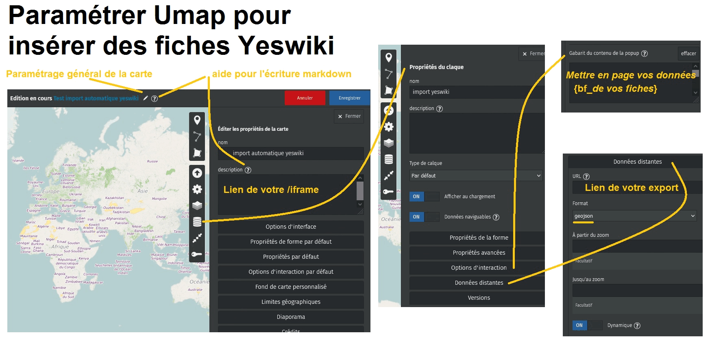

# Comment faire pour

> Tout un tas de petites astuces pour répondre à des besoins courant

## Afficher les fiches YesWiki sur une carte de type umap

Paramétrer Umap pour y insérer des fiches Yeswiki

### Introduction

[Umap](https://wiki.openstreetmap.org/wiki/UMap) est un logiciel cartographique qui permet de créer des calques modifiables (on considère ici que vous l'avez déjà utilisé) .
Depuis la version Doryphore de YesWiki il est possible d'importer automatiquement les données de fiches bazar dans les calques d'une Umap.

Cet export est réalisable depuis de bouton GeoJSON (format de données) de la page de gestion Bazar.
Il donne accès à une page de données

https://www.example.com/?api/forms/{id}/entries/geojson

que vous allez glisser dans le paramétrage de votre carte Umap ({id} représente l'identifiant du formulaire concerné).

### Explications

Voilà quelques points explicatif pour paramétrer votre carte Umap.

#### Coller le lien d'export GeoJSON

Cela ce passe dans "Propriétés d'un calque", "Données Distantes", coller votre lien cité ci-dessus dans "URL" et choisir le "Format" GeoJSON.

#### Paramétrer l'affichage de vos données dans Umap

\- Dans
"Propriétés d'un calque", "Options d'interactions", "Gabarit du contenu de la popup"

vous pouvez définir les champs _bf_wiki_ que vous voulez afficher en les écrivant en syntaxe markdown reconnue par Umap, par exemple:

    {bf\_titre}
    {bf\_site\_internet}
    {bf\_image}

etc...

\- Pour afficher un lien direct vers votre fiche wiki :

    \[\[{url}|source\]\]

\- pour les images :

{{https://www.example.com/geo/files/{imagebf\_image}}}

#### Incruster une page d'accueil pour faciliter les contributions ?

Il est possible de présenter une page spéciale de contribution directement dans la page d'accueil de votre Umap.

Il faut se rendre dans "Éditer les propriétés de la carte" et proposer l'encapsulage d'une page spéciale en _/iframe_ (+ class new window ?) qui redirigera vers votre site pour la saisie de nouvelles fiches.

En markdown sur Umap cela donnera :

{{{https://www.example.com/?VotrePageSpéciale/iframe}}}

#### En image :

## Personnaliser la page de connexion au wiki

Le formulaire de connexion placé habituellement dans la roue crantée de votre menu Yeswiki comprend des options pour personnaliser le parcours de vos contributeurs : le crayon permet d'éditer le composant "Connexion"

### Paramètres du composant Connexion

- **Modifier la page d'inscription** Vous pouvez remplacer la page d'inscription par défaut (qui contient les infos minimales : nom / mail) par un formulaire plus complet - dans le composant : compléter l'url d'inscription avec le nom de votre page contenant un formulaire bazar personnalisé
  Notez que vous devez configurer le formulaire associé avec un champ "créer un utilisateur" accompagné d'un champ e-mail.
- **Diriger l'utilisateur connecté vers une page** : utile pour orienter les contributeurs vers une page contenant leurs données personnelles par exemple - dans le composant : compléter l'url de redirection après connexion réussie `loggedinurl`
- **Diriger l'utilisateur déconnecté vers une page** compléter l'url de redirection après connexion réussie `loggedouturl`
- **Personnaliser la page mot de passe perdu** : créez une page moins austère avec du texte ou des illustrations et ajoutez l'action `{{lostpassword}}`qui permet de réinitialiser le mot de passe - puis dans le composant login : compléter url pour les mots de passe perdus
- **url de profil** : si vous avez modifié la page d'inscription, utilisez l'option 'WikiName' dans Paramètre du profil, cela permettra à l'utilisateur de modifier directement sa fiche.
  Par défaut la page "Modifier les paramètres utilisateurs" permet uniquement de modifier le mail et le mot de passe du user.

### Autres astuces

Lorsqu'un utilisateur tente d'accéder à une page qui nécessite d'être connecté, c'est le formulaire de connexion par défaut qui s'affiche.
**créez une page nommée PageLogin** permet de personnaliser cette page avec un message plus pédagogique et de bénéficier des options de connexions listées ci-dessus en utilisant le composant "Connexion"

## Résoudre le souci de création de listes qui ne s'affichent pas

### Description du problème

- après la création d'une liste, celle-ci ne s'affiche pas correctement dans la liste des listes (accessible avec [ce lien](?BazaR&vue=listes 'Liste des listes :ignore'))

### Correction

1.  faire un `/update` sur votre wiki (accessible avec [ce lien](?GererMisesAJour/update 'Forcer la finalisation de la mise à jour :ignore'))
2.  vérifier si le problème est résolu. Sinon, suivre les [instructions réservées aux webmasters](./webmaster?id=r%c3%a9parer-la-structure-de-vos-bases-de-donn%c3%a9es)
