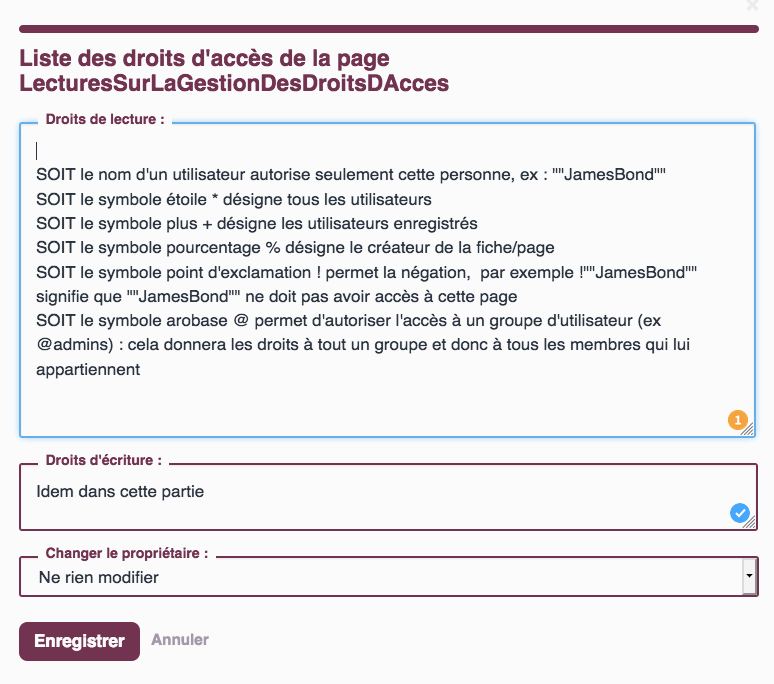
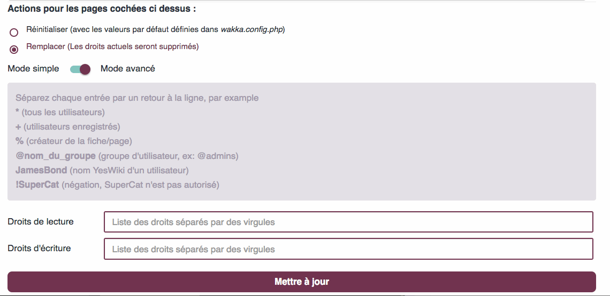
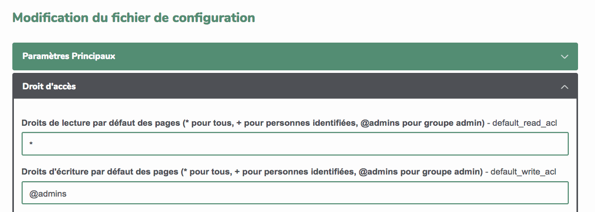
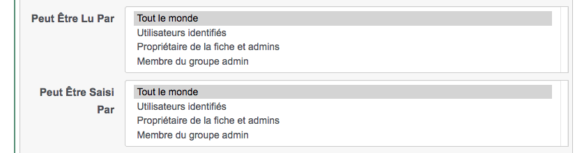
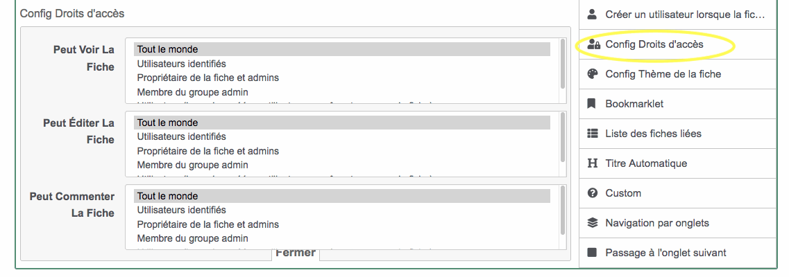
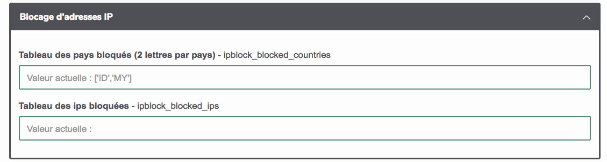
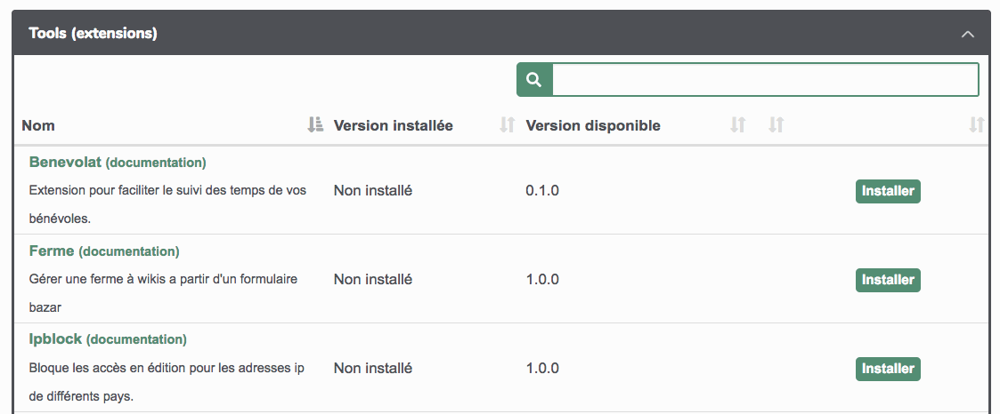

# Administrer son wiki

> TODO Petite description

## Gestion du site : plan de l'administration

**Accueil de gestion du site**

Vous avez là un récap des menus et pages spéciales du wiki.

**Droits d'accès**

C'est ici que vous pouvez indiquer "qui a le droit de faire quoi sur quelle page".
Il faut être identifié comme administrateur pour visionner et modifier les informations de cet espace.

[Voir la rubrique dédiée](/docs/users/fr/admin?id=g%c3%a9rer-les-droits)

**Look**

C'est par là que vous personnalisez le squelette et l'esthétique de votre wiki.
Il faut être identifié comme administrateur pour visionner et modifier les informations de cet espace.

[Voir la rubrique dédiée](/docs/users/fr/admin?id=g%c3%a9rer-le-look)

**Utilisateurs et groupes**

Ici vous visualisez les comptes utilisateurs créés et vous pouvez les organiser en "groupes".
Il faut être identifié comme administrateur pour visionner et modifier les informations de cet espace.

[Voir la rubrique dédiée](/docs/users/fr/admin?id=gestion-des-droits-par-utilisateurice-ou-par-groupe)

**Mots clés**

Si vous avez utilisé des mots clés pour qualifier vos pages wiki vous en trouvez un récap ici.
Il faut être identifié comme administrateur pour visionner et modifier les informations de cet espace.

**Fichier de conf**

Certains éléments de configuration peuvent être personnalisés ici : accès par défaut, sécurité, indexation ...
Il faut être identifié comme administrateur pour visionner et modifier les informations de cet espace.
Nous les explorerons au fil des modules.

**Mises à jour / extensions**

Vous pouvez voir ici la version du wiki et s'il s'agit de la toute dernière.
Si vous êtes identifié comme administrateur vous pouvez faire les mises à jour.

## Gérer les droits
### Introduction aux droits d'accès

YesWiki a beau être très ouvert lors de son installation (ce qui oblige à se poser quelques questions), il n'en offre pas moins une gestion fine des droits de lecture et d'écriture de son contenu. **Cette gestion permettra :**

*   de limiter l'accès de tout ou partie du wiki à certaines personnes ou catégories de personnes (groupes)
*   de protéger certaines parties (bandeau, menu, footer...) de votre wiki contre les modifications involontaires (ou intempestives)
*   de garder certaines parties de votre wiki cachée (mais pas réellement fermées en accès)

#### Un préalable pour jouer dans les droits d'accès : exister sur le wiki

En effet **seules les personnes ayant un compte sur le wiki peuvent modifier les droits d'accès aux pages et encore avec certaines limites.** La seule personne ayant tous les droits est celle qui a créé le wiki (le super admin). Cette personne peut évidemment partager ses droits avec d'autres utilisateurs du wiki (voir plus bas)

**Il est donc nécessaire de pouvoir se créer un compte sur le wiki ou de se connecter à celui-ci.** Cela s'opère via la roue crantée du wiki / se connecter (ou s'inscrire). En cas de perte du mot de passe, le lien "mot de passe perdu" pourra vous le renvoyer sur le mail indiqué lors de l'inscription.
\=> plus d'infos sur [https://yeswiki.net/?DocumentationIdentification](https://yeswiki.net/?DocumentationIdentification)
  
**Une fois connecté, vous ne possédez pas encore beaucoup de droits** (sauf si l'administrateur du wiki vous en a attribués) à savoir :

*   créer des pages (vu précédemment)
*   vous attribuer la propriété d'une page
*   attribuer des droits d'accès en lecture et écriture sur les pages dont vous êtes propriétaire
*   supprimer les pages dont vous êtes propriétaire

##### Devenir propriétaire d'une page

*   On devient automatiquement propriétaire des nouvelles pages que l'on crée lorsque l'on est connecté sur le wiki (cela se vérifie en bas de page avec la mention propriétaire = vous)
*   Pour devenir propriétaire d'une page sans propriétaire, il suffit de cliquer sur Appropriation (en bas de page) : se faisant vous recevez des droits de gestion sur cette page (même si ça ne se voit pas comme ça)
*   On ne peut devenir propriétaire d'une page qui a déjà un propriétaire, mais le propriétaire lui même peut décider de vous nommer nouveau propriétaire de cette page. Si vous avez reçu des droits d'admin sur le wiki, vous pourrez devenir propriétaire de n'importe quelle page sans l'accord du propriétaire !

##### Supprimer une page dont vous êtes propriétaire

Lorsque vous êtes propriétaire d'une page, un bouton supprimer apparaît en bas de page. Il vous permettra de supprimer définitivement la page et son historique (attention c'est sans retour d'où le message de confirmation !).
Si vous avez reçu des droits d'admin sur le wiki, vous pourrez modifier toutes les pages, y compris celles dont vous n'êtes pas propriétaire.

##### Modifier les droits d'une page dont vous êtes propriétaire

En bas de page, vous allez trouver un bouton permissions. En cliquant sur celui-ci, une fenêtre popup va vous permettre de gérer les droits en lecture et écriture.
**Voici les possibilités qui vous sont offertes**

**Cette gestion page par page et user par user est vite "pesante"**

**Pour dépasser cette lourdeur,**

*   un module de gestion des droits des utilisateurs par groupe a été créé
*   un module de gestion du droit d'accès aux pages en masse a été créé

### Gestion des droits par utilisateurice ou par groupe

La gestion utilisateur par utilisateur est très fine MAIS présente quelques inconvénients :

*   lorsque vous avez limité l'accès de plusieurs pages à un utilisateur et qu'un nouvel utilisateur doit recevoir les mêmes accès, vous voilà bon à repasser sur chaque page pour y ajouter son nom ;-(
*   idem dans l'autre sens, si un utilisateur doit "perdre" ses accès

**Pour s'affranchir de ces limites, la notion de groupe a été introduite.**
Un groupe reprend un ou plusieurs utilisateurs wiki. Il se nomme @nomdugroupe.
Un seul groupe existe par défaut sur le wiki @admins et contient par défaut un seul utilisateur à savoir celui qui a créé le wiki.
Ce groupe @admins a TOUS les droits sur TOUTES les pages du wiki.
C'est un groupe "sensible" donc car les utilisateurs qui s'y trouvent ont des pouvoirs importants sur le wiki et notamment des pouvoirs de suppression (de pages, de formulaires bazar, de listes...) avec des effets potentiellement complexes à "rattraper". Il faut donc être vigilant avec les utilisateurs que l'on va placer dans ce groupe.

Il est possible de créer autant d'autres groupes que souhaité.
**Ces autres groupes n'ont aucun privilège sur le wiki**. Ils sont simplement un regroupement d'utilisateurs. Ce regroupement, ce groupe (@poule, @coq, @...) pourra être utilisé dans la gestion des droits des pages du wiki comme on le ferait pour un utilisateur (on mettra le nom du groupe plutôt que le nom de l'utilisateur).
Ce faisant, si un utilisateur (membre du groupe @coq) quitte le projet et ne doit plus pouvoir modifier les pages auquel il avait accès en écriture, il ne faut pas repasser sur chaque page concernée mais il suffira de l'enlever du groupe @coq ;-)
  
Pour gérer les groupes (et les utilisateurs inclus) cela se passe sur la page "utilisateurs et groupes" accessible via la roue crantée / gestion du site (attention, il faut faire partie des administrateurs du wiki pour pouvoir modifier, créer, supprimer des groupes)

**Voici à quoi ressemble la page**

*   pour voir le contenu des groupes : je choisis dans la liste et fait "voir/éditer"
*   pour créer un nouveau groupe : j'indique son nom et fait "définir"
*   pour supprimer un groupe (attention) : je choisis et fait "supprimer"

Pour info : en bas de cette page, vous découvrez et gérer (si vous êtes dans le groupe @admins) les utilisateurs connus du wiki.

**Pour ajouter ou retirer un utilisateur d'un groupe**
lorsque j'ai cliqué sur voir/éditer le groupe concerné, il me suffit dans la case qui apparaît d'indiquer (ou de retirer) le nomwiki de l'utilisateur sur une ligne (sans virgule) et d'enregistrer

### Gestion des droits des pages en masse

La gestion page par page c'est sympa mais quand on a 150 pages dans son wiki... ça peut vite devenir très long. Heureusement il existe une page permettant de gérer les changements des droits d'accès de plusieurs pages (toutes les pages) en même temps.
  
Cette page se nomme "Droits d'accès aux pages" et est accessible via la roue crantée / gestion du site. (attention, il faut faire partie des administrateurs du wiki pour avoir accès à cette page)

Sur cette page, vous pourrez aussi voir les droits qui sont attribués à chacune des pages du wiki et pourrez cocher les pages qui doivent être modifiées et attribuer en bas les nouveaux droits en utilisant

##### en mode simple

via les listes déroulantes proposées (droit de lecture, droit d'écriture)

##### en mode avancé

via les champs classiques (ceux qu'on retrouve quand on édite les droits d'une page seule)

### Gérer les droits d'accès des pages non encore existantes

La gestion vue jusque maintenant permet de gérer l'existant mais comment gérer ce qui va s'ajouter au wiki ?

#### En ce qui concerne les pages

*   soit en le faisant au fur et à mesure via les méthodes présentées ci-dessus
    *   méthode la plus courante (mais franchement pas pratique et fastidieuse)
*   soit en attribuant des droits par défaut à toutes les nouvelles pages créées
    *   Pour ce faire, il faut aller dans la roue crantée/gestion du site/fichier de conf
        *   dans l'accordéon "droit d'accès" vous pouvez déterminer quelles seront les accès par défaut des prochaines pages

#### En ce qui concerne les fiches bazar

Assez souvent, la contribution sur les wikis se passe via des formulaires.
Par défaut ces fiches sont ouvertes en lecture et écriture.
**On peut limiter totalement ou partiellement l'accès aux fiches ou à certaines parties des fiches.**
Cela se réalise lors de la construction du formulaire via certains paramètres.
  
Pour chaque champ de votre formulaire vous pouvez décider des accès en lecture et écriture afin :

*   de déterminer qui peut remplir ce champ (donc la visibilité de celui-ci en mode "saisie")
*   de déterminer qui peut voir ce champ une fois la fiche existante

Vous pouvez aussi décider d'attribuer "par défaut" des droits particuliers à la fiche entière afin :

*   qu'elle ne soit visible QUE par tel ou tel groupe d'utilisateurs
*   qu'elle ne soit modifiable QUE par tel ou tel groupe d'utilisateurs

Cette gestion s'effectue via le champ "configurer les droits d'accès" de votre formulaire

### Configurer les accès à certaines parties au sein même des pages
Il est donc possible de limiter les accés en lecture et/ou écriture aux pages du wiki.
**Mais pourrions nous limiter les accès à certaines parties des pages ?**

Et oui !

Lorsque l'on construit sa page wiki, on utilise souvent les composants.
La plupart de ces composants proposent dans leurs paramètres avancés, des choix permettant de limiter leur visibilité aux seuls utilisateurs autorisés.
*   dans la cas d'un bouton (ou d'un onglet), vous pouvez le cacher aux utilisateurs qui n'ont pas reçu les droits d'accès vers la page vers laquelle ce bouton pointe.
*   dans le cas d'une section, vous pouvez déterminer par qui elle sera "visible"
*   ...

Ces opérations sont aussi réalisables pour les différents champs d'un formulaire (nous verrons ça la semaine prochaine).

### Configurer les accès à certaines parties au sein même des pages
(à trouver ou écrire)

### Éditer les droits d'accès aux actions
(à trouver ou écrire ET à déplacer pour alléger cette section)

### Éditer les droits d'accès aux handlers
(à trouver ou écrire ET à déplacer pour alléger cette section)

## Gérer le look

### Configuration graphique par défaut
Pour **changer le thème graphiques sur l'ensemble du site**, on peut personnaliser la configuration wakka.config.php et rajouter les valeurs:

'favorite\_theme' => 'nom du thème correspondant au nom du sous-répertoire thème correspondant à ce thème personnalisé',
'favorite\_squelette' => 'nom du squelette en liaison avec le thème personnalisé.tpl.html',
'favorite\_style' => 'nom de la feuille de style en liaison avec le thème personnalisé.css'

Exemples :

'favorite\_theme' => 'yeswiki',
'favorite\_squelette' => 'responsive-1col.tpl.html',
'favorite\_style' => 'blue.css',

Mais cela ne s'applique que pour les nouvelles pages créées.
Pour les anciennes pages, il faut alors modifier chaque page en mode édition, bouton thème,
ou bien forcer le thème pour toutes les pages en ajoutant dans wakka.config.php : 'hide\_action\_template' => '1',

### Changer de thème graphique

https://yeswiki.net/?DocumentationChangerThemeGraphique

Chaque page d'un wiki peut s'afficher de diverses manières, à la demande des rédacteurs. Il est ainsi possible de choisir :

*   Le thème graphique : ensemble des éléments esthétiques d'un wiki.
*   Le squelette : qui définit l'architecture de chaque page (nbre de colonnes, etc.)
*   Le style : qui correspond à l'aspect visuel de la page (couleurs, graphisme, etc.)
*   L'image de fond qui permet de changer l'image de fond (logique non ?)

Tous ces éléments peuvent être variés d'une page à l'autre. Mais afin de maintenir une cohérence graphique sur l'ensemble de votre wiki, il est conseillé de se cantonner à l'usage d'un seul et même thème graphique.
[Tester les thèmes !](https://yeswiki.net/?DemoThemes "Tester les thèmes !")
La liste des thèmes par défaut est modifiable, cela relève d'une tache d'administrateur : [voir la documentation](https://yeswiki.net/?DocumentationAjoutThemesGraphiques).

**Pour modifier ces éléments sur une page (précédemment créée ou nouvelle) :**

*   Passer en mode édition (double clic ou "éditer la page")
*   En bas de votre page, apparait un gros bouton Thème graphique :

*  En cliquant dessus, la fenêtre modale suivante apparaîtra alors :

*   Choisissez chaque élément de ces menus déroulants
*   cliquez sur Appliquer puis
*   Sauvez la page

### Ajouter des thèmes graphiques

#### Importer un thème graphique pré-existant

*Cette partie concerne les bidouilleurs confirmés.*

**Pour installer un nouveau thème graphique** :

*   Récupérer le fichier compressé (par exemple depuis [la liste disponible sur le site de Yeswiki](https://yeswiki.net/?TelechargementTemplates))
*   Le dé-compresser
*   L'envoyer par ftp dans votre yeswiki, dans le dossier "thèmes" /theme .

**Pour installer une nouvelle image de fond** :

*   L'envoyer par ftp dans files/backgrounds.

Seuls 2 formats d'images sont acceptés :

*   .jpg pour les images de fond pleine page (limiter la résolution à moins de 1920x1080 pixels pour éviter des temps de chargement trop longs)
*   .png pour les images en mosaïque (répétées sur l'axe horizontal et vertical)

Le thème et l'image de fond seront alors accessibles (en étant connecté sur votre wiki en mode édition) grâce au bouton "Thème graphique"

Pour définir une configuration graphique par défaut se rendre sur la partie "[Changer de thème graphique](https://yeswiki.net/?DocumentationChangerThemeGraphique)"

### Modifier un thème graphique pré-existant

Modifier un thème graphique revient à modifier :

*   Les squelettes : qui se trouvent dans le répertoire "themes/squelettes" d'un thème graphique donné
*   La feuille de style : qui se trouve dans le répertoire "themes/styles"
*   Les images de fond : qui se trouvent dans le répertoire "/files/backgrounds"

L'architecture de YesWiki est basée sur [Bootstrap](https://fr.wikipedia.org/wiki/Twitter_Bootstrap). Pour modifier les thèmes graphiques et squelettes de YesWiki, il convient de maîtriser cette bibliothèque libre de mise en forme.

Modifier le thème graphique va donc revenir à adapter un squelette en modifiant celui-ci avec la syntaxe Bootstrap adaptée et la feuille de style associée.

#### le css

/\*
Voici un exemple de css custom pour le thème margot (le thème par défaut sous doryphore), il agit sur les variables css non personnalisables dans le thème et permet de faire des css sur mesure.
Chaque ligne ci-dessous est à dé-commenter pour être utilisée
Pour en savoir plus, voyez la documentation sur [https://yeswiki.net/?DocumentationThemeMargot](https://yeswiki.net/?DocumentationThemeMargot)
\*/

/\* :root { \*/

/\* couleur pour les messages positifs par defaut vert \*/
/\* --success-color: #3cab3b; \*/

/\* couleur pour les messages d'erreur par defaut rouge \*/
/\* --danger-color: #d8604c; \*/

/\* couleur pour les messages d'alerte par defaut orange \*/
/\* --warning-color: #D78958; \*/

/\* couleur de fond de la partie centrale votre wiki \*/
/\* --main-container-bg-color:var(--neutral-light-color); \*/

/\* couleur des liens \*/
/\* --link-color: var(--primary-color); \*/

/\* couleur des liens au survol \*/
/\* --link-hover-color: var(--primary-color); \*/

/\* couleur de la barre de menu \*/
/\* --navbar-bg-color: var(--primary-color); \*/

/\* --navbar-text-color: var(--neutral-light-color); \*/

/\* --navbar-link-color: var(--neutral-light-color); \*/

/\* --navbar-link-bg-color: transparent; \*/

/\* --navbar-link-hover-color: rgba(255,255,255,0.85); \*/

/\* --navbar-link-bg-hover-color: transparent; \*/

/\* --navbar-border: none; \*/

/\* --navbar-border-radius: 0; \*/

/\* --navbar-shadow: none; \*/

/\* --header-bg-color: var(--neutral-light-color); \*/

/\* --header-text-color: var(--neutral-color); \*/

/\* --header-title-color: var(--primary-color); \*/

/\* couleur de fond du pied de page \*/
/\* --footer-bg-color: transparent; \*/

/\* --footer-text-color: var(--main-text-color); \*/

/\* --footer-title-color: var(--main-text-color); \*/

/\* --footer-border-top: 3px solid var(--neutral-soft-color); \*/

/\* --btn-border: none; \*/

/\* --btn-border-radius: .5em; \*/

/\* --checkbox-color: var(--primary-color); \*/

/\* } \*/
/\*.background-image.fixed {

*   background-attachment: fixed;
*   background-size: auto;

}\*/

#### créer des mises en page plus fines
à écrire :
mermaid / Izmir / bootstrap / markdown

## Suivre la vie de son wiki

### Via la page tableau de bord

Une page TableauDeBord accessible dans le menu "roue crantée". Il permet d'accéder aux

*   derniers comptes utilisateurs créés
*   dernières pages modifiées
*   dernières pages commentées
*   un index de toutes les pages du Wiki

### Via la page DerniersChangements
Sur cette page, vous verrez toutes les pages modifiées du wiki.

### Via les flux rss du wiki
Plusieurs flux RSS sortent du wiki :
 - L'ensemble des changements du wiki
     - ce flux est accessible via la page DerniersChangementsRSS/xml de votre wiki
 - les modifications de chacun des formulaires
      - ces flux sont accessibles via la page "base de données" de la roue crantée

### Recevoir le contenu d'une page par courriel

## Lutter contre le spams

Hélas comme la plupart des wikis ouverts (MediaWiki, DokuWiki), YesWiki n'échappe pas aux attaques de quelques ~~emmerdeurs~~ référenceurs soit-disant professionnels et autres robots de spam, qui polluent les contenus des pages.

### Les symptômes : comment identifier les spams ?

*   Vous pouvez découvrir sur une ou plusieurs pages des liens vers des sites externes qui semblent sans rapport avec l'objet du wiki _(qui vendent des robes de mariée, des sites indonésien sans rapport, des liens commerciaux vers la loi duflot, des textes en langue étrangère etc..)_
*   Il se peut aussi que de nouvelles pages soit créées, et dans certains cas de nouveaux utilisateurs wikis.

Dans tous les cas, il sera toujours possible de faire marche arrière, et les informations sensibles d'accès ftp ou mysql à votre serveur ne peuvent pas être trouvés comme cela.

### Les 10 conseils anti-spam

* **1**. Je consulte régulièrement mon wiki
* **2**. Je m'abonne à son flux RSS [voir plus bas / suivre la vie de mon wiki](#Suivre-la-vie-de-son-wiki)
* **3**. Je consulte la page TableauDeBordDeCeWiki de mon wiki (accessible depuis la "roue crantée")
* **4**. Je vérifie les dernières pages modifiées dans le TableauDeBordDeCeWiki ou sur la page DerniersChangements
* **5**. Je vérifie les derniers comptes crées sur la page TableauDeBordDeCeWiki. (Action {{Listusers last="20"}} )
* **6**. J'édite les pages en question et je supprime les parties indésirables, puis je sauve. (Cela prend moins d'une minute)
* **7**. Je protège l'accès en écriture des pages spéciales du wiki (menu, roue crantée, footer...)
* **8**. Je maintiens mon wiki à jour
* **9**. Pour les plus endurcis, je fais le grand ménage avec l'outil despam (voir plus bas)
* **10**. Je ne cède pas à la tentation de transformer mon espace collaboratif en bunker. Et je continue à mettre en balance les effets positifs de l'intelligence collective.
* 
### Que faire si vous avez du spam ?

#### Réparer une page spéciale spammée

_Tiens, ce matin, en me baladant sur un de mes YesWiki j'ai découvert que j'avais été spammé avec un bel écran bizarre à la place de ma page d'accueil et impossible de pouvoir modifier quoique ce soit !_

##### Si votre wiki est ouvert en écriture:

*   1\. identifier la page spammée en ajoutant le handler /editiframe
    aux pages spéciales. Voici ci-dessous, la liste des pages spéciales concernées.
*   2\. Dès que le code malicieux est repéré, supprimer ce code et sauvegarder la page.
*   3\. Revenir sur la liste des versions de cette page pour éditer la version avant l'apparition du code malicieux et remettre en place le contenu précédent

##### Si votre wiki est fermé en écriture

Il peut être impossible de se connecter au wiki. Ceci peut contourner en utilisant ce lien qui permet de ne pas afficher les pages spéciales : https://www.example.com/?ParametresUtilisateur/iframe

#### Utiliser les paramètres de contrôle d'accès via le wakka config ou la page ["Fichier de conf"](https://yeswiki.net/?GererConfig) XXXXXX à MODIFIER

Des nouveaux paramètres ont été ajoutés dans le wakkaconfig et permettent notamment

*   d'ajouter un capcha en mode édition
*   d'ajouter un champ (mot de passe) en entrée du mode édition (+ un message informatif sur ce mot de passe)

Les paramètres ajoutables au wakkaconfig

    'password\_for\_editing' => 'votremotdepasse',
    'password\_for\_editing\_message' => 'un message qui apparait au dessus du champ mot de passe',
    'use\_hashcash' => true, //ne pas toucher pour l'instant
    'use\_nospam' => true, // ne pas toucher pour l'instant 'use\_alerte' => true,
    'use\_captcha' => true,

Ces paramètres sont aussi activables via la page de gestion du site (onglet fichier de conf)

#### Pour les ajouts dans une page isolée

1.  Editer la page en question et supprimer la partie indésirable, puis sauver. (Cela prend moins d'une minute)

Astuce: veiller à plusieurs à partir du flux RSS qui sort de votre wiki est plus efficace

#### Pour de nouvelles pages indésirables créées

##### Si vous pouvez vous connecter en tant que WikiAdmin :

1.  s'identifier en tant qu'administrateur du wiki (WikiAdmin par défaut)
2.  éditer les permissions de la page pour mettre le compte [WikiAdmin](https://yeswiki.net/?WikiAdmin) propriétaire de la page
3.  supprimer la page à partir du lien sur la barre d'action en bas de page

##### Si vous ne pouvez pas vous connecter en tant que WikiAdmin :**

1.  éditer la page et remplacer tout le texte de spam par un caractère (il faut au moins un contenu autre qu'un espace dans la page pour la sauver (pour ma part j'utilise ".")

#### Pour limiter la création de nouveaux comptes

Pour éviter que des inconnus puissent se créer des comptes, vous pouvez limiter l'action [UserSettings](https://yeswiki.net/?UserSettings) aux seuls administrateurs.
Si cela a l'avantage de bloquer/réserver la création de nouveaux comptes aux seuls admin,cela limite vraiment l'autonomie de vos utilisateurs.

#### Pour supprimer les commentaires indésirables

1.  Ajouter l'action {{erasespamedcomments}} dans la page de votre choix. (Elle n'est accessible qu'aux administrateurs)
2.  Ensuite cocher les commentaires indésirables et appuyer sur le bouton "Nettoyer"

#### Pour supprimer de nombreuses pages rapidement

SI vous êtes connecté-e en tant qu'admin, il vous suffit de coller ceci à la fin de l'url des pages à supprimer : /deletepage&confirme=oui
Cela vous évite toutes les étapes de validation, qui deviennent très fastidieuses lorsqu'on a plusieurs pages à supprimer. Attention, ce "raccourci" supprime définitivement la page sans message de confirmation, ne vous trompez donc pas !

#### Pour les attaques massives sur de nombreuses pages

**cette technique nécessite des informations sur les codes FTP et Mysql**

Pour faire le grand ménage avec le tools despam :

1.  aller sur la barre d'adresse url de votre navigateur et remplacer wakka.php (et ce qu'il y a derrière) par tools.php (pour avoir une url du type http://monadressedewiki/tools.php )
2.  identifiez-vous à l'aide des **identifiants de la base de données Mysql** plutôt que vos identifiants wiki
3.  la liste des extensions apparaît, cliquer sur "Nettoyage Spam"
4.  Sélectionner l'intervalle de temps à prendre en compte pour les dernière modifications
5.  cocher les choix adéquats, entre supprimer la page ou revenir à la version précédente
    *   **ATTENTION, il faut IMPÉRATIVEMENT vérifier les pages en question pour ne pas supprimer définitivement le contenu!!**
6.  cliquer sur "Nettoyer"

#### Pour supprimer les utilisateurs non désirables (utilisateurs avancés, non disponible par défaut)

Ajouter par FTP, dans le répertoire tools l'extension suivante : [http://yeswiki.net/downloads/actions.zip](http://yeswiki.net/downloads/actions.zip)

Pour la mise en oeuvre, voir la documentation suivante:
[Télécharger le fichier doc\_action\_delete.pdf (0.7MB)](https://yeswiki.net/?LutterContreLeSpam/download&file=doc_action_delete.pdf)

#### Activer l'extension Ipblock
Cette extension permet de bloquer l'accès à votre wiki en fontion des adresses IP (et de leur provenance géographique).
Elle s'active via l'onglet Mise à jour / extension de la page gestion du site de votre wiki.
Les paramètres sont alors visibles dans la partie "Blocage d'adresses IP"

#### Fermer l'accès au wiki à certaines adresses IP

Souvent les vagues de spam proviennent d'une région spécifique et on peut s'en préserver via une fermeture des accès aux wikis à ces adresses IP spécifiques (les IP sont spécifiques des régions/pays)

Vous pourrez régler ces détails dans la roue crantée/ gestion du site/ fichier de conf/ blocage d'adresse IP

Il faudra au préalable que vous ayez installé l'extension IP block via roue crantée/gestion du site/mise à jour et extensions

Pour découvrir l'ensemble des stratégies possibles face au spam => [https://yeswiki.net/?LutterContreLeSpam](https://yeswiki.net/?LutterContreLeSpam)

## Fichier de configuration
(simple copie de ce qu'on a dans nos wikis : à enrichir, expliquer)
### Paramètres principaux
 - Titre de votre wiki - wakka_name
 - Nom de la page d'accueil - root_page
 - Langue par défaut (fr ou en ou ... auto = langue du navigateur) - default_language
 - Icône du site (emoji ou URL vers une image PNG) - favicon
 - Activer le mode de debug (yes ou no) - debug
 - Fuseau horaire du site (ex. UCT, Europe/Paris, Europe/London, GMT = utiliser celui du serveur,) - timezone
 - Méthodes autorisées à être affichées dans les iframes (iframe,editiframe,bazariframe,render,all = autoriser tout) - allowed_methods_in_iframe
 - Nombre maximum de versions d'une page affichées par le handler `/revisions`. - revisionscount
 - Image d'avatar par défaut pour les commentaires (URL vers une image) - default_comment_avatar
 - Activer le nettoyage HTML avant sauvegarde. Attention, modifie le contenu à la sauvegarde ! (true ou false) - htmlPurifierActivated
### Droit d'accès
 - Droits de lecture par défaut des pages (* pour tous, + pour personnes identifiées, @admins pour groupe admin) - default_read_acl
 - Droits d'écriture par défaut des pages (* pour tous, + pour personnes identifiées, @admins pour groupe admin) - default_write_acl
 - Droits de commentaires par défaut des pages (comment-closed pour ferme, * pour tous, + pour personnes identifiées, @admins pour groupe admin) - default_comment_acl
 - Commentaires activés (true ou false) - comments_activated
 - Mot de passe demandé pour modifier les pages (voir doc gestion des spams) - password_for_editing
 - Message informatif pour demander le mot de passe (voir doc gestion des spams) - password_for_editing_message
 - Autoriser le doubleclic pour éditer les menus et pages spéciales (true ou false) - allow_doubleclic
### Envoi des e-mails
 - Remplacer le mail utilisé comme expéditeur des messages - contact_from
 - Message personnalisé des mails envoyés depuis l'action contact - mail_custom_message
 - Ajouter 'wiki=' aux liens vers ce wiki dans les e-mails - contact_use_long_wiki_urls_in_emails
### Barre d'édition pour les pages et les champs texte
 - Nom du champ bazar texte long pour lequel les composants doivent être visibles - actionbuilder_textarea_name
### Insertion de médias (images, vidéos)
 - Service de vidéo par défaut (peertube, youtube ou vimeo) - attach-video-config[default_video_service]
 - Adresse du serveur peertube par défaut - attach-video-config[default_peertube_instance]
### Base de données
 - Latitude par défaut des affichages cartographiques - baz_map_center_lat
 - Longitude par défaut des affichages cartographiques - baz_map_center_lon
 - Niveau de zoom par défaut des cartes (1:monde => 15:commune) - baz_map_zoom
 - Hauteur par défaut en pixels des affichages cartographiques - baz_map_height
 - Adresse mail de l'expéditeur des modifications des fiches bazar - BAZ_ADRESSE_MAIL_ADMIN
 - Envoyer un mail aux admininistrateurs à chaque modification de fiche (true ou false) - BAZ_ENVOI_MAIL_ADMIN
 - Temps (s) entre deux rafraîchissements du cache pour vérifier les ajouts et modifications dans les requêtes JSON - baz_external_service[cache_time_to_check_changes]
 - Temps (s) entre deux rafraîchissements du cache pour vérifier les suppresions dans les requêtes JSON - baz_external_service[cache_time_to_check_deletion]
 - Temps (s) entre deux rafraîchissements du cache pour formulaires nécessaires aux requêtes JSON - baz_external_service[cache_time_to_refresh_forms]
 - Permettre la création de fiches même si le wiki est fermé en écriture (true ou false) - bazarIgnoreAcls
### Sécurité
 - Prévenir si l'on quitte la page sans sauvegarder (true ou false) - use_alerte
 - Activer l'utilisation d'un captcha avant la sauvegarde (true ou false) - use_captcha
 - Activer l'antispam hashcash du wiki (activé par défaut) - use_hashcash
 - État du wiki (running ou vide = standard, hibernate = lecture seule) - wiki_status
### Balises meta pour l'indexation web
 - Mots clés pour le référencement (séparés par des virgules, pas plus de 20-30) - meta_keywords
 - Description du site en une phrase, pour le référencement (Attention : ne pas mettre de "." (point)) - meta_description
 - Empêcher les robots à indexer le wiki (Mettre 'noindex,nofollow,noarchive,noimageindex') - meta[robots]
