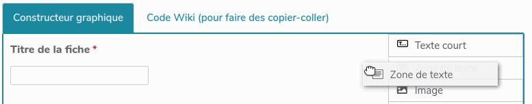
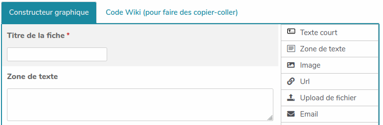
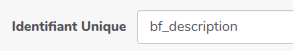
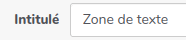
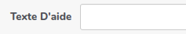
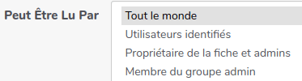
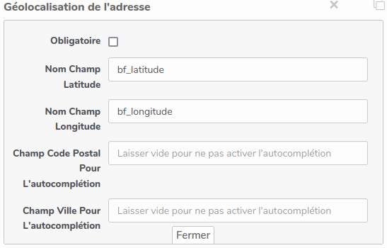

# Bazar
## Bazar-Les bases de données coopératives dans YesWiki

### Définition

Bazar est une extension importante de YesWiki qui lui ajoute des **fonctionnalités de création et de gestion de bases de données** qui permettent aux usagers d'interagir avec les contenus.
Par défaut, quand on installe un nouveau wiki, une page "gestion des bases de données" est créée. Elle est accessible via la roue crantée en haut à droite du menu.

### Comprendre le principe de fonctionnement en 3 phases
Bazar utilise des formulaires qui permettent deux choses :

*   faciliter la **saisie** en offrant un cadre structuré de collecte d'informations,
*   **visualiser** tout ou partie des informations saisies sous une forme qui vous semble pertinente (une carte, un trombinoscope, une liste, etc.).

#### Exemple Bazar

**1 –** Supposons que je souhaite organiser un goûter et que j'utilise pour ce faire un **formulaire** dans lequel je demande :

*   le prénom de chaque personne,
*   si elle apporte une boisson ou un gâteau (soyons fous !),
*   une description plus détaillée de ce qu'elle apporte.

**2 –** Afin de permettre la saisie, je vais mettre à disposition une page sur laquelle je vais afficher le formulaire vide afin que chaque personne puisse y répondre.  
Marguerite, Théo, Barnabé et Manon se rendent sur cette page et remplissent le formulaire. Lorsque chacune de ces personnes se rend sur cette page elle remplit sa **fiche** qui répond à ce formulaire.

]

**3 –** Pour que tout le monde puisse voir ce que chacun va apporter, je vais également mettre à disposition une page sur laquelle je vais afficher toutes les **fiches** de réponses au **formulaire** sous forme de liste (par exemple).  
Je verrai sur cette page les **fiches** de Marguerite, Théo, Barnabé et Manon.

[]

### Qu'est-ce qu'un formulaire ?

Nous appellerons **formulaire** le jeu de questions posées. Dans notre exemple, ce sont : 
 
*   prénom,
*   le type de ce que la personne apporte,
*   des précisions sur ce que la personne apporte.

On désignera par **fiche** une réponse individuelle à un formulaire. Dans notre exemple, il y a quatre fiches qui répondent à ce formulaire.  

### Les trois phases de fabrication d'un formulaire

* **Du point de vue de l'utilisateur**, seules existent :  
    *   La page sur laquelle il ou elle pourra saisir sa **fiche**
    *   La page d'affichage sur laquelle on peut consulter les réponses au **formulaire**
* Mais pour vous qui allez fabriquer le formulaire, les choses sont légèrement différentes.  
Vous allez devoir, avant même de fabriquer les pages de **saisie** des fiches et d'**affichage** des réponses, **concevoir** ce formulaire.  

Nous avons donc trois phases :  
1.   **Concevoir** le formulaire,
2.   Mettre à disposition une page pour la **saisie** des fiches,
3.   Mettre en œuvre une page d'**affichage** des résultats du formulaire.

| Vous | L'utilisateur| 
| -------- | -------- | 
| Concevoir
| Permettre la saisie|Saisir sa fiche
| Afficher les résultats|Consulter les résultats

##### 1 – Concevoir le formulaire

Concevoir le formulaire revient à choisir et agencer les différentes questions que vous allez poser.  
Si vous partez de zéro, cela peut être une excellente occasion de mettre en œuvre de la coopération en co-élaborant votre formulaire.  

On se place, lors de cette étape, à un niveau générique (le formulaire). On ne sait pas si Marguerite va répondre. En revanche, on sait qu'on veut collecter (et donc demander) le prénom de chacune des personnes qui répond au formulaire.

Cette phase de **conception** va avoir un impact sur le comportement du formulaire lors de la **saisie** des différentes fiches, mais également sur ce qu'il est possible de faire en termes d'**affichage** du formulaire.

Lors de la **conception** vous travaillerez dans la page _Base de données_ de votre wiki accessible _via_ le menu roue crantée en haut à droite du wiki.  

##### 2 – Permettre la saisie des fiches

Pour construire la page de **saisie** des fiches vous travaillerez dans une page que vous aurez choisie à cet effet.  

##### 3 – Afficher les résultats du formulaire

De même pour l'**affichage** des résultats du formulaire que vous mettrez en œuvre dans une page de votre choix.

### Concevoir son formulaire

ne pas mettre la partie "méthodo" mais juste la doc YesWiki
https://quincaillere.org/formationgarecentrale2022/?M13Lectures&course=P1Parcours1&module=M13FaciliterLesContributions

#### Créer et modifier un formulaire

##### Accéder à _Bazar_

_Bazar_ est la partie base de données de YesWiki. On s'y rend de la manière suivante.

*   Menu roue crantée en haut à droite du wiki.
*   Entrée «  Base de données ».

  
Notez qu'il faut être connecté avec un compte administrateur du wiki pour pouvoir utiliser certaines fonctionnalités _Bazar_.  
  
L'écran qui se présente ressemble à ceci (voir ci dessous).  
  

Les différents onglets en haut de cette page permettent d'accéder aux différentes fonctions de _Bazar_.  
  
**« Formulaires »** vous permet de gérer vos formulaires.  
  
**« Rechercher »** vous permet de rechercher parmi les fiches déjà présentes dans vos formulaires.  
Vous pouvez également trier vos fiches pour n'afficher que celles appartenant à un formulaire donné.  
  
**« Saisir »** vous permet de saisir des fiches dans un de vos formulaires.  
  
**« Listes »** vous permet de créer les [listes](https://quincaillere.org/formationgarecentrale2022/?DocBazaRListes) (et leurs contenus) que vous utiliserez ensuite dans vos formulaires.  
  
**« Importer »** vous permet d'importer des données en nombre (en provenance d'un tableur par exemple) directement dans un de vos formulaire.  
  
**« Exporter »** vous permet d'exporter les données d'un de vos formulaire pour un usage externe (dans un tableur par exemple).

### Gérer des formulaires _Bazar_ 

Pour gérer les formulaires, il faut se rendre sur l'onglet « Formulaires » de la partie base de données de YesWiki.  

*   Menu roue crantée en haut à droite du wiki.
*   Entrée «  Base de données ».
*   Onglet « Formulaires ».

  
Cet onglet se présente sous la forme d'un tableau dans lequel chaque formulaire présent sur le wiki occupe une ligne.  
Pour chaque ligne, et donc chaque formulaire, on a donc les informations suivantes (les nombres en rouge sur la capture d'écran correspondent aux numéros dans la liste ci-après).  

**1 –** Le nom du formulaire. C'est le nom sous lequel ce formulaire apparaîtra pour vous.  
Parfois ce nom est suivi de quelques mots de description (dans l'exemple ci-contre c'est le cas des formulaires Convive et Ressources)  
**2 –** Ce petit bouton en forme de loupe vous permet d'accéder à la recherche parmi les fiches de ce formulaire. Le comportement est alors similaire à celui qu'on aurait avec l'onglet « Rechercher » en haut de page.  
**3 –** Ce petit bouton en forme de « + » vous permet d'accéder à la saisie de fiches pour ce formulaire. Le comportement est alors similaire à celui qu'on aurait avec l'onglet « Saisir » en haut de page.  
**4 –** Chacune des icônes ou libellés dans ce groupe permet de déclencher l'export, la diffusion ou la publication selon le format indiqué.  
**5 –** Il s'agit de l'identifiant (ou nom) du formulaire pour YesWiki. Vous n'aurez _a priori_ pas à utiliser ce nom.  
**6 –** Ce petit bouton permet de dupliquer un formulaire afin de s'en inspirer pour en construire un autre en partie similaire sans avoir à tout refaire.  
**7 –** Ce petit bouton en forme de crayon permet d'accéder à la modification du formulaire.  
**8 –** Cette petite gomme permet de supprimer toutes les fiches du formulaire. Attention, il n'y a pas de moyen de récupérer des fiches supprimées.  
**9 –** Cette petite poubelle permet de supprimer le formulaire. Attention, il n'y a pas de moyen de récupérer un formulaire supprimé.  
**10 –** Ce bouton permet de créer un nouveau formulaire.  
**11 –** Vous pouvez, si vous avez repéré sur un autre YesWiki un formulaire qui vous conviendrait, utiliser ce champ pour saisir l'adresse du wiki en question. Vous serez ensuite guidés pour récupérer le ou les formulaires qui vous intéressent sur ce wiki.

Création et modification d'un formulaire _Bazar_ Pour modifier un formulaire ou utilisera donc le petit bouton en forme de crayon (cf. 7 précédent).  
Et, pour créer un nouveau formulaire, on utilisera le bouton « Saisir un nouveau formulaire ».  
Les deux boutons envoient sur un écran similaire, vide dans le cas de la création et présentant les questions du formulaire dans le cas d'une modification.  

### Créer un formulaire

### Modifier un formulaire

##### Nom du formulaire

Dans la première zone en haut de l'écran, on saisit (création), ou on trouve (modification), le nom du formulaire.  

*   Ce nom peut être composé de plusieurs mots, comportant éventuellement des caractères accentués.
*   Il est possible de modifier ce nom par la suite.

##### Description du formulaire

Cette zone permet de saisir des explications pour comprendre l'objectif du formulaire depuis l'écran de gestion des formulaires (cf. 1 précédent).  

##### Ajout, suppression et réorganisation des champs du formulaire

**Remarque concernant le vocabulaire –** Nous appellerons **« champ »** la mise en œuvre technique d'une question.  
  
Depuis la version _Doryphore_ de _YesWiki_, la gestion des champs du formulaire se fait au moyen d'un constructeur graphique. Celui-ci permet d'ajouter, modifier, supprimer ou réorganiser des champs dans le formulaire.  

Ce constructeur graphique se présente en deux parties. Les numéros sur l'image renvoient aux explications ci-dessous.  
**Dans la partie gauche de l'écran**, sont montrés les champs (ou questions) déjà présents avec :  

*   leur libellé (**1**),
*   une représentation de leur aspect dans le formulaire final (**2**),
*   un petit astérisque rouge si le champ est obligatoire (**3**).

Lorsqu'on déplace le pointeur de la souris au dessus de la zone correspondant au champ, celui-ci devient une poignée (**4**) qui permet de déplacer le champ pour le positionner à un en autre endroit dans le formulaire.  
Apparaissent également au survol de la souris,  

*   un bouton de suppression du champ (**5**),
*   un bouton de modification du champ (**6**),
*   un bouton de duplication du champ (**7**).

**Dans la partie de droite** se trouvent les différents types de champs possibles (**8**).  
En saisissant, dans la partie droite, l'icône d'un type de champs et en la glissant dans la partie gauche, on va ajouter un champ de ce type au formulaire.

Une zone noire apparaît alors à l'endroit où le champ sera inséré. Dans l'exemple montré, cette zone est placée en dessous du champ préexistant.

En relâchant le bouton de la souris, le champ se crée.  

##### Modification d'un champ de formulaire

En cliquant sur le petit crayon correspondant à un champ, on peut modifier ses différents paramètres.  

##### Enregistrer

Lorsque vous avez fini de modifier votre formulaire, vous devez valider au moyen du bouton du même nom en bas de page.

### Les champs disponibles / types de champs des formulaires

_Bazar_ propose de nombreux types de champs. Voici ceux auxquels vous aurez le plus souvent recours.  

#### /!\\ À ne jamais oublier – Le titre /!\\

### Le seul champ indispensable : le titre

##### Particularités indispensables

Ce champ est un champ de type texte court. Cependant, il a trois particularités indispensables.  
**1.** Il doit être présent dans tout formulaire.  
**2.** Son paramètre identifiant unique doit nécessairement être « bf\_titre ».  
**3.** Il doit nécessairement être obligatoire.  
  
Vous êtes libres de définir le libellé qui vous convient.  

##### Corollaire

Si un formulaire doit comporter une question obligatoire qui en sera le titre, il convient de choisir judicieusement celle-ci. Dans le cas de la participation à un goûter, par exemple, on pourra demander le prénom de la personne qui s'inscrit.  

##### Qu'advient-il de ce titre ?

**Lors de la création d'une fiche** par un utilisateur, YesWiki fabrique une page (d'un type particulier) à partir de cette fiche.  
L'adresse (_url_) de cette page est déterminée automatiquement à partir du titre de la fiche. Une fiche dont le titre serait « Le titre de ma fiche » donnerait la page _LeTitreDeMaFiche_. À l'usage, il peut arriver que deux fiches soient créées avec le même titre. _Bazar_ évite alors les doublons en ajoutant un nombre à la fin du titre qu'il génère (ici, _LeTitreDeMaFiche1_).  
Le fait que chaque fiche soit également une page présente plusieurs avantages.  

*   Vous pouvez donner l'adresse d'une fiche (ex. : _https://mon.wiki.fr/?LeTitreDeMaFiche_) à quelqu'un sans pour autant que cette personne ait à chercher parmi toutes les fiches.
*   Les différentes modifications de la fiche occasionneront autant de versions de la page.
*   Il est possible de modifier les droits sur une fiche/page en particulier.
*   Si vous modifiez le titre d'une fiche après sa création, le titre affiché sera bien modifié, mais pas l'adresse de la page.

**Lors de l'affichage d'une fiche**, le titre est présenté de manière particulière.

### Champ de type texte court

Un champs de texte qui permet la saisie de quelques mots
.
### Paramètres génériques

Certains paramètres sont génériques à tous ou pratiquement tous les types de champs. Ils sont repris ici.  

##### Obligatoire

Ce paramètre permet d'indiquer si répondre à cette question sera obligatoire. Le champ est obligatoire lorsque la case est cochée.  

##### Identifiant unique

Ce paramètre permet de définir le nom du champ pour YesWiki. Ce nom sera utilisé par YesWiki pour identifier le champ et doit donc impérativement être unique. Si un autre champ avait le même identifiant dans votre formulaire, vous observeriez des dysfonctionnements.  
Vous n'avez à intervenir sur ce paramètre que dans les rares cas où la documentation le spécifie.  

##### Intitulé

Il s'agit du texte de votre question. YesWiki préremplit ce paramètre avec le type de champ, charge à vous de remplacer cela par un libellé pertinent.  

##### Texte d'aide

Ce paramètre vous permet de saisir un texte d'aide afin d'aiguiller l'utilisateur si vous pensez qu'il peut en avoir besoin pour cette question. 

##### ✨ Peut être lu par

Par défaut, chaque champ peut être lu par toute personne ayant le droit de visualiser une fiche du formulaire. Ce paramètre permet de modifier ce comportement pour le champ en question. On peut ainsi masquer un champ à certains utilisateurs.  
~~[Voir la liste des différentes valeurs possibles]~~(https://quincaillere.org/formationgarecentrale2022/?DocBazarParametreAccesValeurs "Les différentes valeurs possibles").  

##### ✨ Peut être saisi par

Par défaut, chaque champ peut être saisi par toute personne ayant le droit de saisir une fiche du formulaire. Ce paramètre permet de modifier ce comportement pour le champ en question. On peut ainsi masquer un champ à certains utilisateurs.  
[Voir la liste des différentes valeurs possibles](https://quincaillere.org/formationgarecentrale2022/?DocBazarParametreAccesValeurs "Les différentes valeurs possibles").

### Paramètres spécifiques au type de champs « texte court »

##### Valeur

Ce paramètre permet de pré-remplir le champ. C'est utile lorsque on connait la réponse la plus courante (si, par exemple, on demande le pays).  

##### Nombre de caractères visibles

Ce paramètre permet de préciser combien de caractères seront visibles à l'écran.  

##### Longueur max

Ce paramètre permet de limiter la longueur de la réponse que les utilisateurs peuvent saisir.

### Champ de type « zone de texte »

Une zone de texte permet la saisie d'un texte relativement long et pouvant courrir sur plusieurs lignes.
*   Il a l'aspect d'un titre (en haut, plus gros, en couleur). Mais on s'y attendait.
*   Dans une liste de fiches par exemple, seul le titre sera visible pour toutes les fiches non « dépliées ».
*   Le titre est le seul champ qui soit présenté sans rappel de la question posée lors de sa saisie. Par exemple, dans un formulaire dans lequel on utilise le prénom comme titre, on aura « Nadine » et non pas « Prénom : Nadine ».

Comme tous les champs celui-ci comporte des paramètres génériques et des paramètres spécifiques. 

#### Paramètres génériques

Certains paramètres sont génériques à tous ou pratiquement tous les types de champs. Ils sont repris ici.  

##### Obligatoire

Ce paramètre permet d'indiquer si répondre à cette question sera obligatoire. Le champ est obligatoire lorsque la case est cochée.  

##### Identifiant unique

Ce paramètre permet de définir le nom du champ pour YesWiki. Ce nom sera utilisé par YesWiki pour identifier le champ et doit donc impérativement être unique. Si un autre champ avait le même identifiant dans votre formulaire, vous observeriez des dysfonctionnements.  
Vous n'avez à intervenir sur ce paramètre que dans les rares cas où la documentation le spécifie.  

##### Intitulé

Il s'agit du texte de votre question. YesWiki préremplit ce paramètre avec le type de champ, charge à vous de remplacer cela par un libellé pertinent.  

##### Texte d'aide

Ce paramètre vous permet de saisir un texte d'aide afin d'aiguiller l'utilisateur si vous pensez qu'il peut en avoir besoin pour cette question. 

##### ✨ Peut être lu par

Par défaut, chaque champ peut être lu par toute personne ayant le droit de visualiser une fiche du formulaire. Ce paramètre permet de modifier ce comportement pour le champ en question. On peut ainsi masquer un champ à certains utilisateurs.  
~~[Voir la liste des différentes valeurs possibles]~~(https://quincaillere.org/formationgarecentrale2022/?DocBazarParametreAccesValeurs "Les différentes valeurs possibles").  

##### ✨ Peut être saisi par

Par défaut, chaque champ peut être saisi par toute personne ayant le droit de saisir une fiche du formulaire. Ce paramètre permet de modifier ce comportement pour le champ en question. On peut ainsi masquer un champ à certains utilisateurs.  
[Voir la liste des différentes valeurs possibles](https://quincaillere.org/formationgarecentrale2022/?DocBazarParametreAccesValeurs "Les différentes valeurs possibles").

### Paramètres spécifiques au type de champs « zone de texte »

##### Valeur

Ce paramètre permet de pré-remplir le champ. C'est utile lorsque on connaît la réponse la plus courante (si, par exemple, on demande le pays).  

##### Format d'écriture

Ce paramètre permet de paramétrer les fonctionnalités d'écriture dont disposeront les utilisateurs. Trois valeurs sont possibles.  

*   **Wiki –** C'est la valeur par défaut. Elle offre pour la saisie de ce champ tous les outils disponibles lorsqu'on édite une page YesWiki.
*   **Éditeur wysiwyg –** Ce paramétrage offre à l'utilisateur beaucoup plus de facilité de saisie. Son usage est toutefois à limiter pour des raisons d'ergonomie.
*   **Texte non interprété –** Cette valeur limite la saisie aux seuls caractères sans mise en forme (pas d'italique ni de gras par exemple). C'est très utile pour saisir des adresses postales.

##### Largeur champ de saisie

Ce paramètre permet de préciser la largeur du champ de saisie.

### Champ de type « image »
Un champ de type image permet d'importer un fichier image qui sera ensuite visualisable dans la fiche.

Comme tous les champs celui-ci comporte des paramètres génériques et des paramètres spécifiques. 

##### Obligatoire

Ce paramètre permet d'indiquer si répondre à cette question sera obligatoire. Le champ est obligatoire lorsque la case est cochée.  

##### Identifiant unique

Ce paramètre permet de définir le nom du champ pour YesWiki. Ce nom sera utilisé par YesWiki pour identifier le champ et doit donc impérativement être unique. Si un autre champ avait le même identifiant dans votre formulaire, vous observeriez des dysfonctionnements.  
Vous n'avez à intervenir sur ce paramètre que dans les rares cas où la documentation le spécifie.  

##### Intitulé

Il s'agit du texte de votre question. YesWiki préremplit ce paramètre avec le type de champ, charge à vous de remplacer cela par un libellé pertinent.  

##### Texte d'aide

Ce paramètre vous permet de saisir un texte d'aide afin d'aiguiller l'utilisateur si vous pensez qu'il peut en avoir besoin pour cette question. 

##### ✨ Peut être lu par

Par défaut, chaque champ peut être lu par toute personne ayant le droit de visualiser une fiche du formulaire. Ce paramètre permet de modifier ce comportement pour le champ en question. On peut ainsi masquer un champ à certains utilisateurs.  
~~[Voir la liste des différentes valeurs possibles]~~(https://quincaillere.org/formationgarecentrale2022/?DocBazarParametreAccesValeurs "Les différentes valeurs possibles").  

##### ✨ Peut être saisi par

Par défaut, chaque champ peut être saisi par toute personne ayant le droit de saisir une fiche du formulaire. Ce paramètre permet de modifier ce comportement pour le champ en question. On peut ainsi masquer un champ à certains utilisateurs.  
[Voir la liste des différentes valeurs possibles](https://quincaillere.org/formationgarecentrale2022/?DocBazarParametreAccesValeurs "Les différentes valeurs possibles").

#### Paramètres spécifiques au type de champs « image »

**Hauteur vignette**
YesWiki génère une vignette des images afin de les afficher rapidement si besoin. Ce paramètre permet de préciser la hauteur de cette vignette.
**Largeur vignette**
YesWiki génère une vignette des images afin de les afficher rapidement si besoin. Ce paramètre permet de préciser la largeur de cette vignette.
**Hauteur re-dimension**
YesWiki peut harmoniser la taille des images importées pour ce formulaire. Ce paramètre permet de préciser la hauteur de cette image redimensionnée.
**Largeur re-dimension**
YesWiki peut harmoniser la taille des images importées pour ce formulaire. Ce paramètre permet de préciser la largeur de cette image redimensionnée.
**Alignement**
C'est là que l'on paramètre le comportement d'affichage de l'image. Son fonctionnement est similaire à ce qui se passe dans l'édition de pages (quand on joint une image avec le bouton Fichier).

### Champ de type « upload de fichier »

Ce type de champ permet d'uploader un fichier (par exemple au format PDF). Ce fichier est ensuite téléchargeable par les personnes qui visualisent la fiche.

Comme tous les champs celui-ci comporte des paramètres génériques et des paramètres spécifiques. 

##### Obligatoire

Ce paramètre permet d'indiquer si répondre à cette question sera obligatoire. Le champ est obligatoire lorsque la case est cochée.  

##### Identifiant unique

Ce paramètre permet de définir le nom du champ pour YesWiki. Ce nom sera utilisé par YesWiki pour identifier le champ et doit donc impérativement être unique. Si un autre champ avait le même identifiant dans votre formulaire, vous observeriez des dysfonctionnements.  
Vous n'avez à intervenir sur ce paramètre que dans les rares cas où la documentation le spécifie.  

##### Intitulé

Il s'agit du texte de votre question. YesWiki préremplit ce paramètre avec le type de champ, charge à vous de remplacer cela par un libellé pertinent.  

##### Texte d'aide

Ce paramètre vous permet de saisir un texte d'aide afin d'aiguiller l'utilisateur si vous pensez qu'il peut en avoir besoin pour cette question. 

##### ✨ Peut être lu par

Par défaut, chaque champ peut être lu par toute personne ayant le droit de visualiser une fiche du formulaire. Ce paramètre permet de modifier ce comportement pour le champ en question. On peut ainsi masquer un champ à certains utilisateurs.  
~~[Voir la liste des différentes valeurs possibles]~~(https://quincaillere.org/formationgarecentrale2022/?DocBazarParametreAccesValeurs "Les différentes valeurs possibles").  

##### ✨ Peut être saisi par

Par défaut, chaque champ peut être saisi par toute personne ayant le droit de saisir une fiche du formulaire. Ce paramètre permet de modifier ce comportement pour le champ en question. On peut ainsi masquer un champ à certains utilisateurs.  
[Voir la liste des différentes valeurs possibles](https://quincaillere.org/formationgarecentrale2022/?DocBazarParametreAccesValeurs "Les différentes valeurs possibles").

#### Paramètres spécifiques au type de champs « upload de fichier »

**Taille max**
Ce paramètre permet de limiter la taille du fichier. Il s'agit d'un nombre d'octets (par ex. 2000000 équivalent à 2 Mo).

#### Champ de type « email »

Ce type de champs permet de saisir une adresse électronique. YesWiki effectue automatiquement des contrôles sur la syntaxe de l'adresse et propose également de paramétrer des comportements spécifiquement liés à ce type de données.

Comme tous les champs celui-ci comporte des paramètres génériques et des paramètres spécifiques. 

##### Obligatoire

Ce paramètre permet d'indiquer si répondre à cette question sera obligatoire. Le champ est obligatoire lorsque la case est cochée.

##### Identifiant unique

Ce paramètre permet de définir le nom du champ pour YesWiki. Ce nom sera utilisé par YesWiki pour identifier le champ et doit donc impérativement être unique. Si un autre champ avait le même identifiant dans votre formulaire, vous observeriez des dysfonctionnements.  
Vous n'avez à intervenir sur ce paramètre que dans les rares cas où la documentation le spécifie.  

##### Intitulé

Il s'agit du texte de votre question. YesWiki préremplit ce paramètre avec le type de champ, charge à vous de remplacer cela par un libellé pertinent.  

##### Texte d'aide

Ce paramètre vous permet de saisir un texte d'aide afin d'aiguiller l'utilisateur si vous pensez qu'il peut en avoir besoin pour cette question. 

##### ✨ Peut être lu par

Par défaut, chaque champ peut être lu par toute personne ayant le droit de visualiser une fiche du formulaire. Ce paramètre permet de modifier ce comportement pour le champ en question. On peut ainsi masquer un champ à certains utilisateurs.  
~~[Voir la liste des différentes valeurs possibles]~~(https://quincaillere.org/formationgarecentrale2022/?DocBazarParametreAccesValeurs "Les différentes valeurs possibles").  

##### ✨ Peut être saisi par

Par défaut, chaque champ peut être saisi par toute personne ayant le droit de saisir une fiche du formulaire. Ce paramètre permet de modifier ce comportement pour le champ en question. On peut ainsi masquer un champ à certains utilisateurs.  
[Voir la liste des différentes valeurs possibles](https://quincaillere.org/formationgarecentrale2022/?DocBazarParametreAccesValeurs "Les différentes valeurs possibles").

#### Paramètres spécifiques au type de champs « email »

**Remplacer l'email par un bouton contact**
En sélectionnant « oui » pour ce paramètre, on fait en sorte que l'adresse électronique soit remplacée, lors de l'affichage de la fiche, par un bouton qui renvoie vers un formulaire de contact automatiquement généré. L'email n'est donc pas visible par les personnes qui visualisent la fiche.
**Envoyer le contenu de la fiche à cet email**
Ce paramètre permet de demander à YesWiki d'envoyer le contenu de la fiche à l'adresse saisie. Cet envoi se fera lorsque la personne aura validé la saisie de la fiche.

### Champ de type « sélectionner »

Un champ de ce type permet de proposer à l'utilisateur une liste fermée de choix. Les choix possibles seront présentés sous forme d'une liste déroulante.
En outre, l'utilisation de ce type de champ permet d'avoir recours à des facettes pour filtrer parmi les fiches remplies.

En premier lieu ce type de champs nécessite de pouvoir énumérer les différentes valeurs possibles. 
*A AJOUTER : Lorsqu'on peut énumérer toutes les réponses possibles à une question *

Comme tous les champs celui-ci comporte des paramètres génériques et des paramètres spécifiques. 

##### Obligatoire

Ce paramètre permet d'indiquer si répondre à cette question sera obligatoire. Le champ est obligatoire lorsque la case est cochée.

##### Identifiant unique

Ce paramètre permet de définir le nom du champ pour YesWiki. Ce nom sera utilisé par YesWiki pour identifier le champ et doit donc impérativement être unique. Si un autre champ avait le même identifiant dans votre formulaire, vous observeriez des dysfonctionnements.  
Vous n'avez à intervenir sur ce paramètre que dans les rares cas où la documentation le spécifie.  

##### Intitulé

Il s'agit du texte de votre question. YesWiki préremplit ce paramètre avec le type de champ, charge à vous de remplacer cela par un libellé pertinent.  

##### Texte d'aide

Ce paramètre vous permet de saisir un texte d'aide afin d'aiguiller l'utilisateur si vous pensez qu'il peut en avoir besoin pour cette question. 

##### ✨ Peut être lu par

Par défaut, chaque champ peut être lu par toute personne ayant le droit de visualiser une fiche du formulaire. Ce paramètre permet de modifier ce comportement pour le champ en question. On peut ainsi masquer un champ à certains utilisateurs.  
~~[Voir la liste des différentes valeurs possibles]~~(https://quincaillere.org/formationgarecentrale2022/?DocBazarParametreAccesValeurs "Les différentes valeurs possibles").

##### ✨ Peut être saisi par

Par défaut, chaque champ peut être saisi par toute personne ayant le droit de saisir une fiche du formulaire. Ce paramètre permet de modifier ce comportement pour le champ en question. On peut ainsi masquer un champ à certains utilisateurs.  
[Voir la liste des différentes valeurs possibles](https://quincaillere.org/formationgarecentrale2022/?DocBazarParametreAccesValeurs "Les différentes valeurs possibles").

#### Paramètres spécifiques au type de champs « sélectionner »

**Origine des données**
Dans ce paramètre, pour permettre à l'utilisateur de choisir parmi les valeur d'une liste, sélectionnez « une liste ».
Si, au contraire, vous souhaitez permettre à l'utilisateur de choisir parmi des fiches d'un autre formulaire, sélectionnez « Un formulaire Bazar ».
**Choix de la liste/du formulaire**
Avec ce paramètre vous choisissez la liste (ou le formulaire) à partir de laquelle vous souhaitez que les utilisateurs choisissent.
**Valeur par défaut**
Ce paramètre vous permet de proposer une valeur par défaut. Si vous n'en précisez pas, c'est le mot « choisir » qui s'affichera jusqu'à ce qu'un choix soit effectué. Attention, pour préciser la valeur par défaut, il faut indiquer sa clef dans la liste (et non pas sa valeur).

### Champ de type « groupe de cases à cocher »

Un champ de ce type permet de proposer à l'utilisateur une liste fermée de choix. Les choix possibles seront présentés sous forme d'un groupe de cases à cocher.
En outre, l'utilisation de ce type de champ permet d'avoir recours à des facettes pour filtrer parmi les fiches remplies.

En premier lieu ce type de champs nécessite de pouvoir énumérer les différentes valeurs possibles.
*A AJOUTER : Lorsqu'on peut énumérer toutes les réponses possibles à une question *

##### Obligatoire

Ce paramètre permet d'indiquer si répondre à cette question sera obligatoire. Le champ est obligatoire lorsque la case est cochée.  

##### Identifiant unique

Ce paramètre permet de définir le nom du champ pour YesWiki. Ce nom sera utilisé par YesWiki pour identifier le champ et doit donc impérativement être unique. Si un autre champ avait le même identifiant dans votre formulaire, vous observeriez des dysfonctionnements.  
Vous n'avez à intervenir sur ce paramètre que dans les rares cas où la documentation le spécifie.  

##### Intitulé

Il s'agit du texte de votre question. YesWiki préremplit ce paramètre avec le type de champ, charge à vous de remplacer cela par un libellé pertinent.  

##### Texte d'aide

Ce paramètre vous permet de saisir un texte d'aide afin d'aiguiller l'utilisateur si vous pensez qu'il peut en avoir besoin pour cette question.

##### ✨ Peut être lu par

Par défaut, chaque champ peut être lu par toute personne ayant le droit de visualiser une fiche du formulaire. Ce paramètre permet de modifier ce comportement pour le champ en question. On peut ainsi masquer un champ à certains utilisateurs.  
~~[Voir la liste des différentes valeurs possibles]~~(https://quincaillere.org/formationgarecentrale2022/?DocBazarParametreAccesValeurs "Les différentes valeurs possibles").  

##### ✨ Peut être saisi par

Par défaut, chaque champ peut être saisi par toute personne ayant le droit de saisir une fiche du formulaire. Ce paramètre permet de modifier ce comportement pour le champ en question. On peut ainsi masquer un champ à certains utilisateurs.  
[Voir la liste des différentes valeurs possibles](https://quincaillere.org/formationgarecentrale2022/?DocBazarParametreAccesValeurs "Les différentes valeurs possibles").

#### Paramètres spécifiques au type de champs « groupe de cases à cocher »

**Origine des données**
Dans ce paramètre, pour permettre à l'utilisateur de choisir parmi les valeur d'une liste, sélectionnez « une liste ».
Si, au contraire, vous souhaitez permettre à l'utilisateur de choisir parmi des fiches d'un autre formulaire, sélectionnez « Un formulaire Bazar ».
**Choix de la liste/du formulaire**
Avec ce paramètre vous choisissez la liste (ou le formulaire) à partir de laquelle vous souhaitez que les utilisateurs choisissent.
**Valeur par défaut**
Ce paramètre vous permet de proposer une valeur par défaut. Si vous n'en précisez pas, c'est le mot « choisir » qui s'affichera jusqu'à ce qu'un choix soit effectué. Attention, pour préciser la valeur par défaut, il faut indiquer sa clef dans la liste (et non pas sa valeur).

#### Champ de type « groupe de boutons radio »

Un champ de ce type permet de proposer à l'utilisateur une liste fermée de choix. Les choix possibles seront présentés sous forme d'un groupe de boutons radio.
En outre, l'utilisation de ce type de champ permet d'avoir recours à des facettes pour filtrer parmi les fiches remplies.
En premier lieu ce type de champs nécessite de pouvoir énumérer les différentes valeurs possibles. 

*A AJOUTER : Lorsqu'on peut énumérer toutes les réponses possibles à une question *

Comme tous les champs celui-ci comporte des paramètres génériques et des paramètres spécifiques. 

##### Obligatoire

Ce paramètre permet d'indiquer si répondre à cette question sera obligatoire. Le champ est obligatoire lorsque la case est cochée.  

##### Identifiant unique

Ce paramètre permet de définir le nom du champ pour YesWiki. Ce nom sera utilisé par YesWiki pour identifier le champ et doit donc impérativement être unique. Si un autre champ avait le même identifiant dans votre formulaire, vous observeriez des dysfonctionnements.  
Vous n'avez à intervenir sur ce paramètre que dans les rares cas où la documentation le spécifie.  

##### Intitulé

Il s'agit du texte de votre question. YesWiki préremplit ce paramètre avec le type de champ, charge à vous de remplacer cela par un libellé pertinent.

##### Texte d'aide

Ce paramètre vous permet de saisir un texte d'aide afin d'aiguiller l'utilisateur si vous pensez qu'il peut en avoir besoin pour cette question. 

##### ✨ Peut être lu par

Par défaut, chaque champ peut être lu par toute personne ayant le droit de visualiser une fiche du formulaire. Ce paramètre permet de modifier ce comportement pour le champ en question. On peut ainsi masquer un champ à certains utilisateurs.  
~~[Voir la liste des différentes valeurs possibles]~~(https://quincaillere.org/formationgarecentrale2022/?DocBazarParametreAccesValeurs "Les différentes valeurs possibles").  

##### ✨ Peut être saisi par

Par défaut, chaque champ peut être saisi par toute personne ayant le droit de saisir une fiche du formulaire. Ce paramètre permet de modifier ce comportement pour le champ en question. On peut ainsi masquer un champ à certains utilisateurs.  
[Voir la liste des différentes valeurs possibles](https://quincaillere.org/formationgarecentrale2022/?DocBazarParametreAccesValeurs "Les différentes valeurs possibles").

#### Paramètres spécifiques au type de champs « groupe de boutons radio »

**Origine des données**
Dans ce paramètre, pour permettre à l'utilisateur de choisir parmi les valeur d'une liste, sélectionnez « une liste ».
Si, au contraire, vous souhaitez permettre à l'utilisateur de choisir parmi des fiches d'un autre formulaire, sélectionnez « Un formulaire Bazar ».
**Choix de la liste/du formulaire**
Avec ce paramètre vous choisissez la liste (ou le formulaire) à partir de laquelle vous souhaitez que les utilisateurs choisissent.
**Valeur par défaut**
Ce paramètre vous permet de proposer une valeur par défaut. Si vous n'en précisez pas, c'est le mot « choisir » qui s'affichera jusqu'à ce qu'un choix soit effectué. Attention, pour préciser la valeur par défaut, il faut indiquer sa clef dans la liste (et non pas sa valeur).

### Champ de type date

Un champ de type date permet de saisir sans erreur une date.
Certains affichages des résultats (calendrier, agenda, etc.) nécessitent la présence d'un champ date.

Comme tous les champs celui-ci comporte des paramètres génériques et des paramètres spécifiques. 

##### Obligatoire

Ce paramètre permet d'indiquer si répondre à cette question sera obligatoire. Le champ est obligatoire lorsque la case est cochée.  

##### Identifiant unique

Ce paramètre permet de définir le nom du champ pour YesWiki. Ce nom sera utilisé par YesWiki pour identifier le champ et doit donc impérativement être unique. Si un autre champ avait le même identifiant dans votre formulaire, vous observeriez des dysfonctionnements.  
Vous n'avez à intervenir sur ce paramètre que dans les rares cas où la documentation le spécifie.  

##### Intitulé

Il s'agit du texte de votre question. YesWiki préremplit ce paramètre avec le type de champ, charge à vous de remplacer cela par un libellé pertinent.  

##### Texte d'aide

Ce paramètre vous permet de saisir un texte d'aide afin d'aiguiller l'utilisateur si vous pensez qu'il peut en avoir besoin pour cette question. 

##### ✨ Peut être lu par

Par défaut, chaque champ peut être lu par toute personne ayant le droit de visualiser une fiche du formulaire. Ce paramètre permet de modifier ce comportement pour le champ en question. On peut ainsi masquer un champ à certains utilisateurs.  
~~[Voir la liste des différentes valeurs possibles]~~(https://quincaillere.org/formationgarecentrale2022/?DocBazarParametreAccesValeurs "Les différentes valeurs possibles").  

##### ✨ Peut être saisi par

Par défaut, chaque champ peut être saisi par toute personne ayant le droit de saisir une fiche du formulaire. Ce paramètre permet de modifier ce comportement pour le champ en question. On peut ainsi masquer un champ à certains utilisateurs.  
[Voir la liste des différentes valeurs possibles](https://quincaillere.org/formationgarecentrale2022/?DocBazarParametreAccesValeurs "Les différentes valeurs possibles").

#### Paramètres spécifiques au type de champs date

**undefined**
Ce paramètre permet de préciser si on souhaite que la date soit prédéfinie à la date du jour.
**Attention** – À l'heure à laquelle ces lignes sont écrites, la valeur « non » aboutit à ce que la date ne soit pas prédéfinie, et inversement.

### Champ de type « géolocalisation de l'adresse »

Ce champ n'est pas un vrai champ.

Il s'agit, de fait, d'un outil qui permet de transformer une adresse saisie par un humain en un jeu de coordonnées (longitude et latitude).  
Son comportement est donc un peu différent de ce qu'on trouve dans les autres champs.  

Notamment, pour trouver les coordonnées d'une adresse, il faut à YesWiki des informations sur celle-ci. Votre formulaire doit donc obligatoirement contenir au moins un des champs suivants (une bonne pratique étant d'en avoir plusieurs, voire tous).  

*   un champ dont l'identifiant unique est « bf\_adresse ». S'il n'existe pas, il est d'ailleurs inséré automatiquement lors de la création du champ « géolocalisation de l'adresse » ;
*   un champ dont l'identifiant unique est « bf\_ville » ;
*   un champ dont l'identifiant unique est « bf\_pays ».

Il est indispensable d'avoir un champ de ce type dans votre formulaire si vous souhaitez afficher vos résultats sous forme de carte.

### Paramètres du type de champs « géolocalisation de l'adresse »

##### Obligatoire

##### Nom du champ latitude

Avec ce champ, YesWiki va convertir l'adresse postale en coordonnées. Ce paramètre indique à YesWiki dans quel nom interne il doit donner à la valeur de latitude. Sauf besoin précis, conservez la valeur par défaut qui est « bf\_latitude ».  

##### Nom du champ longitude

Avec ce champ, YesWiki va convertir l'adresse postale en coordonnées. Ce paramètre indique à YesWiki dans quel nom interne il doit donner à la valeur de longitude. Sauf besoin précis, conservez la valeur par défaut qui est « bf\_longitude ».

A AJOUTER depuis
https://quincaillere.org/formationgarecentrale2022/?M23bLecturesBazar1ConcevoirSonForm&course=P2Parcours2&module=M23GererFinementLesDonnees

✨ Configuration des droits d'accès aux fiches du formulaire
✨ Construire le titre des fiches d'un formulaire à partir d'autres champs
✨ Liste fiches liées
✨ Ajouter des onglets dans son formulaire
✨ Le code derrière
✨ Rendre une question conditionnelle

## Afficher un formulaire en mode saisie 

Voir la partie de la documentation composant. INSERER LE LIEN

## Afficher le rendu des formulaires 

Voir la partie de la documentation composant INSERER LE LIEN 

## Importer / exporter des données

Il est possible :

*   d'importer des données externes (d'un tableur par exemple) dans un formulaire bazar
*   d'exporter des données d'un formulaire bazar pour les utiliser ensuite dans un tableur classique

### Étapes pour importer des données

*   se connecter au wiki (il faut être parmi les administrateurs pour pouvoir importer des données)
*   se rendre sur la page permettant la gestion des formulaires (elle contient l'action{{bazar}})
*   cliquer sur le bouton **importer**
*   choisir parmi les formulaires celui dans lequel on souhaite importer des données

*   le wiki fournit alors diverses infos sur la structure du fichier nécessaire pour permettre un bonne importation
*   le wiki fournit un fichier type vide au format CSV comme exemple (on peut le remplir et se servir de celui-ci ensuite)

*   une fois que l'on a préparé son fichier d'importation selon les consignes données
*   on choisit son fichier à importer
*   on clique sur le bouton **Importer le fichier\`**
*   une étape de contrôle / validation est proposée
*   si tout s'est bien passé on reçoit un message

### Étapes pour exporter des données

*   se connecter au wiki (il faut être parmi les administrateurs pour pouvoir importer des données)
*   se rendre sur la page permettant la gestion des formulaires (elle contient l'action{{bazar}})
*   cliquer sur le bouton **exporter**
*   choisir parmi les formulaires celui que l'on souhaite exporter

*   le wiki génère un fichier CSV à télécharger

**Quoi faire avec mon fichier CVS ?** Un CSV peut s'ouvrir avec Excel, Open Office, Google Doc ... en précisant simplement que le caractère d'espacement est une virgule.
