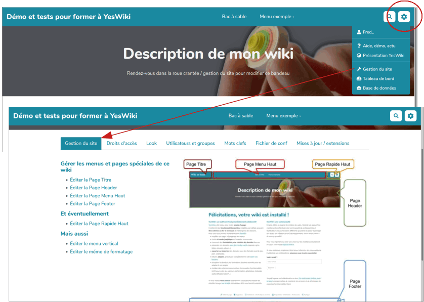
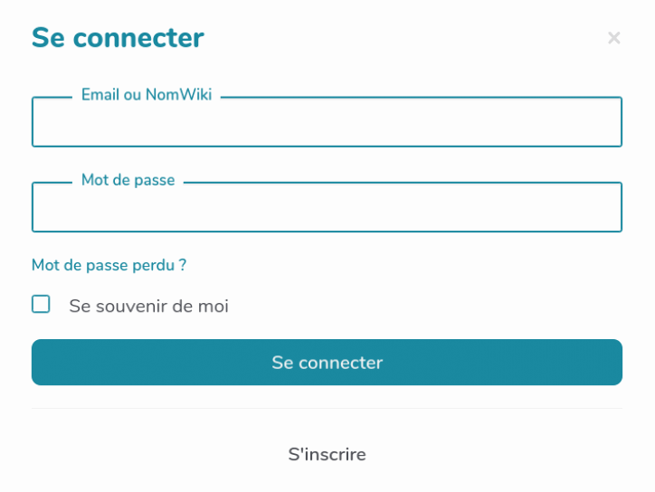

Prise en main
============

> **Pour décrouvrir les fonctionalités de base d'un wiki**
> * Quelques trucs si l'informatique vous fait peur Pour moi, page inutile
>
> **Ajouter et modifier des contenus**
>
> * Éditer une page (premiers)
> * Mettre en forme le texte (premiers)
> * Créer une nouvelle page (premiers)
> * Inclure une page dans une autre (premiers)
> * Créer un lien (premiers)
> * Joindre un fichier : image, son ... (premiers)
> * Restaurer l'ancienne version d'une page (premiers)
>
> **Agencer du contenu**
>
> * Éditer et modifier un menu (premiers)
> * Composition d'une page (premiers)
> * Modifier le menu du haut (premiers)
> * Modifier le bandeau (pageheader) (premiers)

Editer une page
---------------

Les pages d'un Yeswiki ont deux status, 
 - le mode lecture, c'est le mode que vous optiendrez en arrivant sur un wiki
 - le mode édition, reconnaissable à sa barre d'édition et aux "codes" colorés qui apparaissent dans la page

Pour passer en mode édition, trois solutions :
 - Utiliser le lien **éditer** en bas de page
 - Double cliquer dans la page
 - Ajouter /edit à la fin de l'adresse de la page

!> Vous n'arrivez pas à éditer une page YesWiki, elle a certainement été fermée en écriture

### Syntaxe YesWiki

Actuellement, YesWiki utilise des balises plus ou moins complexes pour les styles, les actions et autre astuces de mise en forme.
Ainsi, un texte en **gras** s'affiche ```**```**gras**```**```
 - pour supprimer les balises, il faut les supprimer avant **ET** après l'élément impacté
 - Pour des balises plus complexes style ```{{section bgcolor="var(--primary-color)" class="shape-rounded" pattern="border-solid" }}Texte encadré{{end elem="section"}}``` (oui, je sais, ça fait peur au début) il faut bien supprimer tout ce qui est avant **ET** après _Texte encadré_, Le plus simple.

Deux solutions en cas de soucis :
 - revenir sur une version précédente de la page
 - supprimer tous les codes de la partie impactée et remettre les choses en place calmement

!> Help, tout le texte de ma page est en gras ou en italique, c'est souvent une balise qui est ouverte et n'est pas fermée, style ```**texte en gras```

### Mise en forme

La plupart des mises en forme standard (gras, encadré, saut de ligne...) sont accessible via les boutons de l'éditeur. Voici quelques mise en formes supplémentaires

!> TODO: reprendre tous les exemples de l'aide de YesWiki ici (ReglesDeFormatage), et modifier cette page pour qu'elle pointe vers cette nouvelle doc

!> TODO: est ce que la partie composant buttons + mise en forme ne pourrait pas venir ici?

#### Listes
```yeswiki
 - Liste à puce niveau 1
 - Puce niveau 1
   - Puce niveau 2
   - Puce niveau 2
 - Puce niveau 1

 1) Liste énumérée
 2) Liste énumérée
 3) Liste énumérée
```

> Remarque : en mode édition, il faut parfois sauter une ligne après une liste à puce pour garder la coloration syntaxique...

#### Tableaux
```yeswiki preview
[|
|**Nom**  |**prénom** |**Couleurs préférées** |
|Lagaffe  |Gaston     |jaune                  |
|Lapalice |Jean       |vert                   |
|]
```

#### Écrire du code HTML
Si vous déposez du HTML dans la page wiki, il faut l'entourer de `""` pour qu'il soit interprété

```yeswiki
""<b>Ceci est du HTML</b>""
```
#### Créer une ancre, un lien qui envoie sur une partie de votre page
Le code suivant permet de créer le lien qui ira vers votre paragraphe : ```<a href="#ancre1">Aller vers le paragraphe cible</a>```
Et cette partie de code sera à placer juste au dessus du paragraphe cible : ```<div id="ancre1"></div>```

#### Mettre du texte en couleur
```""<span style="color:#votrecodecouleur;">votre texte à colorer</span>""```
 - Quelques codes couleur => mauve : #990066 / vert : #99cc33 / rouge : #cc3333 / orange : #ff9900 / bleu : #006699
 - [Voir les codes hexa des couleurs](http://fr.wikipedia.org/wiki/Liste_de_couleurs http://fr.wikipedia.org/wiki/Liste_de_couleurs)

#### Utiliser des icônes
##### Emoji
Il est possible de copier des icônes dans des sites sources puis de les coller dans votre wiki. (Par exemple sur ce site) [http://getemoji.com]
##### Font Awesome
```""<i class="fas fa-ambulance"></i>""``` et sur le site de (Font awesome)[https://fontawesome.com/v5/search] chercher icone à votre pied et remplacer _ambulance_ par le nom de votre icone

#### Barre de progression
```yeswiki
[10%]
[50%]
[85%]
```

Créer une page / insérer un lien
-------------------------------

!> **Règle de nommage** : le nom des pages YesWiki ne doivent contenir ni espaces ni caractères spéciaux. Pour les rendre lisible, le mieux est d'utiliser des tirets `nom-de-ma-page`, ou des majuscules `NomDeLaPage` (c'est ce qu'on appelle un `ChatMot`)

**Deux méthodes sont à votre disposition pour créer une page**

1. Lors de l'édition d'une page, cliquez le l'icone pour ajouter un lien. Dans la fenêtre qui s'ouvre, mettez le nom de votre nouvelle page yeswiki, elle sera crée automatiquement
2. Allez directement vers l'URL de la page que vous souhaitez créer (exemple : https://yeswiki.net/?MaNouvellePage). Comme elle n'existe pas encore on vous proposera de la créer

> Astuce 1: une fois ma nouvelle page créée, je peux enlever le lien qui y mène sans que la page disparaisse pour autant. Je peux retrouver mes pages dans la roue crantée en haut à droite > Tableau de bord. Une bonne manière de cacher des pages ;-)

> Astuce 2: YesWiki va interpréter tout ChatMot comme une nouvelle page. Si on veut écrire un ChatMot sans créer de nouvelle page (par exemple pour écrire YesWiki sans créer de lien), on l'encadre de double guillemets:

Revenir à la version précédente d'une page
-------------------------------------------

Dans YesWiki chaque modification d'une page est sauvegardée dans un **historique**. Par défaut il est possible de voir les 30 versions antérieures d'une page et, ce qui est souvent bien pratique, de restaurer une version antérieure.

**Pour y accéder** il suffit de cliquer sur le lien en bas de page nommé : "Dernière édition : _jour_._mois_._année_"

> Attention: cet accès est possible pour les personnes qui ont les droits en écriture sur la page concernée, c'est-à-dire tout le monde par défaut, mais les administrateurs du site peuvent faire un autre choix.


Insérer un média (images/pdf/...)
----------------------------------

!> TODO Ne pas décrire tout ce qui est accessible avec l'interface.
!> Décrire la gestion des différents formats
!> Décrire comment faire pour utiliser une image d'une page dans une autre


En plus du texte, on peut vouloir ajouter des images, des documents à télécharger, voire des vidéos ou des fichiers audio. Avec YesWiki ceci est très facile ! Voici comment faire.

Dans la page en mode édition, cliquer sur le bouton "Fichier" permet de choisir un fichier qui se trouve sur votre ordinateur. (listes fichiers affichables)  (svg, png, gif, jpg, bmp...) (.doc, .pdf, .xls, .odt, .txt...) mp3 flv
=> ce qui sera interprété et ce qui fera un lien de téléchargement

En fonction du type de fichier à insérer, YesWiki propose des interfaces différentes, mais le principe reste le même.

> Astuce: pour les fichiers vidéos, ou interactif type pad -> mettre lien vers une aure section dédiée


Insérer des éléments d'un autre site (iframe)
---------------------------------------

> Une **iframe** est un petit bout de code qui permet à une page d'embarquer (encapsuler, intégrer... _embed_ en anglais) des contenus et fonctionalités issus d'autres sites internet.

Vous pouvez ainsi profiter des fonctionnalités de cet autre site au sein même de votre wiki : lire une vidéo, écrire dans un pad et bien d'autre... Voici comment faire :


### Trouver le code iframe permettant l'intégration

On le trouve souvent dans les options _Partager_, _Intégrer_ ou encore _iframe_. Il ressemble à quelque chose comme ça:

```
<iframe src="https://unsite.com/iframe" ...></iframe>
```

### Collez ce code dans la page wiki

Il faudra juste penser à ajouter avant et après **deux guillemets**.

```
""<iframe src="https://unsite.com/iframe" ...></iframe>""
```

### Bricoler le code

Dans le bout de code à copier-coller, plusieurs paramètres peuvent être ajoutés/modifiés :

Les paramètres `width` (largeur) et `height` (hauteur) permettent de **spécifier la taille de l'iframe** et ils sont renseignés en pixels ou en pourcentage.

```
<iframe src="..." width="100%" height="500"></iframe>
```

Pour que la **hauteur se calcule automatiquement**, utilisez le paramètre `class`

```
<iframe src="..." class="auto-resize"></iframe>
```

Le paramètre `frameborder` permet de **gérer la bordure** noire du cadre (`1` pour activer, `0` pour désactiver)

```
<iframe src="..." frameboder="0"></iframe>
```
  

Les composants
---------------

!> TODO: L'idée était de juste lister les composants disponibles pour qu'on puisse les trouver en cherchant dans le moteur de recherche de la doc. A voir si on garde ça ou si plutôt on réserve cette section a des descriptions de composants avancés (y'aurait quoi par exemple?)

Les composants sont des éléments que l'on peut rajouter dans une page wiki.
Utiliser les composants ajoutera un code -parfois compliqué-  dans votre page. En cliquant sur ce code, un crayon apparaîtra dans la marge. En cliquant dessus, vous activerez une interface qui codera à votre place afin de modifier simplement chacune des fonctionnalités de votre composant.

### Boutons

Le composant bouton permet de créer un bouton avec des icônes, qui enverra sur une page du wiki ou un autre site. Les combinaisons entre les différents paramètres vous permettrons de faire bouton à votre pied.

### Mise en forme (mise en page)

Mise en forme propose 6 possibilités :

* Étiquette : mettre en avant un texte au travers d’une couleur de fond.
* Onglets : créer des onglets dans une page, permet d’obtenir des sous menus horizontaux ou verticaux.
* Encadré : encadrer un texte ou proposer un encadré qui se ferme quand on clique sur son titre.
 * Section : couteau suisse de mise en forme, permet d’encadrer un paragraphe, de lui adjoindre une couleur ou une image de fond et beaucoup d’autres combinaisons.
 * Afficher des encadrés en accordéon : déclinaison d’encadré, accordéon permet de chaîner plusieurs encadrés, quand vous ouvrez un encadré, ça ferme les autres.
 * Afficher en plusieurs colonnes : permet de créer plusieurs colonnes dans une page ou une partie de page, très utile pour des mises en page avancées.

### Syndication / Flux RSS

Permet d'afficher des informations arrivant de sites internet externe, permet de créer une page de veille.

### Gestion des tags

Dans chaque page (en bas en mode édition) ou fiche d’un formulaire, vous pouvez ajouter des mots clefs ou tags. Gestion des tags vous propose 3 actions :

 * Créer une liste des pages par tag
 * Nuage de tags
 * Lien RSS vers la liste pour des tags donnés

### Réactions / Votes

Ce composant vous offre trois possibilités :

* Réactions et votes
* Réactions de l'utisateur.ice connecté.e
* Administration des réactions

### Vidéo intégrée

afficher une vidéo proposée par PeerTube, Viméo ou Youtube à partir de son identifiant.

### Actions d'envoi d'e-mail/listes

permet 3 actions :

* Afficher un formulaire de contact
* S’abonner à une liste de discussion (qui devra être créée par ailleurs)
* Se désabonner à une liste de discussion

### Afficher les données d'un formulaire

Afficher les données d’un formulaire : véritable logiciel dans YesWiki, le gestionnaire de formulaire vous permet d’en créer mais ensuite d’afficher les résultats. Avec cette action, vous pourrez afficher les données des 4 formulaires fournis par défaut :

* Annuaire
* Agenda
* Blog-Actu
* Ressources

Vous pourrez bien sûr afficher les données des formulaires que vous aurez fabriqués. Il vous suffira de choisir le formulaire qui vous intéresse puis de choisir parmi les formes de restitution des résultats : Liste, Blocs, Cartographie, Calendrier, Agenda, Annuaire , Time Line, Carousel, Photobox, Liste de liens, Blog, Tableau.

### Afficher un formulaire de création de fiche

Ce composant est le pendant de l’action précédente, il permet d’afficher l’espace de saisie correspondant au formulaire qui vous intéresse.

### Actions avancées 

De nombreuses autres actions sont disponibles, en voici la liste :

#### Créer un sommaire de la page
#### Afficher des liens "Page Suivante" "Sommaire" "Page Précédente" dans une page
#### Afficher une barre de progression
#### Recherche de texte
#### Inclure une page dans une autre
#### Rediriger vers une autre page du Wiki
#### Afficher les pages sous forme de liste
#### Afficher les pages qui ont un lien vers la page courante
#### Afficher mes changements
#### Afficher mes pages
#### Afficher le contenu du fichier de configuration
#### Lister les utilisateurs, utilisatrices
#### Liste les derniers changements
#### Liste les derniers commentaires
#### Lister toutes les pages
#### Lister toutes les pages sauf les fiches bazar
#### Lister les pages à créer
#### Lister les pages orphelines
#### Lister seulement les fiches bazar

Structure du wiki
--------------------

### La composition d'une page 

#### Par défaut une page wiki contient :

*   une **Page Titre** : c'est le nom du wiki
*   une **Page Menu Haut** : on peut y ajouter des liens vers les pages du wiki (menu et sous-menu)
*   une **Page Rapide Haut** : il s'agit des pages d'administration du wiki, la roue crantée en haut à droite
*   une **Page Header** : c'est une partie utile pour écrire le titre donné au wiki, ajouter une description, un logo...
*   une **Page Footer** : autrement dit un pied de page, où se trouvent diverses informations au sujet due wiki


#### Il y a deux manières d'accéder à une page menu pour la modifier :

##### Par la roue crantée 



Dans la page Gestion du site, on retrouve les liens vers toutes les pages citées ci-dessus.

##### Par l'url


Pour les menus par défaut ces url sont :  

*   https://www.urldusite.ext/PageTitre
*   https://www.urldusite.ext/PageMenuHaut
*   https://www.urldusite.ext/PageRapideHaut
*   https://www.urldusite.ext/PageHeader
*   https://www.urldusite.ext/PageFooter

### Zoom sur le menu du haut

Pour créer ou modifier un menu...

#### ... il faut savoir créer des liens...

Les titres de menu correspondent à des liens menant à des pages, qu'elles soient déjà créées ou non.  
Ici la page "Démo" n'existe pas : il y a un petit crayon à côté de son nom dans la page (en bas) et dans le menu (en haut). On peut créer la page en cliquant sur son nom, dans la page ou dans le menu.

#### ...et des listes à puces (idem !)

Une page menu est organisée comme une liste de puces. Un niveau de menu correspond au retrait de la puce, soit un ou plusieurs espaces placés en début de ligne :  

*   un seul espace avant le tiret créera un titre de premier niveau (toujours apparent dans le menu). Ici la page "Démo".
*   deux espaces avant le tiret créera un titre de deuxième niveau (apparent après avoir cliqué sur le titre de premier niveau). Ici les pages Test1 et Test2.

N'hésitez pas à vous inspirer du code du menu déjà en place. Un wiki récemment installé a quelques éléments de menu justement pour vous montrer comment ça marche ;-)  


### Visite de la roue crantée 

Cliquer sur la roue crantée en haut à droite me donne accès à un certain nombre d'espaces dédiés à l'administration du wiki :


La roue crantée peut être personnalisée sur PageRapideHaut.

#### Se connecter

Ce bouton sert à s'identifier ou à se créer un compte ("s'inscrire") :



#### Aide, démo, actu

Vous avez là une intégration des pages d'aide du site yeswiki.net

#### Présentation YesWiki

Cette page vous décrit YesWiki et sa communauté.

#### Gestion du site

!> TODO ajouter lien vers section dans la page admin

Cette page gestion du site est très importante. Elle donne accès à de nombreuses fonctionnalités d'administration :


[Voir la page dédiée](admin.md)

#### Tableau de bord

Dans le tableau de bord, vous pouvez voir :

* les derniers comptes utilisateurs créés
* les dernières pages modifiées
* la liste exhaustive des pages du wiki

C'est le tableau de bord configuré par défaut mais vous pouvez le personnaliser.

#### Base de données

C'est ici que l'on configure Bazar : Bazar est une extension importante de YesWiki qui lui ajoute des fonctionnalités de création et de gestion de bases de données (formulaires).

Il faut être identifié comme administrateur pour créer ou modifier un formulaire Bazar. [Voir la page dédiée](bazar.md)
