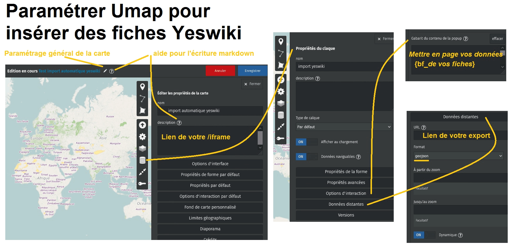

Comment faire pour
==================

> Tout un tas de petites astuces pour répondre à des besoins courant

## Afficher les fiches YesWiki sur une carte de type umap

Paramétrer Umap pour y insérer des fiches Yeswiki

### Introduction

[Umap](https://wiki.openstreetmap.org/wiki/UMap) est un logiciel cartographique qui permet de créer des calques modifiables (on considère ici que vous l'avez déjà utilisé) .
Depuis la version Doryphore de YesWiki il est possible d'importer automatiquement les données de fiches bazar dans les calques d'une Umap.

Cet export est réalisable depuis de bouton GeoJSON (format de données) de la page de gestion Bazar.
Il donne accès à une page de données

https://www.example.com/?api/forms/{id}/entries/geojson

que vous allez glisser dans le paramétrage de votre carte Umap ({id} représente l'identifiant du formulaire concerné).

### Explications

Voilà quelques points explicatif pour paramétrer votre carte Umap.

#### Coller le lien d'export GeoJSON

Cela ce passe dans "Propriétés d'un calque", "Données Distantes", coller votre lien cité ci-dessus dans "URL" et choisir le "Format" GeoJSON.

#### Paramétrer l'affichage de vos données dans Umap

\- Dans
 	 "Propriétés d'un calque", "Options d'interactions", "Gabarit du contenu de la popup"

vous pouvez définir les champs _bf\_wiki_ que vous voulez afficher en les écrivant en syntaxe markdown reconnue par Umap, par exemple:

    {bf\_titre}
    {bf\_site\_internet}
    {bf\_image}

etc...

\- Pour afficher un lien direct vers votre fiche wiki :

    \[\[{url}|source\]\]

\- pour les images :

 	 {{https://www.example.com/geo/files/{imagebf\_image}}}

#### Incruster une page d'accueil pour faciliter les contributions ?

Il est possible de présenter une page spéciale de contribution directement dans la page d'accueil de votre Umap.

Il faut se rendre dans "Éditer les propriétés de la carte" et proposer l'encapsulage d'une page spéciale en _/iframe_ (+ class new window ?) qui redirigera vers votre site pour la saisie de nouvelles fiches.

En markdown sur Umap cela donnera :

 	 {{{https://www.example.com/?VotrePageSpéciale/iframe}}}
#### En image :

